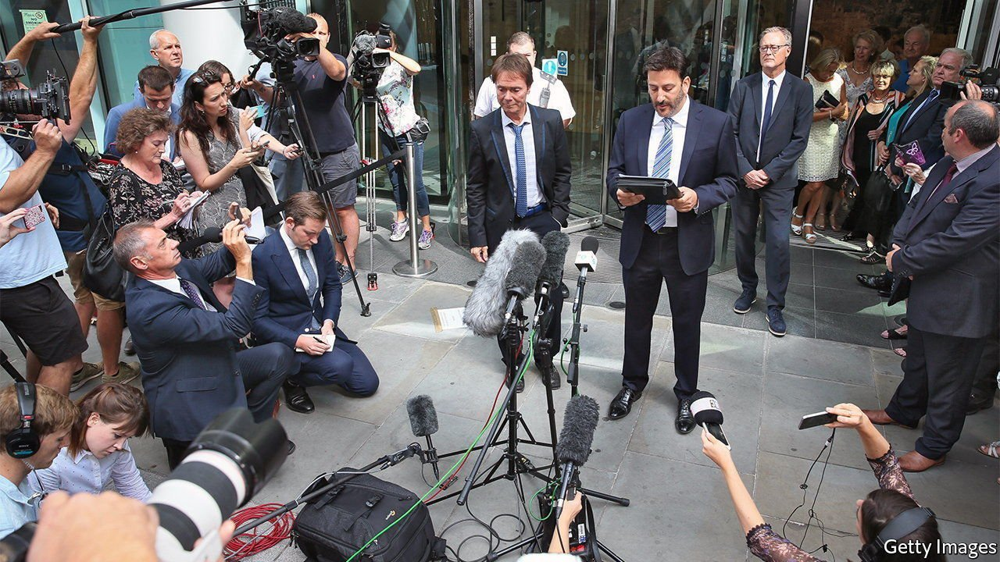

###### Nobody’s business

# British privacy law now rivals libel law in gagging the press 

##### The Supreme Court rules Bloomberg invaded a businessman’s privacy by reporting on a criminal inquiry 

 

> Feb 19th 2022 

IN 2016 BLOOMBERG, a media giant, published an article about the early stages of a criminal inquiry by a British regulator into an American businessman. The facts were gleaned from a letter Bloomberg had seen, sent by British authorities requesting information from a foreign counterpart. They have never been disputed. But on February 16th the Supreme Court ruled that Bloomberg had invaded the man’s privacy. It confirmed an award of damages for the misuse of private information of £25,000 ($34,000) to the individual, now known only as ZXC. In doing so, it tilted British law further away from freedom of the press and towards privacy rights.

Bloomberg argued that the legal principle that everyone is presumed innocent until proven guilty would ensure that its readers did not infer from its reporting that ZXC was guilty of a criminal offence. But the Supreme Court concluded that he was still likely to have suffered harm to his reputation, and that such harm was encompassed by Article 8 of the European Convention on Human Rights, which protects the right to privacy and family life. The degree of reputational harm from such reporting would vary, it said in its 51-page judgment, “but experience shows that it can be profound and irremediable”. Individuals suspected of criminal wrongdoing now have a reasonable expectation of privacy until charged.


The ruling was widely expected, says Beth Grossman, a media barrister at Doughty Street Chambers in London. She points to the precedent set in 2018 by Sir Cliff Richard’s victory against the BBC. The singer, who was wrongly suspected of sexual assault, had sued the broadcaster for intruding on his privacy by transmitting live footage shot from a helicopter of a police raid on his home. Nonetheless, it heightens concerns about a chilling effect on high-quality journalism.

In an article for Bloomberg’s website, John Micklethwait, editor-in-chief of Bloomberg News (and a former editor-in-chief of The Economist), points to one risk: that the ruling will hamper reporting on corporate malfeasance. It will be easier for the rich and powerful to “keep their identities secret pretty much from the moment they are investigated until they are convicted, something that big corporations tend to specialise in delaying”. He thinks the judges were influenced by “tabloidish excesses”, not just in Sir Cliff’s case but in that of Milly Dowler, a murdered schoolgirl whose voicemail was hacked by journalists in 2002 before her body was found.

Ms Grossman points to two more risks. First, news reports about the early stages of an investigation may cast an unflattering light on the actions of police and other authorities. Any harm to innocent individuals who are named must be set against the benefits of scrutinising the uses of state power. Second, when it comes to crimes that often go unreported, such as sexual assault and historic instances of child abuse, seeing a perpetrator’s name in the news may prompt more victims to come forward. It is not good enough to say that the names will be published when charges are brought: they may never be without the information provided by such previously unknown victims.

The ruling is the end of the line for ZXC v Bloomberg. The precedent will stand unless the government decides to set out in new law where it thinks the boundary between the right to privacy and the right to report should lie. It has already indicated that a planned bill of rights would raise the threshold for granting “celebrity injunctions”—court orders that enable wealthy individuals to ensure that extra-marital affairs and other misdeeds go unreported. Britain’s libel laws are famed worldwide for their ferocity. But increasingly, privacy law is an equally serious constraint on the freedom of the press. ■

