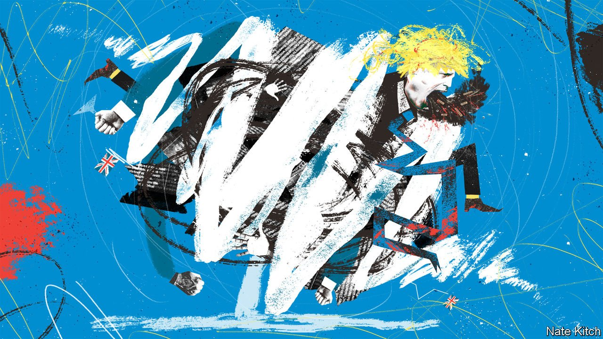
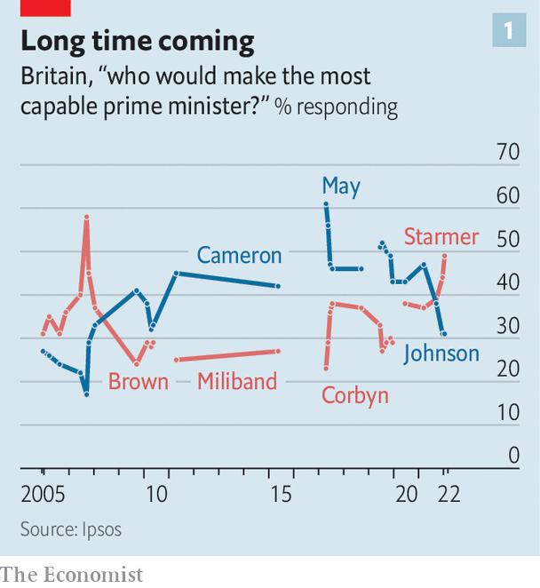
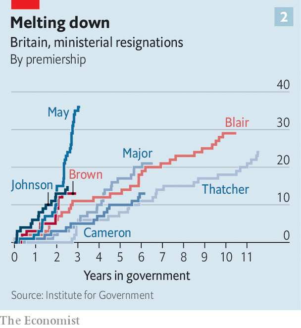
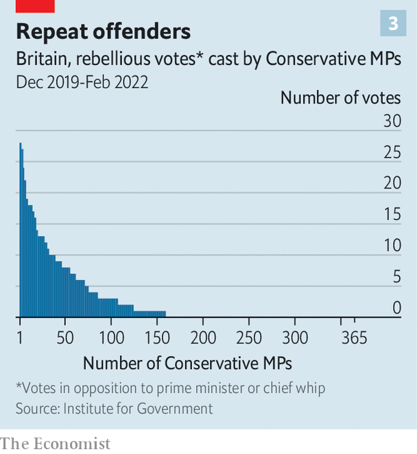
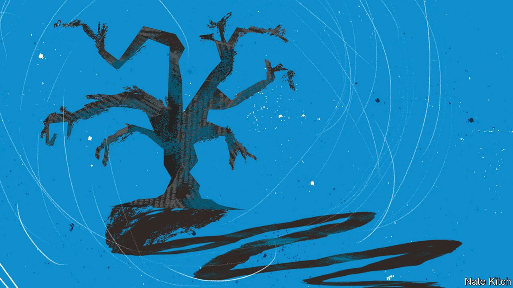

###### Old dudes

# The Conservative Party has become factional and rebellious 

##### That is degrading its capacity to govern 

 

> Feb 19th 2022 

BORIS JOHNSON did not promise to be a great prime minister. He knew many in the Conservative Party loathed him. But he came into office in July 2019 after sweeping a Tory leadership contest with a simple offer: that only he could rescue the party from an existential crisis.

That spring the Brexit deal crafted by his predecessor, Theresa May, had been rejected three times by Parliament. The party had split, paralysing business in the House of Commons. Its vote share collapsed to single digits, cannibalised by the Brexit Party. The prospect of Jeremy Corbyn, Labour’s far-left leader, governing at the head of an unwieldy coalition loomed.


What might follow seemed the stuff of Tory nightmares: nationalisations and tax raids; another referendum on Europe; perhaps one on Scottish independence, too. Mr Johnson’s campaign slogan promised nothing more than short-term survival: Deliver Brexit, Unite the country, Defeat Corbyn. D.U.D.—perhaps not a perfect acronym for an election campaign, Mr Johnson joked in his acceptance speech. But easily improved with an E: “Dude! We are going to energise the country.”

 


What he would give for some energy now. A series of parties in Downing Street during covid-19 lockdowns has crippled his premiership. He is being investigated by the Metropolitan Police. Labour has enjoyed poll leads since early December that, if replicated in a ballot tomorrow, would see it becoming the largest party in a hung parliament. Worse, polls show Mr Johnson trailing Mr Corbyn’s successor, Sir Keir Starmer, as the more capable prime minister. It is the first time the Tories have been behind on this metric since 2008 (see chart 1). Mr Johnson has the worst approval ratings since John Major in 1994, according to polling from Ipsos.

Mr Johnson has sought to relaunch his government with a small reshuffle. He promises to tackle health-care backlogs. Tory MPs are weighing whether to oust him. Yet his party’s problems will persist beyond the reboot. The disunity he promised to banish in 2019 will confront any successor. It is exhausted by 12 years in office, rebellious and riven by factions.

The Conservative Party has always been a broad coalition: from the landowners and urban middle classes of the Victorian era, to the wets, dries and “shits” (as some dubbed its authoritarian wing) of Margaret Thatcher’s. But these competing causes and traditions were subordinated to the task of running the country. “The Conservatives have always prided themselves on being a party of government,” wrote Andrew Gamble, a political scientist, in “The Conservative Nation” in 1974. Despite a Babel of conflicting voices, the party “is renowned for its unity and cohesion, the absence of factions in its ranks, and loyalty to its leaders”. What he termed the “politics of power”—running the state—took precedence over the “politics of support”—pleasing the electorate.

Fifty years on the Conservative Party remains superb at winning elections. Mr Johnson did indeed save it from catastrophe: a new Brexit agreement was signed, and unity enforced by suspending 21 Europhile MPs. At the election that followed, it won its largest majority in 30 years. With new northern voters came a new blue-collar doctrine. Public-sector investment was cranked up to the highest level since the 1970s, and liberal institutions such as the BBC and universities lined up for a kicking. By 2024 it will be 106 years since the granting of universal male suffrage; the Tories will have been in office for 68% of them. At the next election they will be seeking an unprecedented fifth term in office.

Yet the machine for government that Gamble described is misfiring. After three leaders, four general elections and a traumatic struggle over Brexit, ideological differences between MPs have widened, grievances festered and rebellions become a habit. Increasingly, ministers find protesting against unseen enemies preferable to delivering policy. The result is not total paralysis: 44 government bills received royal assent in the last session of parliament, including measures essential for life outside the EU. But the party’s capacity to digest differences and coalesce around a reformist programme has degraded.

It’s a real mean team

The twin threats of failing to deliver Brexit and losing to Mr Corbyn, which rallied the party around Mr Johnson, have disappeared. No Tory MP wants to enter opposition, but a Labour government no longer appears to them the catastrophe it once did. Sir Keir has junked Mr Corbyn’s socialist platform, and Brexit is secure. Whisper it, says one senior Tory, but the union probably would be safe under Sir Keir too.

Instability runs from the top. “I can’t think of any Number Ten which has imploded at this speed,” says a former aide. Successful prime ministers keep top aides for up to a decade; Mr Johnson is now being assisted by his fourth chief of staff and fourth director of communications since 2019. An interim chief operating officer has been installed in Downing Street; Whitehall-watchers suspect a permanent candidate has been impossible to find.

 


Ministers have quit the government at a striking rate. The first two years of Mr Johnson’s administration saw more resignations outside of reshuffles than in any since 1979 (see chart 2). Some ministers found it too radical: Mr Johnson’s ruthless methods for delivering Brexit sparked a wave of exits. For others, it has not been radical enough. Johnny Mercer resigned as a defence minister over the government’s inability to halt the prosecution of troops who had served in Northern Ireland. Lord Frost, the chief Brexit negotiator, quit lamenting Mr Johnson’s failure to create a low-tax, light-regulation economy. Sleaze has taken a toll. Douglas Ross, a Scotland minister, quit in 2020 in protest at breaches of covid lockdowns by Dominic Cummings, then Mr Johnson’s chief adviser. Lord Agnew, who oversaw Whitehall reform, resigned over lax checks on fraud.

 


Conservative MPs have been strikingly rebellious, notes Alice Lilly of the Institute for Government, a think-tank. Some 44% rebelled against the whip at least once in the over 400 parliamentary divisions since the general election (see chart 3). A hard core of 32 MPs has done so more than ten times. By contrast, in the 2015-16 session, under David Cameron, 18% of the party rebelled across 267 divisions. Under Mrs May, rebellions reflected a single deep cleavage over Brexit. Under Mr Johnson, they have been more varied, over everything from farm standards and building codes to free school meals and rules on trade with China.

They have been driven by former ministers, who regard Mr Johnson’s operation as amateurish and have no interest in promotion. Mrs May led a rebellion of former ministers against cutting overseas aid. But the intake of 2019, built in Mr Johnson’s populist image, has also proved unruly. In January one of its members, Christian Wake ford, defected to Labour. Louie French won a by-election in December 2021, and rebelled just two weeks later.

Meanwhile the Conservatives have Balkanised into ginger groups that look more like the factionalism of the far left. The European Research Group of ultra-Brexiteers, formed in 1993, demonstrated how a small number of MPs, organised through an internal system of officers, briefings and whips, could force the government to change course. It has an alphabet soup of imitators: the Covid Recovery Group (lockdown critics); China Research Group (Sinosceptics); Northern Research Group (cash-hungry MPs for poor towns) and Common Sense Group (anti-woke warriors). Opponents on one issue become allies on the next. A split has opened with the Scottish Conservatives: its members of the Scottish Parliament overwhelmingly want Mr Johnson to resign over Partygate.

WhatsApp has helped rebels to organise, while social-media campaigns and the online publication of voting records heap pressure on MPs to dissent. The size of Mr Johnson’s majority is a problem, reckons Philip Cowley, a political scientist at Queen Mary University of London: it is large enough to breed complacency at the top, but small enough to be wiped out with a moderate rebel effort.

Tories no longer agree on the most basic rules of politics, such as whether checks and balances are a vital part of a democratic system or an unacceptable restraint on an elected government. MPs split over Mr Johnson’s aborted plan last November to exonerate an ally, Owen Paterson, who had been found guilty by a parliamentary committee of unethical lobbying. There is a cultural rift between those who prayed for Hillary Clinton and those who cheered for Donald Trump. Mr Johnson’s misleading claim that Sir Keir, in his former role as director of public prosecutions, had failed to prosecute Jimmy Savile, a notorious paedophile, delighted only part of the party.

The environment is becoming another cause of cleavage. Backbenchers in the Net Zero Scrutiny Group are critical of the cost to households of climate-change mitigation. Lord Frost is campaigning to end the moratorium on shale-gas exploration. He is opposed by Lord Goldsmith, an environmentalist close to the prime minister.

The deepest schism is over Mr Johnson’s policy of “levelling up” poorer regions. The election in 2019 was followed by an uneasy compact between southern Tory incumbents, who prioritised tax cuts, and newly elected northern MPs, who demanded roads, railways and hospitals. It was fused by electoral logic and Mr Johnson’s ready charm. “Everyone read into Boris their own ideological persuasion,” says a former cabinet minister. As Mr Johnson’s electoral appeal collapsed, so did the compact. The “levelling up” white paper, published on February 2nd, was too statist for the libertarians but too skinny for the big spenders. The tragedy of Mr Johnson, says another former cabinet minister, is that he had the instincts to build a new electoral coalition. “But what he lacks is an intellectually coherent idea of how you form a platform that can combine the various elements of the Conservative tradition, and keep them all on board.”

Well I drunk a lot of wine

Donors are disillusioned, too. They dug deep to keep Mr Corbyn out of power: Tories raised £19.4m ($26.3m) during the campaign of 2019, or 63% of all donations to political parties. John Armitage, a hedge-fund founder who has donated more than £3m to the party, recently gave £12,000 to Sir Keir’s office, in the hope of supporting better opposition. Tory fund raising will be hampered by “the sense of sleaze, and winking, and lack of seriousness, and an inability to do anything”, he says. “I was asked to donate to the Conservatives at the end of last year, and I said: ‘Why would I do that?’” John Caudwell, the founder of Phones4U, a now-closed retailer, gave £500,000 in 2019, but is undecided whether to donate again. “I thought [Mr Corbyn] would kill the country,” he says. A Thatcherite donor is considering backing an insurgent party in the hope of jolting Mr Johnson to the right. “I feel almost as depressed now as I did in the 70s,” he says.

Mr Johnson came to office with radical ambitions. But Mr Cummings was central to those, and when he left, says a former minister, “it was like taking the spinal ganglia out of government”. An overhaul of the planning regime was paused months ago. After Partygate Mr Johnson ceded power to backbenchers, inviting them to craft policy through a series of committees. An anti-obesity campaign and mandatory covid-19 vaccinations for health-care workers have been dropped. The promotions of Jacob Rees-Mogg, the “Brexit opportunities” minister, and Nadine Dorries, the culture secretary, look more like a demonstration of fealty to the party faithful than any expectation of serious policymaking. In Gamble’s phrasing, the politics of support has triumphed over the politics of power.

A leadership ballot will be triggered if 15% of Conservative MPs (that is, 54) submit a letter of no confidence in Mr Johnson. He would then need to win a majority of his MPs (that is, 181) to remain in office. Backbenchers must calculate whether their chance of holding their seats would increase if they ditched him, and whether the risks justify a divisive contest. That moment has not been reached: only 15 have publicly called for Mr Johnson to go, and they are drawn from different wings of the party. Still, a ballot may come if the police fine him, or if the party does awfully in local elections in May.

Downing Street would probably function better under a new leader. Rishi Sunak, the chancellor, would be “effectively presidential rather than parody presidential”, says one admirer. Liz Truss, the foreign secretary, and Jeremy Hunt, a former health secretary, are in the running; both are more diligent administrators than Mr Johnson. A successor would probably wish to reassert the ministerial code that supposedly regulates the government’s behaviour but has been neglected by Mr Johnson, and ditch some of the coarseness. (Mr Sunak disowned the remarks about Savile.) A short honeymoon would follow.

The unruliness and strategic dilemmas would remain, however. The front-runners’ CVs would suggest a reversion to the low-tax, small-state conservatism that is gospel to party activists. Mr Sunak claims to be a fiscal disciplinarian; Ms Truss, to be a disciple of Thatcher. Running against Mr Johnson in 2019, Mr Hunt promised to slash corporation tax. But geography is destiny, and the 2019 intake accounts for more than a quarter of the parliamentary party. “I can’t see Rishi backing off levelling up for one second,” says a supporter. “If the party turns back now it will split between its old and new coalitions,” says Will Tanner of Onward, a think-tank that studies new Tory voters. A battle to offer Johnsonism without Johnson would ensue.

 


The root of Tory misery is in being, at heart, a small-state party in an increasingly big-state world. By the next election public debt will be 95% of GDP. The tax burden is already at its highest, as a share of GDP, since the 1950s, and is scheduled to rise further. A row over raising payroll taxes to fund health care is a foretaste of the decade to come: according to the Resolution Foundation, another think-tank, state spending will be 44% of GDP by 2030. The task, says Mr Tanner, is to find policies that satisfy both camps, delivering social reform for less money. That would take focus and imagination hitherto absent.

He can kick like a mule

Mr Johnson hangs on in part because Tory members still think him fit for the job by a margin of two to one, according to YouGov, a pollster. And divided as it is, the party cannot settle on a successor or a policy agenda to replace him. Doubts linger about Ms Truss’s capacity for the top job, and about Mr Sunak’s greenness. First elected in 2015 before a rapid promotion, he has never appeared on “Question Time”, a rowdy television debate show that is a proving ground for ministers, notes a colleague. His views on criminal justice, education and much else are unclear. “He will have to develop a platform very, very quickly,” says a former minister. Yet saying anything definite is risky in a party so fragmented.

Tory MPs are unhappy with Mr Johnson. But rid of the external terrors of 2019, grown tolerant of low standards and content to see difficult reforms parked, they may not be sufficiently miserable to remove him. He is too weak to rule its factions; they are too weak to oust him. An exhausted party can sustain an unsuitable prime minister for quite some time. ■

