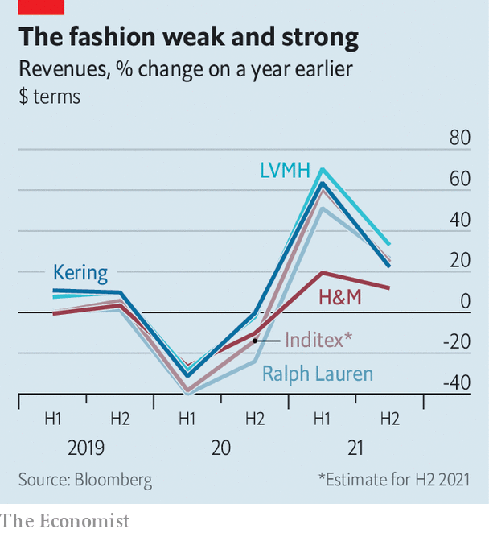

###### The middle-market corset

# After expanding in 2021, fast fashion may be squeezed again 

##### H&M and Inditex had a good year but face familiar challenges 

 

> Feb 19th 2022 

AMERICAN CONSUMERS are feeling flush. On February 15th the Commerce Department reported that the country’s shoppers spent 3.8% more in January than they had in December, unfazed by spiking inflation and covid-related uncertainty. That was the fastest monthly rise in nearly a year. Some of this splurge is going on new rags. Elsewhere, too, garment-sellers are booming. In Britain fashion was the only segment to see online sales grow last month, year on year, according to Capgemini, a consultancy. As catwalks and cocktail parties decamp from New York, which has just hosted its Fashion Week, to London, where another one is kicking off, the mood in the clothes business is as bright as the pastel-coloured dresses that are all the rage this season.

High-end labels like Christian Dior (owned by LVMH, a luxury colossus) or Gucci (part of Kering, a fellow French group) are relatively immune to economic turmoil. People who can afford their frocks may take a knock in a recession but seldom end up shirtless. The same cannot be said of less luxurious fashion houses. But they, too, have had a good run of late.


Ralph Lauren, a relatively upmarket American brand, opened 40 new shops in the third quarter last year alone, including a flagship store in Milan, as well as shops in Atlanta, Chicago, Detroit and Miami, often on those cities’ swankiest shopping streets. Its boss, Patrice Louvet, thinks consumers will keep replenishing their wardrobes and says his firm “is back on the offence”. In the mass market, sales at Hennes &amp; Mauritz (H&amp;M), a fast-fashion giant, are back to pre-pandemic levels and profitability is better than it has been in years. Helena Helmersson, who took over as its chief executive in January 2020, just before covid-19 hit Europe, has proclaimed that she wants to double the Swedish group’s sales by 2030 and reach an operating margin of above 10% within three years, up from less than 2% in 2020 and 7.7% in 2021.

 


Ms Helmersson and Mr Louvet reflect an optimism in the industry as it emerges from the disruptions caused by the pandemic. But they should go easy on the champagne during upcoming Fashion Weeks. Clothes companies, in particular those catering more to the masses, face an assortment of challenges. Some of these, such as digitisation and sustainability, predate covid-19. The pandemic has only heaped on more, from supply-chain bottlenecks and sky-high shipping costs to worker shortages. On top of that, the caprices of the world’s most populous autocracy mean that one false step can cost firms a fortune. H&amp;M sales in China slumped last year after the company expressed concerns about allegations of forced labour in the Xinjiang region.

Fashion retailers’ success last year was driven by unusual circumstances that will not last. Pent-up demand triggered a wave of “revenge buying” when shops reopened at last, in particular for “occasion wear” (jargon for pricey stuff). Shoppers’ pockets were lined with infusions of government cash. And the pandemic was the final nail in the coffin for some weaker firms, reducing competition in the crowded market; Topshop, Laura Ashley and TM Lewin went under in Britain, and Ann Taylor, Brooks Brothers and J. Crew did in America.

Now that consumers are no longer receiving cheques from the government, and have anyway already spruced up their wardrobes, they may become more parsimonious. Unlike luxury brands’ well-heeled customers, who might hardly notice that a handbag that cost $5,000 in 2019 now goes for $8,000 (as became true in November of Chanel’s Classic Flap), those of mass-market brands may balk at higher price tags. Necessary investments in digitisation and sustainability—Ms Helmersson has launched a vegan collection and invested in Sellpy, a digital platform to trade second-hand clothes—will eat into the fast-fashion houses’ profitability.

Younger models

As for competition, some passé brands may be gone but a few fresh faces look much more threatening to the mass-market giants’ market share. Companies like Shein, a Chinese super-discounter, Britain’s Asos or Germany’s Zalando have greater digital nous than mostly offline H&amp;M and Inditex, its Spanish arch-rival and owner of brands including Zara. They are also finding ways to appeal to young fashionistas. All this may be why analysts forecast a more modest increase in H&amp;M sales than Ms Helmersson does, of around 50% by 2030, and less cushy margins. Its share price, like that of Inditex, is below where it was before the pandemic.

In its annual report on the state of the clothing business, McKinsey, a consultancy, predicts that discount and luxury fashion will continue to wow investors this year. The middle-market retailers may enjoy another season or two of revenge buying. After that, their prospects are looking more threadbare. ■

For more expert analysis of the biggest stories in economics, business and markets, , our weekly newsletter.

Dig deeper

All our stories relating to the pandemic can be found on our . You can also find trackers showing ,  and the virus’s spread across .

