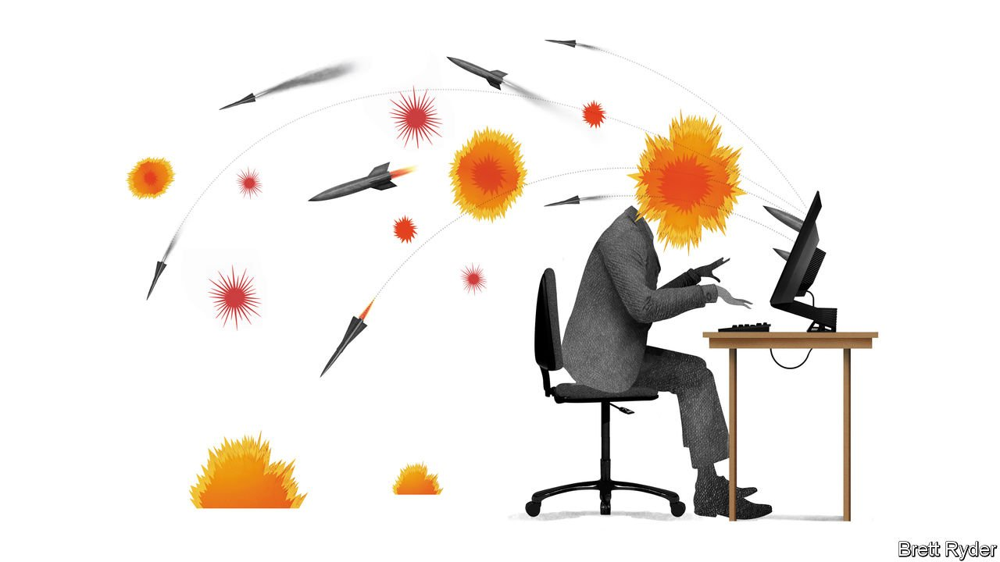

###### Schumpeter

# Companies have a lot to fear from Russia’s digital warmongering 

##### Insurance against state-sponsored hacks is becoming harder to find 

 

> Feb 19th 2022 

NOTPETYA IS A nasty name for the world’s vilest computer attack. Embedded in an innocuous piece of tax software, the virus, which the American government said had the Kremlin’s fingerprints all over it, struck Ukraine in June 2017, knocking out federal agencies, transport systems, cash machines—even the radiation monitors at Chernobyl, the husk of a nuclear-power station.

It then went rogue, worming its way from the computers of multinational firms with local outposts in Ukraine to their global operations, causing collateral damage to victims ranging from Maersk, a huge shipping company, and Saint-Gobain, a French construction giant, to Mondelez International, owner of Cadbury chocolate. The total hit was put at $10bn, making it the costliest such attack ever. One of the most expensive blows fell on Merck, a New Jersey-based drugmaker with a market value close to $200bn, which lost 40,000 computers in the blink of an eye and was forced to halt manufacturing of its human-papillomavirus vaccine.


Merck sought to cover its cyber-losses with a $1.4bn property-insurance claim. However, its insurers refused to pay, invoking a clause in the contract called war exclusion. This precludes coverage in the event of warlike action by governments or their agents. The matter ended up in a New Jersey court. Years later, as Russian troops and cyber-warriors are once again threatening Ukraine, a judgment in the case offers a timely reason to explore how much companies have learned since then about dealing with potentially catastrophic cyber-warfare. The short answer is: not enough.

The Merck judgment, made public last month, is potentially a landmark one. It tackles a question of great importance in the context of modern-day belligerence: is cyber-warfare war? Merck’s insurers, including firms like Chubb, argued that there was ample evidence that NotPetya was an instrument of the Russian government and part of ongoing hostilities against Ukraine. In other words, it was an act of warlike behaviour covered by the war exclusion. The court, however, sidestepped the question of who was responsible for the assault. Instead, it said that insurers did nothing to change the language of their contracts to suggest that the war exclusion included cyber-attacks. It said it was reasonable for Merck to think that the exclusion applied only to “traditional” warfare, ie, tanks and troops, not worms, bugs and hackers.

It is not the final verdict. A similar war-exclusion case involving Mondelez and its insurers continues in an Illinois court. But though it marked a victory for Merck, it may be a Pyrrhic one for companies at large. That is because many insurers are now seeking to strengthen the language in policies the better to shield themselves from payouts related to state-sponsored cyber-mischief. If a NotPetya-like virus were to come from Russia’s warmongering in Ukraine and burrow itself into the world’s supply chains, insurers are keen to ensure they limit their exposure to it. The consequences of that for corporate victims could be severe.

The evidence suggests companies have a lot to fear. Last year a report by HP, a technology firm, said that state-sponsored attacks had doubled between 2017 and 2020, and that businesses were the most common targets. Increasingly, the state hackers’ weapon of choice is malware inserted into the software or hardware of suppliers, which is particularly hard for companies up the value chain to detect. Unlike other cyber-criminals, who attack and move on, states have strategic patience, lots of resources and are above the law within their own borders. They cover their tracks well, too, so it can be particularly hard to attribute blame for an attack.

In the face of that, the insurance industry’s caution is understandable. It is already facing a surge in ransomware claims from companies during the covid-19 pandemic, which is driving up the price of cyber-insurance. The NotPetya attack revealed the risk of “silent cyber”, or unspecified cyber-risk hidden within insurance contracts. These could pose a systemic risk to the industry in the event of a large-scale, correlated attack. Partly in response to such threats, Lloyd’s Market Association, an advisory group, recently issued four model clauses for excluding war coverage from cyber-insurance policies. They enable insurance companies to customise their exclusions more easily and give companies more clarity on which risks are covered and which aren’t. But they appear to protect the insurers more than the insured.

It is still an evolving market. The Merck war-exclusion judgment relied on case law rendered before cyber was even a word. The cyber-insurance industry, though growing fast, is still small and immature. Eventually, the actuarial techniques for gauging cyber-risk will improve, and the insurance industry will get better at requiring clients to introduce the cyber-equivalent of fire alarms and sprinkler systems to minimise danger. For now, though, the risk of considerable confusion persists if something close to a cyber-war were to break out.

Self-isolation

So what should companies do? A well-known checklist of safety measures to implement includes things like two-factor authentication and swift software updates, which help keep hackers at bay. In light of the danger of infection along the supply chain, either from compromised hardware or software, firms should painstakingly assess their contingent exposures: factories or offices in far-flung locations, outsourced IT, cloud computing and even cyber-security itself.

Corporate boards need to have a stronger grasp of the threat levels. As one former cyber-spook says, they need not just gender and racial diversity but technological diversity, too, in order to grill the company’s techies on cyber-defences. Furthermore, they need to recognise cyber-war as one of the growing number of geopolitical risks that firms face. Ensuring that any of a firm’s contact points with Ukraine and Russia are not a vulnerability for the rest of its operations is the first of many steps they should take. ■

For more expert analysis of the biggest stories in economics, business and markets, , our weekly newsletter.

Read more from Schumpeter, our columnist on global business:

 (Feb 12th 2022)

 (Feb 5th 2022)

(Jan 29th 2022)

