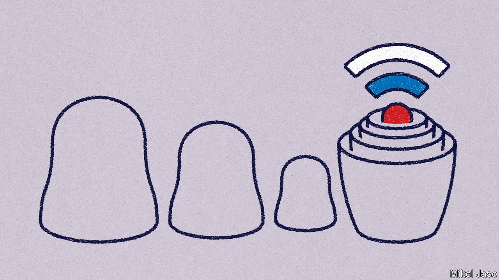
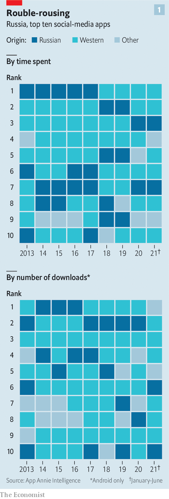
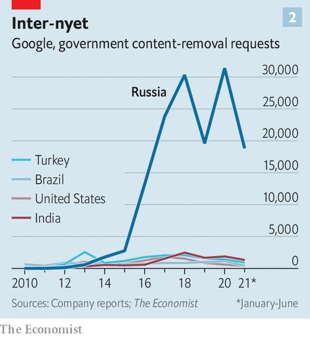

###### Digital geopolitics

# Russia is trying to build its own great firewall 

##### Can its tech industry separate from the West’s? 

 

> Feb 19th 2022 

VLADIMIR PUTIN, Russia’s president, has portrayed his  as pushing back against Western advances. For some time he has been doing much the same online. He has long referred to the internet as a “CIA project”. His deep belief that the enemy within and the enemy without are in effect one and the same means that if , Mr Putin’s foremost internal foe, uses YouTube—his video of the president’s seaside palace was viewed more than 120m times—then YouTube and its corporate parent, Google, are enemies, too.

Faced with such “aggression”, Mr Putin wants a Russian internet that is secure against external threat and internal opposition. He is trying to bring that about on a variety of fronts: through companies, the courts and technology itself.


In early December VK, one of Russia’s online conglomerates, was taken over by two subsidiaries of Gazprom, the state-owned gas giant. In the same month a court in Moscow fined Alphabet, which owns Google, a record $98m for its repeated failure to delete content the state deems illegal. And Mr Putin’s regime began using hardware it has required internet service providers (ISPs) to install to block Tor, a tool widely used in Russia to mask online activity. All three actions were part of the country’s effort to assure itself of online independence by building what some scholars of geopolitics, borrowing from Silicon Valley, have begun calling a “stack”. His efforts could serve as an inspiration, and a model, for tyrants elsewhere.

In technology, the stack is the sum of all the technologies and services on which a particular application relies, from silicon to operating system to network. In politics it means much the same, at the level of the state. The national stack is a sovereign digital space made up not only of software and hardware (increasingly in the form of computing clouds) but also infrastructure for payments, establishing online identities and controlling the flow of information.

Benjamin Bratton, a political philosopher at the University of California, San Diego, sees the stack as a set of new dimensions for the state, piled up one on top of the other, each of them analogous to the territory defined by its physical borders. The default stack is largely American, because that is where the internet grew up. But other places are trying to differentiate their stacks, some seeing opportunity, some staving off perceived threats. The EU, with ambitions to become the world’s , is putting together what it hopes will be a more open stack, less tied into proprietary technologies and monopolistic applications. India, Japan and Taiwan are all working on their own distinct digital scaffolds.

Most germane to an autocrat like Mr Putin is what has gone on in . China built its internet with censorship in mind. , a deep-rooted collection of sophisticated digital checkpoints, allows traffic to be filtered with comparative ease. The size of the Chinese market means that indigenous companies, which are open to various forms of control, can successfully fulfil all of their users’ needs. And the state has the resources for a lot of both censorship and surveillance.

Mr Putin and other autocrats covet such power. But they cannot get it. It is not just that they lack China’s combination of rigid state control, economic size, technological savoir-faire and stability of regime. They also failed to start 25 years ago. So they need ways to achieve what goals they can piecemeal, by retrofitting new controls, incentives and structures to an internet that has matured unsupervised and open to its Western begetters.

Russia’s efforts, which began as purely reactive attempts to lessen perceived harm, are becoming more systematic. Three stand out: creating domestic technology, controlling the information that flows across it and, perhaps most important, building the foundational services that underpin the entire edifice.

Take the technology first—microprocessors, servers, software and the like. Although Russia has some notable firms in these areas—Baikal and Mikron in semiconductors, ABBYY and Kaspersky in software—for the most part companies and government agencies prefer Western wares. Russian companies’ share of the semiconductor market was less than 1% of the global total in 2020 according to EMIS, a data provider. In servers and business software the situation is much the same.

The government has made moves to restart a chipmaking plant in Zelenograd near Moscow, the site of a failed Soviet attempt to create a Silicon Valley. But it will not operate at the cutting edge. So although an increasing number of chips are being designed in Russia, they are almost all made by Samsung and TSMC, a South Korean and a Taiwanese contract manufacturer. This could make the designs vulnerable to sanctions. An added problem is that they are often not up to snuff. Some experts have doubts about the capabilities of Russia’s home-grown Elbrus processors, designed by a firm called the Moscow Centre of SPRAC Technologies.

For crucial applications such as mobile-phone networks Russia remains highly reliant on Western suppliers, such as Cisco, Ericsson and Nokia. Because this is seen as leaving Russia open to attacks from abroad, the industry ministry, supported by Rostec, a state-owned arms-and-technology giant, is pushing for next-generation 5G networks to be built with Russian-made equipment only. The country’s telecoms industry does not seem up to the task. And there are internecine impediments. Russia’s security elites, the siloviki, do not want to give up the wavelength bands best suited for 5G. But the only firm that could deliver cheap gear that works on alternative frequencies is Huawei, an allegedly state-linked Chinese electronics group which the siloviki distrust just as much as security hawks in the West do.

It is at the hardware level that Russia’s stack is most vulnerable.  if Russia were to invade Ukraine would probably see the country as a whole treated as Huawei now is by America’s government. Any chipmaker around the world that uses technology developed in America to design or make chips for Huawei needs an export licence from the Commerce Department in Washington—which is usually not forthcoming. If the same rules are applied to Russian firms, anyone selling to them without a licence could themselves risk becoming the target of sanctions. That would see the flow of chips into Russia slow to a trickle.

When it comes to software the Russian state is using its procurement power to amp up demand. Government institutions, from schools to ministries, have been encouraged to dump their American software, including Microsoft’s Office package and Oracle’s databases. It is also encouraging the creation of alternatives to foreign services for consumers, including TikTok, Wikipedia and YouTube.

 


From Russia, with likes

Here the push for indigenisation has a sturdier base on which to build. According to Group M, the world’s largest media buyer, Yandex, a Russian firm which splits the country’s search market with Alphabet’s Google, and VK, a social-media giant, together earned $1.8bn from advertising last year, more than half of the overall market. VK’s VKontakte and Odnoklassniki trade places with American apps (Facebook, Instagram) and Chinese ones (Likee, TikTok) on the top-ten downloads list (see chart 1).

This diverse system is obviously less vulnerable to sanctions—which are nothing like as appealing a source of leverage here as they are elsewhere in the stack. Making Alphabet and Meta stop offering YouTube and WhatsApp, respectively, in Russia would make it much harder for America to launch its own sorties into Russian cyberspace. So would disabling Russia’s internet at the deeper level of protocols and connectivity. All this may push Russians to use domestic offerings more, which would suit Mr Putin well.

As in China, Russia is seeing the rise of “super-apps”, bundles of digital services where being local makes sense. Yandex is not just a search engine. It offers ride-hailing, food delivery, music-streaming, a digital assistant, cloud computing and, someday, self-driving cars. Sber, Russia’s biggest lender, is eyeing a similar “ecosystem” of services, trying to turn the bank into a tech conglomerate. In the first half of 2021 alone it invested $1bn in the effort, on the order of what biggish European banks spend on information technology (IT).

Structural changes in the IT industry are making some of this Russification easier. Take the cloud. Its data centres use cheap servers made of off-the-shelf parts and other easily procured commodity kit. Much of its software is open-source. Six of the ten biggest cloud-service providers in Russia are now Russian, according to Dmitry Gavrilov of IDC, a research firm. He says most successful ones are “moving away from proprietary technology” sold by Western firms (with the exception of chips). And as in the West, cloud computing has allowed specialised providers of online software to break through; in Russia this has included amoCRM, Miro and New Cloud Technologies.

Import substitution is a slow process and success is by no means guaranteed. However, it can no longer be considered a “joke”, in the words of Andrei Soldatov, editor of Agentura.ru, an online portal, and co-author of “The Red Web”, a book about digital activism in Russia. “The government is making steady progress in dragging people into a domestic digital bubble,” he recently wrote.

If technology is the first part of Russia’s stack, the “sovereign internet” is the second. It is code for how a state controls the flow of information online. In 2019 the government amended several laws to gain more control of the domestic data flow. In particular, these require ISPs to install “technical equipment for counteracting threats to stability, security and functional integrity”. This allows Roskomnadzor, Russia’s internet watchdog, to have “middle boxes” slipped into the gap between the public internet and an ISP’s customers. Using “deep packet inspection” (DPI), a technology used at some Western ISPs to clamp down on pornography, these devices are able to throttle or block traffic from specific sources (and have been deployed in the campaign against Tor). DPI kit sits in rooms with restricted access within the ISPs’ facilities and is controlled directly from a command centre at Roskomnadzor.

This is a cheap but imperfect version of China’s Great Firewall, says Roya Ensafi of Censored Planet, a project at the University of Michigan to measure internet censorship. It has improved Roskomnadzor’s ability to block sites and interrupt the virtual private networks many use to camouflage internet usage. It also allows the regulator to block, as it did during protests in 2019, live-video streaming without taking down whole mobile-phone networks.

 


Complementing the firewall are rules that make life tougher for firms. In the past five years Google has fielded 20,000-30,000 content-removal requests annually from the government in Russia, more than in any other country (see chart 2). From this year 13 leading firms—including Apple, TikTok and Twitter—must employ at least some content moderators inside Russia. This gives the authorities bodies to bully should firms prove recalcitrant.

The ultimate goal may be to push foreign social media out of Russia altogether, creating a web of local content controllable through courts, corruption and loyal thugs. But this Chinese level of control would be technically tricky. The DPI boxes are unable to filter out all foreign traffic. It would also be unpopular: Russians are rather keen on YouTube and WhatsApp. And it would make life more difficult for Russian influence operations, such as those of the Internet Research Agency, to use Western sites to spread propaganda, both domestically and abroad.

A view to instill

“Russia is less about blocking and more about shaping the information environment,” says Justin Sherman of the Atlantic Council, a think-tank. Strategically placed constraints, both online and offline, should suffice to guide the digital flow without hard barriers. Making foreign services less reliable will shift consumers towards domestic ones. Facing throttling, fines or worse, Western firms are likely to comply with government demands, as they did when leant on to remove apps Mr Navalny’s supporters had designed to show voters which opposition candidates were best placed to win elections.

Russia’s homegrown stack would still be incomplete without a third tier: the services that form the operating system of a digital state and thus provide its power. In its provision of both e-government and payment systems, Russia puts some Western countries to shame. Gosuslugi (“state services”) is one of the most-visited websites and most-downloaded apps in Russia. It hosts a shockingly comprehensive list of offerings, from passport application to weapons registration. Even critics of the Kremlin are impressed, not least because Russia’s offline bureaucracy is hopelessly inefficient and corrupt. Sergey Sanovich of Princeton University observes that by leapfrogging into the virtual world, leaders in Moscow showed they could deliver, and got a better grasp of what agencies far from the capital are doing. Privacy concerns, which can be a barrier to online government, were not much of a worry.

The desire for control also motivated Russia’s leap in payment systems. In the wake of its annexation of Crimea, sanctions required MasterCard and Visa, which used to process most payments in Russia, to ban several banks close to the regime. In response, Mr Putin decreed the creation of a “National Payment Card System”, which was subsequently made mandatory for many transactions. Today it is considered one of the world’s most advanced such schemes. Russian banks use it to exchange funds. The “Mir” card which piggybacks on it has a market share of more than 25%, says GlobalData, an analytics firm.

Other moves are less visible. A national version of the internet’s domain name system, currently under construction, allows Russia’s network to function if cut off from the rest of the world (and gives the authorities a new way to render some sites in accessible). Some are still at early stages. A biometric identity system, much like India’s Aadhaar, aims to make it easier for the state to keep track of citizens and collect data about them while offering new serv ices. (Muscovites can now pay to take the city’s metro just by showing their face.) A national data platform would collect all sorts of information, from tax to health records—and could boost Russia’s efforts to catch up in artificial intelligence (AI).

These plans must be taken with a dollop of salt. “Russia’s industrial policy seems that of a superpower, but in reality it is an economic minnow,” points out Janis Kluge of the German Institute for International and Security Affairs, a think-tank. Even if it had the means, he says, it does not seem willing to spend what it takes. Mr Putin has said that national capabilities in AI will determine who becomes “the ruler of the world”. But Russia is not making those capabilities a particularly high priority.

That said, as technology gets cheaper and more openly available, a country like Russia will be able to do ever more with only a modest effort. Stacks are modular; their layers can in principle be swapped out. You do not have to control all of them to get your way. In other words, Russia does not need the latest and smallest semiconductors, say, to build a serviceable edifice on top of what it has; and if it is hard to reach what is available elsewhere, serviceable may be good enough. The country’s bureaucrats have shown that they are able to learn quickly and improvise around technologies they lack.

Others are watching Kremlin’s progress. They include Iran (which requires censorship by software at ISPs), Kazakhstan (which may delegate some of its digital transformation to Sber) and Turkey (which demands the physical presence of foreign firms’ content moderators). They may back Russia diplomatically as it promotes its digital ambitions. Jointly with China, Russia has stalled UN talks aimed at defining responsible state behaviour in cyberspace, instead insisting on “information sovereignty”—code for doing what ever it pleases. Now it wants a Russian, Rashid Ismailov, to take over as secretary-general of the International Telecommunication Union (ITU), which governs swathes of the telecoms world. Mr Ismailov’s resumé includes stints as a deputy telecoms minister and Huawei executive.

Russia wants the ITU to replace the Internet Corporation for Assigned Names and Numbers as the overseer of the internet’s address system. America and its allies will block this. But the idea appeals to countries desiring stack sovereignty, which may be enough to win Mr Ismailov the votes he needs to beat Doreen Bogdan-Martin, an ITU official from America, in October, when the new secretary-general will be chosen.

Try another day

If push comes to shove in Ukraine, the strength of Russia’s stack against sanctions, and perhaps other forms of attack, will be tested. The costs could be high: capabilities would be lost and networks degraded. Russia may become more dependent on Chinese hardware and software, something its own elites fear (though this would hardly be a win for the West).

Whatever the upshot of such “stack-to-stack warfare”, as Mr Bratton calls it, the Kremlin’s efforts have shown would-be imitators that there is plenty of mileage in trying to take control of what layers of the internet you can, and of aligning yourself with likeminded regimes. New ways of embodying the state always enable new forms of influence and diplomacy—as well as of war. ■

For more expert analysis of the biggest stories in economics, business and markets, , our weekly newsletter.

