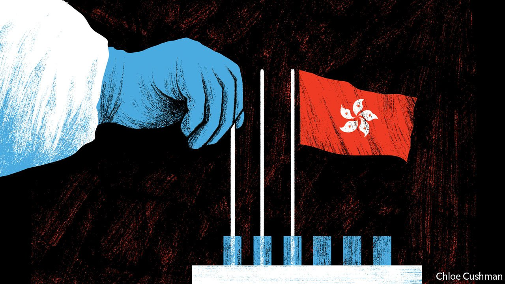

###### Chaguan

# China’s “zero-covid” policy doubles as a loyalty test 

##### Hong Kong can open to the mainland or the world. It must choose 

 

> Feb 19th 2022 

HONG KONG is about to endure its worst three months since the covid-19 pandemic began. With new case numbers running at thousands per day and doubling every few days, the financial and trading hub of 7.5m people faces an outbreak that—were it happening in mainland China—would trigger a citywide lockdown, with millions of people told to stay home, if necessary for weeks.

Hong Kong will not close in the same way, its chief executive, Carrie Lam, assured the public on February 15th, even as she admitted that a fifth covid wave is overwhelming hospitals and quarantine sites. The central government, knowing that a lockdown cannot simply be imposed from the mainland, says that primary responsibility for pandemic control rests with Hong Kong. But Hong Kong’s caution is making national leaders in Beijing restless. Also on February 15th official media reported President Xi Jinping’s instruction that the territory use “all necessary measures” to control the outbreak (to illustrate Mr Xi’s concern for residents, a state-owned Hong Kong tabloid depicted him beside a red Valentine’s heart). A flurry of editorials from mainland commentators and scholars complains of Hong Kong officials who “worship” Western values and lack faith in China’s “dynamic zero covid” strategy of crushing each outbreak. If epidemiologists’ models are right, Hong Kong’s latest surge will decline by summer. At that point, a broader political reckoning will follow.


Tian Feilong, of the semi-official Chinese Association of Hong Kong and Macau Studies, has written that the territory’s civil servants and government leaders are failing the test set by party chiefs in Beijing, that Hong Kong must be governed by “patriots”. That same test was used last year to ban opposition candidates from running for elected office, even as a national-security law was used to jail dozens of democracy campaigners for their roles in anti-government protests. With overt opposition crushed, attention is turning to “soft resistance” among Hong Kong’s administrators. Civil servants stand accused of nostalgia for British rule, and of secretly envying Western countries that choose to live with covid in the name of individual freedoms—a stance that Chinese experts excoriate as “social Darwinism” that leaves the weak to perish, in contrast with the Communist Party’s stern but life-saving controls. Ominously, mainland commentators have questioned Mrs Lam’s commitment to “dynamic zero covid”, grumbling about her use in late January of a dismissive Chinese phrase when noting that she was not the initiator of the strategy. A hand-picked committee must choose a new chief executive for Hong Kong in late March. National leaders have yet to signal whether they favour Mrs Lam for a second term. Her own plans are unclear.

Regina Ip, a pro-establishment member of Hong Kong’s legislature and of the chief executive’s cabinet, or Executive Council, calls it “undeniable that many senior officials are held hostage by Western ideas about the protection of fundamental rights and freedoms which they hold in awe but do not fully understand”. Mrs Ip backs sterner measures, with the mainland as a model. At the moment, she says, case numbers are soaring while Hong Kong’s borders are mostly closed, leaving the territory “falling between two stools: neither as effective in controlling the spread of covid as mainland China, nor as open as our rival city, Singapore”.

Yet few believe that citywide lockdowns are possible in Hong Kong. Ren Yi, a Beijing-based blogger read by many of China’s media and political elites, thinks that pro-establishment Hong Kong politicians are reluctant to tell national leaders that they cannot enforce full, mainland-style controls. Mr Ren, whose pen-name is Chairman Rabbit, does not welcome this reality. But he felt a duty to write a much-cited recent post about the power of Hong Kong’s “deep state”, in order to “try to lower Beijing’s expectations”.

Some differences are practical. Hong Kong lacks the hundreds of thousands of Communist Party members and public workers who stand guard outside closed housing estates, round up residents for mass testing and deliver food parcels to those trapped indoors, when mainland cities of similar size are sealed. Hong Kong’s police force has fewer than 31,000 officers: not enough to lock 7.5m people indoors. With baffling complacency, during months without covid cases, Hong Kong failed to stock up on rapid tests or prepare sites to isolate those with mild symptoms before the fast-spreading Omicron variant hit. Authorities are now scrambling to requisition empty public housing and hotel rooms.

No law can force people to trust their rulers

Then there is Hong Kong’s divided politics. Many residents deeply distrust both Mrs Lam and national leaders in Beijing. They would resist tools that drive compliance on the mainland, such as apps that allow officials to confine those suspected of proximity to covid cases by remotely turning their smartphone “health codes” from green to yellow or red, barring them from trains and shops.

Hong Kong is hardly laissez-faire about covid, having now banned outdoor gatherings of more than two people and locked down neighbourhoods for compulsory testing. Ben Cowling, a professor of epidemiology at the University of Hong Kong, worries about death rates in coming months, notably among the oldest, who have largely shunned covid vaccines. Once this wave passes he can imagine fresh attempts to eliminate the virus in Hong Kong, in order to try once more for an open border with the mainland. “I don’t think Omicron is the end of zero covid,” he says.

Mainland scholars urge Hong Kong to accept pandemic help from the central government to boost national pride. They charge those seeking access to the outside world with elitism: opening to the mainland, they say, is what the masses want. China’s top official in Hong Kong, Luo Huining, last month warned the city against “self-pity” over its role as an adjunct to China’s overall development. Behind debates about public health, arguments about loyalty lurk. They will outlast even this relentless pandemic. ■


 (Feb 12th)

 (Feb 5th)

 (Jan 29th)

Dig deeper

All our stories relating to the pandemic can be found on our . You can also find trackers showing ,  and the virus’s spread across .

