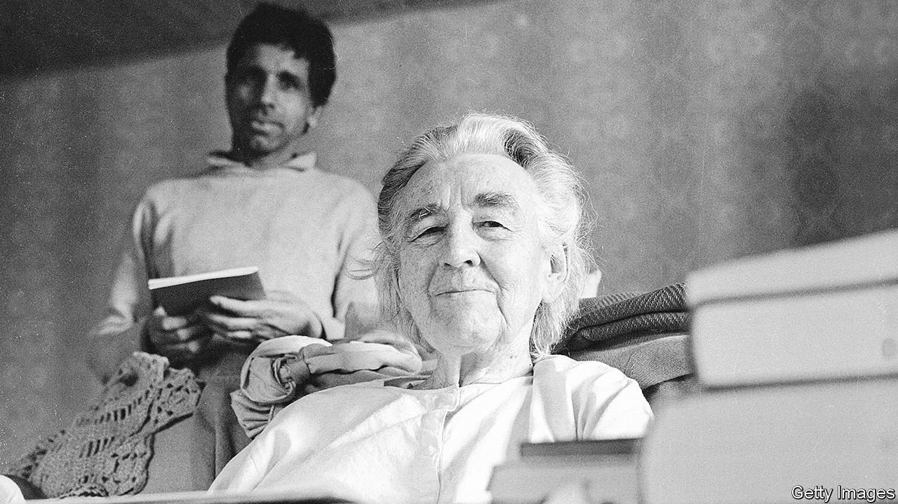

###### Writing India’s history

# A book recalls the foreign agitators for India’s independence 

##### The argument of “Rebels against the Raj” is about the future as much as the past 

 

> Feb 19th 2022 

Rebels Against The Raj. By Ramachandra Guha. Knopf; 496 pages; $35. William Collins; £25

HOW DO POLITICAL winds affect the writing of history? In India those in power have long pressed publishers to pay most heed to their favoured historical figures. For much of the past century, as the Congress party dominated public life, writers lavished attention on the independence heroes who were drawn from its ranks, Mahatma Gandhi and Jawaharlal Nehru foremost among them.


In contrast, figures of similar importance to the independence movement who were (or became) rivals of Congress were given shorter shrift. The Bengali firebrand Subhas Chandra Bose was not forgotten, but he was far from celebrated in the same fashion as the Congresswallahs. (Admittedly, he had hurt his own reputation by rushing into exile to ally with the Nazis and Japanese during the war.) Another anti-British campaigner, who despised Congress as much as he opposed imperialists, was Vinayak Savarkar. He was long shunned by historians, in part because of his close association with a gang of men who murdered Gandhi in 1948.

Of late the winds have shifted in India. Congress now looks flattened as a political force. Strong regional politicians have established rival power bases; nationally it is the Hindu nationalist Bharatiya Janata Party (BJP) that breezes through one election after another. In turn, different historical characters are attracting sympathetic attention from writers. Bose has been revived as a pre-eminent figurehead of Bengali regional pride, for example. As for Savarkar: the prime minister Narendra Modi extols him. As the creator of Hindutva (the Hindu-first movement) roughly a century ago, Savakar and his illiberal ideas arguably shaped the majoritarian views of modern BJP leaders as much as anyone.

For a distinguished historian who champions the appealing idea of India as tolerant, humane and welcoming to adherents of all religions or none, this is a dispiriting moment. Ramachandra Guha has already written several acutely observed books on Gandhi’s life (among other topics). His latest work, “Rebels Against The Raj”, is a study of India in the build-up to its independence, the 75th anniversary of which falls this year. In it, Mr Guha makes clear his distress at India’s souring mood.

He warns of the current drift towards national and religious parochialism. “The rise of nativism and xenophobia”, he writes, “has been both immense and intense.” India’s leaders once stood for inclusion, universal rights and liberal democracy, but today’s leitmotif is to “proclaim with pride that you are Hindu”. Politicians crow about throwing off a millennium of foreign rule (meaning Muslim Mughals, then British imperialists) and India’s growing might, while suggesting they have nothing to learn from the rest of the world.

Mr Guha’s new book challenges such thinking with a reminder of how many outsiders held (and hold) deep affection for India and its democratic cause. He introduces a remarkable cast of seven foreign activists who struggled for India’s freedom from the 1910s onwards. They were British, Irish and American, and included political campaigners, journalists, a reformed communist, a social worker and a teacher. All suffered for their principles and were imprisoned by the British.

Nor were they alone. Other foreigners, Mr Guha points out, played a big part in India’s drive for independence, including C.F. Andrews, a priest and social reformer who urged Britain to grant India its freedom. But Mr Guha sets aside those he terms “bridge-builders” between Britain and India (among them some who wished for a kindlier form of imperial rule). His interest is in the outright renegades, who proved themselves utterly, joyously disloyal to Britain’s imperial project.

The author is intrigued by the motivation of people who make sacrifices for others in distant places, or for groups distinct from their own, whether socially, racially or economically. He likens his renegades to the thousands of foreign volunteers who fought against fascism in the Spanish civil war of the 1930s. He finds another parallel in individuals who choose to turn against immoral regimes, such as idealistic white South Africans who resisted apartheid. At times, he rightly observes, disloyalty is a trait much to be admired.

Rebels with a cause

The stories of his seven subjects—four men and three women—are deftly inter twined. The most compelling is Annie Besant, who came to India in middle age in 1892, an orator already known for campaigning for “home rule” in Ireland. She became a proponent of theosophy (an esoteric religious movement) and for a while outdid Gandhi in the affections of the Indian public as she called for freedom. She pushed for women’s rights, and votes, and helped found Banaras Hindu University, still one of the most prominent in India. Her efforts deeply unsettled British rulers who were unsure how to shut her up.

Meanwhile, Madelaine Slade (pictured), a former concert pianist from Britain’s home counties, devoted her long life to Gandhi, living in ashrams and traipsing across rural India. She took an Indian name, Mira Behn, and probably had her greatest impact by pleading the cause of Indian independence to the American public and in the White House. The other five include Benjamin Horniman, a battling newspaper editor who promoted a free press both before and after independence, and Samuel Stokes, who campaigned against the use of forced, unpaid labour (a disturbingly common practice both before and under British rule).

Mr Guha does not overstate the role of these foreigners. He sums up his group as “active conscience-keepers”, who remained true to their rebellious ways even after independence—readily criticising their friends, the new rulers of India, just as they had opposed misrule by the British. His account does not change the broad narrative of how Indians won freedom for themselves. Its real point is as much about the future as the past—an argument for the tolerant, outward-looking country India could once again become. ■

