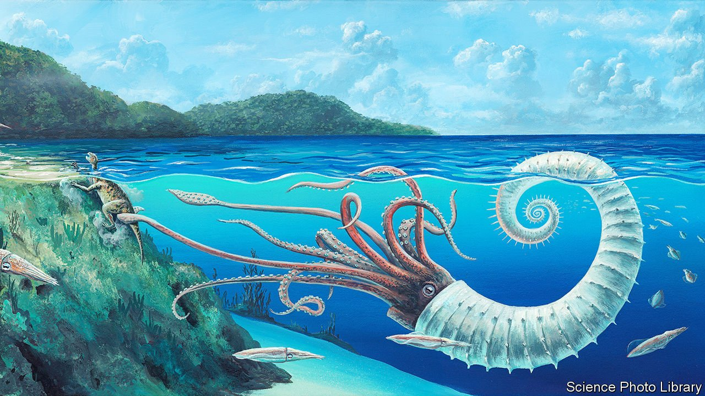

###### The story of life on Earth

# Creatures of the deep past come to life in “Otherlands” 

##### The long view in Thomas Halliday’s book offers both hope and trepidation 

 

> Feb 19th 2022 

Otherlands. By Thomas Halliday. Random House; 416 pages; $28.99. Allen Lane; £20

THE DEEP past is a foreign country; it helps to pack a guidebook. “Otherlands” is just such a Baedeker. In this bracingly ambitious book, Thomas Halliday, a palaeobiologist, rewinds the story of life on Earth—from the mammoth steppe of the last Ice Age to the dawn of multicellular creatures over 500m years ago.


Like the time traveller in H.G. Wells’s “The Time Machine”, readers risk chronological whiplash as chapters hopscotch deeper into the past, skipping millennia at the turn of a page. Like that literary odyssey, this is a journey from the familiar to the bewilderingly strange. At times in Earth’s history, east Africa groaned under ice sheets kilometres thick. Antarctica, meanwhile, was once a steamy tropical jungle through which swaggered penguins built like rugby players. Massive reefs of glass sponges grew beneath late Jurassic seas, ghostlike thickets of translucent silicon marching for miles into the darkness.

An outlandish bestiary stalks through “Otherlands”, which Mr Halliday evokes with a naturalist’s eye. Early hominins, he says, scavenged at kill sites with otters the size of lions—perhaps the first species driven to extinction by the ancestors of modern humans. Other animals prompt science-fiction horror. Omnidens (“all tooth”), the apex predator of the Cambrian seas, might have been dreamed up by the artist H.R. Giger. The giant worm sucked prey into its digestive system past six spirals of jagged teeth. Its closest analogy, Mr Halliday notes, is the “sarlacc” from “Star Wars”.

This deep-time perspective marginalises human beings. Maps at the start of each chapter convey the globe’s mutability as the familiar outlines of the continents warp and blur, shuttling like chequers on a board. The Ediacaran period, for instance, is so distant in time that even its night sky was different: “Many of the stars we are familiar with are yet to be born.”

Written in lush, occasionally overripe prose, Mr Halliday’s approach is immersive. He relies on “trace fossils”—in other words, fossil records of behaviour, rather than biological remains, a footprint rather than a thigh bone. In this way lost worlds are preserved, and “a startling wing-flap…is made solid and lasting”. Mythology and folklore preserve such traces too. Maori stories commemorate New Zealand’s Haast’s eagle, a monstrous raptor with a three-metre wingspan that was capable of snatching a child. Myths of the one-eyed Cyclops arose from the nasal openings in the skulls of dwarf elephants, which once roamed the islands of the Mediterranean.

The long view of “Otherlands” offers both hope and trepidation. Life is already diversifying in response to human-induced climate change: after 200m years, glass sponge reefs have returned, thriving in oxygen-depleted seas. In 2016 a bacterium was discovered near a plastic-recycling facility in Japan, “the first known life form …to be entirely plastivorous”. But the remote past also furnishes warnings.

The global warming of the Eocene period anticipated conditions that might obtain by the end of this century—the Antarctic forested with temperate woodland and sea levels rising by ten metres, swamping the homes of a billion people. “Change, eventually, is inevitable,” Mr Halliday says. At the same time, humankind’s future requires “sacrifice, an act of permanence”. It will not be cheap. ■

