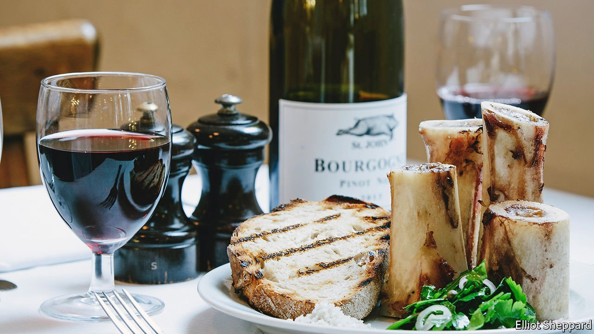

###### World in a dish

# In the fickle world of restaurants, sticking to a vision takes guts 

##### And, in the case of St John in London, bone marrow 

 

> Feb 19th 2022 

IT IS NEARLY 30 years since St John opened in a former smokehouse, just to the north of the City of London. Back then, the restaurant felt daringly stark: whitewashed walls and concrete floors, drinks specials on chalkboards, a high-ceilinged dining room with white tablecloths and wooden chairs, no music. After the pastel-coloured 1980s, it seemed to smack of the mortuary or the operating theatre. Today the decor is reassuringly unaltered.

So is the food. St John’s menu changes daily, but its style is constant—what Fergus Henderson, its co-founder, calls “a kind of British cooking”. It became famous in the early noughties, when the late Anthony Bourdain, an American chef, author and television presenter, rhapsodised over its roast bone marrow salad. That is the only dish that almost never leaves the menu, for good reason: it is a symphony of unctuousness (marrow), brightness (a parsley, caper and shallot salad), salinity (a mound of grey sea salt) and crunch (toast), which the diner composes himself. Marrow and other offal favoured by Mr Henderson began appearing on menus of fashionable restaurants from Seattle to Melbourne.


The offal fad competed with one for molecular gastronomy, with its spheres of olive juice, then gave way to farm-to-table cooking, which painstakingly detailed the provenance of every radish in a salad. Eventually came the narrative-driven cooking of today, in which each dish has its culturally appropriate origin story. The marrow is still on the menu at St John.

Yet while the offal grabs the headlines, Mr Henderson’s kind of British cooking ultimately rests on bold, unfussy simplicity. It is a cold-weather translation of Italian country cooking, with high-quality meat and vegetables simply prepared. The menu is laconic (“Snails and Oakleaf”), flavours strong and balanced, presentation a flourish above plain. Mr Henderson now has Parkinson’s disease and no longer cooks, but the restaurant hews to his vision.

In a mercurial industry, that is rare. Far too many posh metropolitan restaurants share a dreary, trendy predictability, supplying the same gently upbeat music, the same mixture of vaguely Italianate and East Asian dishes, and excessively busy cocktails with poetic or suggestive names. There is nothing inherently wrong with that. Everyone wants to succeed, and these things sell. Castigating restaurateurs for offering them is as silly as berating directors for making superhero films. But while predictable restaurants and superhero movies can be successful, and sometimes even good, they cannot be truly great.

Not every singular vision succeeds, or is worth pursuing in the first place. Stubbornness and greatness are not the same thing. But—as every would-be novelist turned lawyer or sculptor turned dentist knows—such dreams are all too easy to abandon out of fear of failure. And more than most businesses, restaurants tend to fail. To open one that goes against the grain is a risk. To find that same restaurant little changed, still packed with diners and still delicious after more than a quarter of a century is a quiet cause for joy. ■

