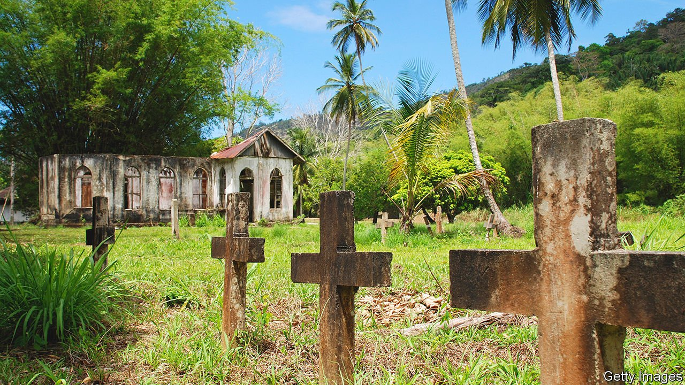

###### Debut fiction

# Love and other demons in “When We Were Birds” 

##### Ayanna Lloyd Banwo’s luminous novel is set in her native Trinidad 

 

> Feb 19th 2022 

When We Were Birds. By Ayanna Lloyd Banwo. Doubleday; 304 pages; $27.00. Hamish Hamilton; £14.99

THIS LUMINOUS story is powered and steered by two characters from different walks of life who have different attitudes to death. Set in fictitious locales of Ayanna Lloyd Banwo’s native Trinidad, her debut novel tells of the separate struggles and twinned destinies of Emmanuel Darwin and Yejide St Bernard. What looks set to be a simple tale of boy meets girl soon develops into a thoroughly original and emotionally rich examination of love, grief and inheritance.


Darwin (as the character prefers to be called) leaves his home in the country and hitches a ride to Port Angeles to start work as a gravedigger at the Fidelis Cemetery. His mother, a devout Rastafarian who has taught him to keep a distance from death, is appalled at his choice of job: “Not in no dead yard and not in that dead city.” But in the absence of other opportunities, Darwin is forced to turn his back on her and take his chances in a place that can reputedly “swallow a man whole”.

Meanwhile, on her family’s estate in Morne Marie, Yejide waits for Petronella, her ailing mother, to gasp her last breath. When she dies, Yejide inherits a mysterious legacy that has been passed down through generations of St Bernard women—the ability to anticipate death and commune with spirits. “I feel the dead calling,” she later says, “and I see death coming before it reach.”

Darwin meets Yejide when she turns up at Fidelis to make burial arrangements for her mother. They sense a special connection and an intimate relationship blossoms. But privately each is plagued by a pressing individual concern. Darwin discovers that his colleagues at the cemetery are embroiled in shady business and that his life is in danger. Yejide is visited by Petronella’s restless ghost, which urges her to escape her fate and make her own life: “Take your man, take yourself and run.” But can the pair run far enough?

Several recent novels have included memorable scenes in graveyards, among them “The Ministry of Utmost Happiness” by Arundhati Roy and George Saunders’s sublime, Booker-prizewinning “Lincoln in the Bardo”. As in those books, the “dead yard” in “When We Were Birds” is full of life. Ms Lloyd Banwo ensures that the scenes it hosts are packed with drama, colour and tension, particularly in her gripping finale.

In other hands, the flights of fancy in Yejide’s story might have clashed with the grounded realism of Darwin’s. Here they blend into a heady mix. The rhythms of Ms Lloyd Banwo’s narrative voice help keep the reader rapt. Like the corbeaux—vultures which, in the author’s invented mythology, escort dead souls to the afterlife—her novel takes flight and soars. ■

