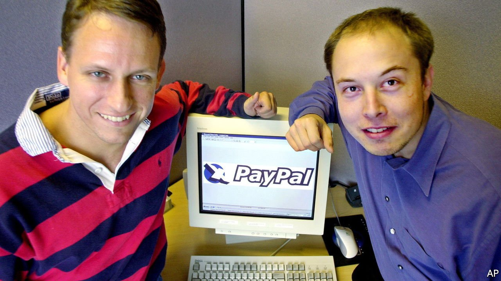

###### Making tech’s mafia

# “The Founders” examines the rise and legend of PayPal 

##### Its top brass, recounts Jimmy Soni, became one of tech’s most influential networks 

 

> Feb 19th 2022 

The Founders. By Jimmy Soni. Simon &amp; Schuster; 496 pages; $30. Atlantic Books; £18.99

IT IS HARDLY a tech giant. PayPal, a digital-payments firm, has a market capitalisation of $135bn, compared with Amazon’s $1.6trn and Apple’s $2.8trn. Yet it holds a unique position in Silicon Valley mythology. A startling number of PayPal’s co-founders and honchos have gone on to corporate greatness, earning themselves the nickname the “PayPal mafia”.


The top job at the firm was held by both Elon Musk, boss of Tesla and one of the world’s richest men, and Peter Thiel, a veteran venture capitalist and co-founder of Palantir Technologies, a data-analytics firm. Reid Hoffman, co-founder of Linked In, held various senior roles. Three PayPal alumni later created YouTube; others co-founded Yelp, a popular review website, and Yammer, a social network. Former employees landed senior jobs at Google, Apple and Facebook, as well as at some of the valley’s biggest venture-capital firms. Together they form “one of the most powerful and successful networks ever created”, argues Jimmy Soni in “The Founders”.

His well-researched book chronicles PayPal’s birth and transformation from a scrappy startup to a profitable business which, in 2002, was bought by eBay for $1.5bn. The origin story starts with two other companies: Confinity, co-founded by Mr Thiel, which planned to build software to beam money between PalmPilots, then must-have devices for businessfolk; and X.com, co-founded by Mr Musk, which was meant, as he put it, to be “the Amazon of financial services”, offering internet users everything from mortgages to credit cards to insurance. Both found success with features that let customers transfer money using email. Initially rivals, the firms merged. PayPal was the result.

The story of its rise is gripping. PayPal was born during the internet boom of the late 1990s, when money poured into Silicon Valley. The fierce competition fomented by the investment in turn generated intense pressure; all-nighters were common. PayPal burned through dangerous amounts of cash to attract new customers. It was sued repeatedly and subject to fraud. Splits among the top brass caused commotions: two chief executives were ousted in coups in a six-month spell. Mr Soni’s text is peppered with colourful quotations from Mr Thiel (“I need people here I can scream at”) and Mr Musk (“This is like gambling one hundred million smackeroos”).

All this gives a taste of the chaos of startup life. Business models were improvised on the fly. Shortly before Confinity’s launch, Mr Thiel told journalists that his new product would be free. That was news to his engineers, who quickly removed fees from the website. Experimentation led to grave mistakes. For almost a month a loophole in X.com’s security allowed villains to steal from banks using only account and routing numbers, both of which were printed on cheques.

What the book lacks is a clinching answer as to why the PayPal gang have been so successful. Lots of theories are offered, including the wildness of the PayPal rollercoaster and the outsider status of many of those involved (nine of the ten founders of the two original firms were foreign-born). None of these explanations is convincing; most apply to other tech startups.

Even so, this is an engrossing glimpse of the PayPal mafia’s riotous early days. Many former employees object to that nickname now, on the grounds that it insinuates something sinister. A quip by John Malloy, a former board member, better captures the book’s tone: “Calling us a mafia is to insult mafias. A mafia is far better organised than we were.” ■

