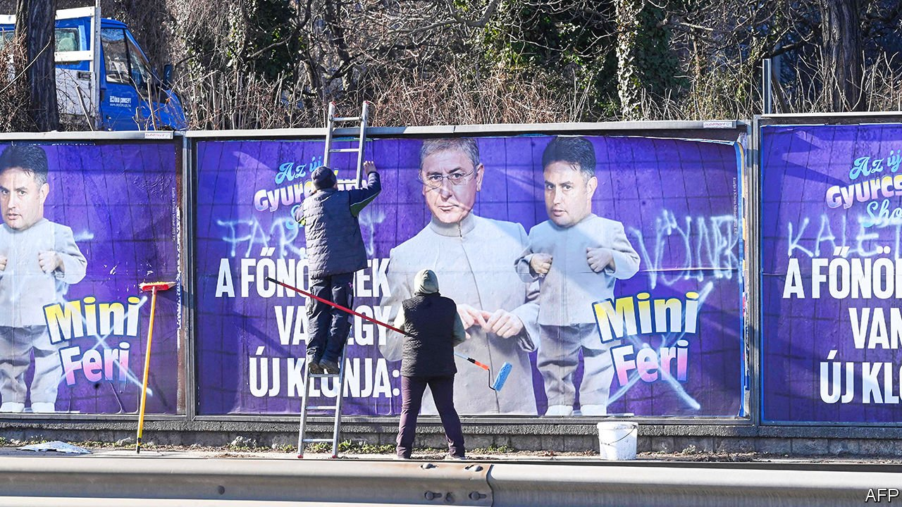

###### Hungary for change

# As Orban runs for re-election, Hungary’s opposition fears fraud 

##### They have some reason to 

 

> Feb 17th 2022 

VIKTOR ORBAN, Hungary’s prime minister and a hero to populists in Europe and America, faces a general election on April 3rd. Hungary’s complicated electoral system has grown more so during Mr Orban’s 12-year tenure. This is no accident: the changes are designed to keep his Fidesz party in power.

In 2014 the share of MPs elected from single-member constituencies was raised to 106 out of the 199 seats in parliament. (The rest are elected by proportional representation.) Single-member districts tend to favour Fidesz, the biggest party—the more so as they have often been gerrymandered. In 2018 Fidesz won 91 of them. Overall, it translated just under half of the popular vote into a two-thirds majority in parliament, a supermajority that has allowed Mr Orban and his cronies to change the constitution, pack the courts and channel billions of euros in EU aid to their allies.


This year the entire opposition, from leftists to the hard right, has formed a single list to oppose Fidesz. Polls show the two sides roughly even. With the race tight, the opposition is now more worried than ever about electoral transparency. One concern is that in November the government changed the law to let voters register at any address where they receive official correspondence. This could potentially allow them to shift their registration to close districts, or even to vote twice.

The National Electoral Office calls such fears groundless. It is publishing weekly updates of the number of voters who re-register, in case anything suspicious turns up. Citizens can sign up to help count the vote themselves, notes Attila Nagy, the office’s president, and all political parties can appoint members to district electoral commissions. A civic group called 20k22 is training 20,000 independent vote-counters. ODIHR, a European electoral watchdog, will send a large mission to scrutinise the campaign; it hopes to have 200 observers on election day.

Yet even if fears of cheating prove overblown, Fidesz will still have an unfair edge. It has granted voting rights to ethnic Hungarian minorities in neighbouring countries. They are allowed to vote by mail, and they mostly back Fidesz. Hungarians who emigrate, however—who tend to be highly educated and to vote against Fidesz—must vote in person at consulates abroad.

More important is the tilted media playing field. State broadcasters peddle Fidesz propaganda; the private media are almost entirely in the hands of Mr Orban’s allies. On election day the government will stage a referendum asking voters leading questions, such as “Do you support the unrestricted exposure of underage children to sexually explicit media content that may affect their development?” (implying the opposition do). Meanwhile billboards in Budapest portray Peter Marki-Zay, the opposition’s prime ministerial candidate, as the “Mini-Me” of a reviled former leader.

For attention the opposition relies on social media and street campaigns, says Bernadett Szel, a liberal MP who lost her district in 2018 by a quarter of a percentage point. She got into parliament on her party’s proportional list, but winning her district would have given them one more seat. “We weren’t organised enough. Now we know it’s an unfair game.” ■

