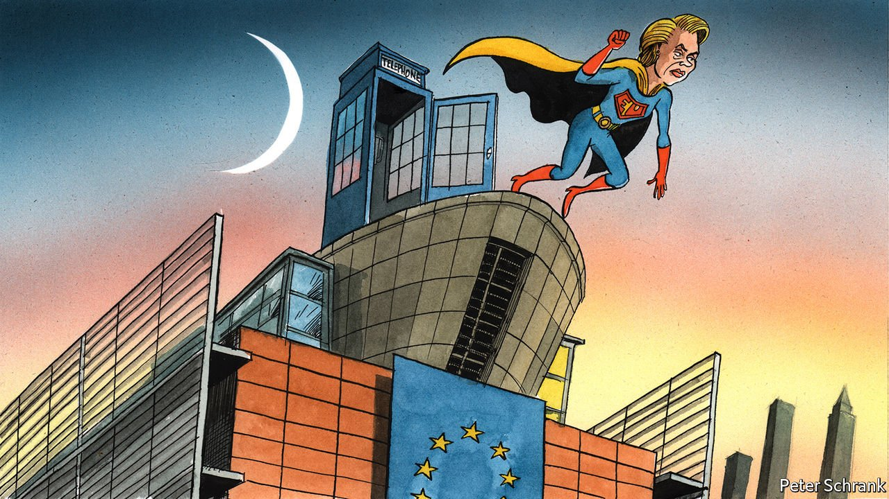

###### Charlemagne

# Europe is using newfound powers to bring Poland into line 

##### Other troublesome members may be next 

 

> Feb 19th 2022 

MOST GOOD superhero movies have a scene in which the protagonist discovers—often after some freakish accident—that he or she has developed amazing new powers. The first attempts to use these new powers are unsatisfactory. Shirts are accidentally torn to shreds and bedrooms covered in spider-web. Given time, however, the new abilities are tamed, then mastered. Audiences soon forget how the unlikely powers were acquired and enjoy the crusade, caped or otherwise, for justice and order.

Politicians who dream of being superheroes imagine being able to bend foes to their will. How easy life would be if troublemakers quietly fell into line. Look at Europe today, and a superpower may be sprouting. For years Poland has been needling the European Commission, which enforces the treaties binding the 27 member states of the EU together. Since coming to power in 2015 populists in Warsaw have neutered the judiciary and placed judges firmly under the thumb of the government. For a time the commission wimpishly spluttered about the vital role of the rule of law in Europe, even as its threats and ultimatums were gleefully defied. No longer. Twice this month the Polish authorities have offered to climb down, agreeing to reverse their judicial measures in much the manner the EU has demanded.


For a hint as to why Poland is suing for peace, look to high politics and lowbrow entertainment. The high politics is the sabre-rattling in Ukraine, Poland’s neighbour. Periods of geopolitical tension are no time to alienate allies; Ukraine is a refugee crisis in the making for Poland. Perhaps mindful of Russian troops posted in next-door Belarus, President Andrzej Duda earlier this month suggested Poland “should close all disputes that exist as soon as possible”. A long-running spat involving a Polish lignite mine spewing smog into the Czech Republic has been hastily settled. A media-ownership law America didn’t like was also shelved.

The lowbrow bit is the story of the EU’s budding superpowers. For years the commission has faced a gap in its authority. Countries that wanted to join the club could be made to commit to liberal democratic standards, such as free speech and independent courts. This gave the EU lots of leverage: follow the rules or you stay on the outside. But once the aspirants were allowed in, as Poland was in 2004 alongside several former communist-bloc neighbours, the muscles in Brussels atrophied. There is a procedure to punish member states that flout the norms they had once signed up to, but it requires near-unanimity to impose. The biggest sanctions are a loss of voting rights in a bloc that prides itself on reaching consensus. That is less fearsome than, say, being able to strike down your enemies with lightning.

As with many superheroes, it was a freakish accident of nature that gave the EU its new powers. The turning point in its case was the pandemic. One of the bloc’s responses to covid-19 was the Next Generation fund (NGEU), a €750bn ($853bn) pot of grants and loans earmarked mainly for poorer countries. Poland has long been a recipient of vast EU largesse, as anyone who has driven on its fine new highways can attest. But withholding funds that member states can tap as part of the normal union budget is complicated. When it comes to NGEU, the commission has essentially full discretion as to whether Poland is a worthy recipient. So far, it has pointedly refused to dole out any cash, even as other countries are seeing their exchequers replenished with NGEU money. That is €36bn in loans and grants that Poland could tap if Brussels says so, enough to boost Polish GDP by around 2% in the coming years.

To make matters worse for Poland and the EU’s other miscreants, on February 16th the EU’s top court endorsed rules that allow the commission to withhold even old-fashioned European funds, such as those paid to boost poor regions, from members it thinks are flouting their rule-of-law obligations. That comes on top of the existing ability to levy fines on those breaking EU rules; in one such case against Poland penalties are now running at €1m a day.

Pole-axed

Like Peter Parker fumbling with his new web-weaving abilities, the Eurocracy needs time to adjust to these new powers. For it is not just rule-of-law violations that could be addressed. In the past Brussels railed against member states not abiding by euro-zone debt and deficit rules. The weighty rulings it produced had all the impact of a report issued by a think-tank: praised as obviously sensible, then swiftly forgotten. Now Eurocrats can ensure their recommendations are listened to, lest dollops of NGEU money be withheld. Pow!

There are limits to these newfound powers. Poland has made good use of European funds, so their withdrawal would be felt by voters and make the government less popular. It is therefore keen to mollify Brussels. By contrast Hungary has squandered EU cash on projects that benefit cronies of the prime minister, Viktor Orban. A squeeze would hurt them, but affect Hungarian voters rather less. So Mr Orban has more leeway to ignore Brussels’s nagging about his serial rule-breaking. His government denounced this week’s ruling as “politically motivated”.

A more humdrum constraint is whether the EU wants to use these powers at all. Eurocrats wielding such awesome authority willy-nilly might raise questions about accountability; big member states such as Germany have long pushed for a soft approach on rule-breakers. Poland has power too, or thinks it does. It has threatened to derail the bloc’s agenda. But that is mostly a hollow threat given that so much EU business is veto-proof these days.

The contours of the EU’s victory against Polish judge-nobbling remain unclear. The populist government may struggle to muster a fractious parliament to endorse its climbdown. Critics deem the measures insufficient; the commission seems confident it can push for even more concessions. Poland may stay defiant. But the Eurocrats in Brussels look a lot more powerful than they did. ■

Read more from Charlemagne, our columnist on European politics:

 (Feb 12th)

 (Feb 5th)

 (Jan 29th)

