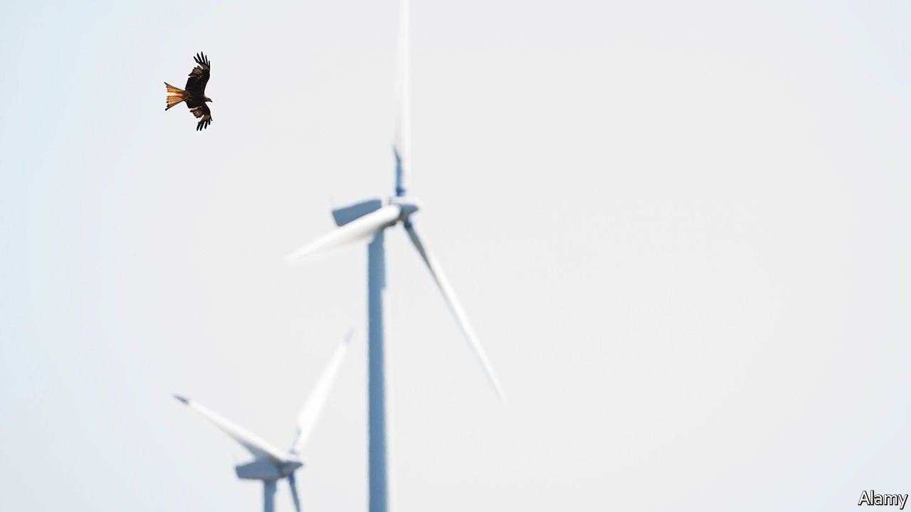

###### Robert Habeck’s odyssey

# Germany’s plans for wind power are dauntingly ambitious 

##### And green-on-green arguments aren’t helping 

 

> Feb 17th 2022 

“WIND ENERGY is Schmarrn [nonsense],” exclaims Albert Köstler in his earthy Bavarian vernacular. He became hostile to wind power as mayor of the small town of Neualbenreuth, near Germany’s Czech border. Having reinvented itself as an attractive spa town, Neualbenreuth fought to prevent wind farms from spoiling the view for tourists. Now Mr Köstler’s scepticism has curdled into frustration with the pushy investors and plemplem (“crazy”) politicians who wish to stud the landscape with turbines. Bavaria’s vistas tend to inspire NIMBYism in locals, admits Roland Grillmeier, chief administrator of the nearby Tirschenreuth district. But he shares their concerns.

 


On current form, Mr Köstler has little to worry about. Last year just eight turbines were erected in Bavaria, Germany’s largest state. Indeed, where vast subsidies and legal guarantees had once turned Germany into Europe’s wind-power heavyweight, construction of turbines has lately ground to a near-halt (see chart). In the first half of 2021 coal overtook wind as the leading electricity source in Germany.


That is set to change. Decarbonising German industry and energy is the guiding project of the three-party “traffic-light” coalition that took office in December. As part of its goal of turning Germany carbon-neutral by 2045, the government pledges that 80% of electricity will come from renewable sources by 2030, up from 42% today. Because demand will rise, that implies a 120-150% growth in renewables.

Wind is central to that effort. The government wants to have more than 100GW of onshore wind power installed by the end of the 2020s. Account for the removal of old turbines, and that means more than doubling the current capacity, of 56GW, in eight years. By law, 2% of German territory will be set aside for wind turbines. “The face of the country is going to change,” said Robert Habeck, the Green vice-chancellor, whose climate-and-economy ministry will push the rollout. Even lobbyists are taken aback by the scale of the ambition.

Hurdles lie ahead. In Germany’s federal system NIMBYs have the ear of state governments, nowhere more than in Bavaria, where since 2014 turbines have had to be placed a minimum distance of ten times their height from settlements. German industry is concentrated in southern states like Bavaria; but the northern coast is windier. Rather than scrap the “10H” rule, Markus Söder, Bavaria’s pugnacious premier, thinks Germany should invest in more north-south grid capacity.

But the federal government says every state must do its bit. To press the point, Mr Habeck has embarked on an “ecological patriotism” tour of all 16, starting with a testy visit to Mr Söder in Munich. Because wind power brings revenue and rent, communities are often split. Mr Habeck says Germans should discuss his plans around their kitchen tables. Mr Grillmeier says he looks forward to a “thrilling” debate.

A second problem is the bureaucratic tangles and skill shortages that clog infrastructure planning across Germany. Under staffed municipalities fearful of lawsuits are often ill-equipped to handle complex applications. Environmental checks run in circles. Even upgrading existing turbines often means a whole new approval process. The typical application takes four years, and their numbers will grow. The government vows to halve that period.

Then there is the red kite, an iconic bird of prey whose flight patterns leave it peculiarly vulnerable to death by turbine. On a chilly winter day Martin Kolbe, head of the Red Kite Centre in Halberstadt, a town in the eastern state of Saxony-Anhalt, points out a handful of the fork-tailed birds arcing gracefully over the bare trees. Birds are well protected in German law (to a fault, say wind groups). But studies still find a negative correlation between the numbers of wind turbines and red kites in a given area. Gory pictures of decapitated birds are a staple of anti-wind campaigns.

More turbines will mean more dead birds. That will intensify “green-on-green” tensions between climate activists and conservationists. The government wants to shift from a legal framework that protects individual creatures to one that preserves species numbers, and to tweak the relevant EU directives. It will also enshrine a “public interest” principle giving renewables priority over animal or landscape protection. National conservation groups accept that Germany needs wind power. But their local affiliates tend to be testier. Mr Kolbe, a measured sort, says some of his conservationist peers are deeply concerned. “This will be an extremely painful discussion,” says one observer.

For now Mr Habeck will treat Germany’s states as allies in his quest to get to 2%. But should some demur, the federal government could remove their powers to impose distance rules. Some expect it to convene a wind summit where state politicians will haggle over how to reach the national target. Lawsuits are likely, political bunfights certain. Yet ministers are quietly confident. “The politics of wind have changed,” says Patrick Graichen, one of Mr Habeck’s deputies. “A few years ago this was dominated by NIMBYs and protesters. Now German industry knows it needs cheap power, and the states are moving.”

Germany’s Energiewende (energy transition) has been full of wrong turns and expensive missteps like the closing of its nuclear plants. But if it can get this phase right, it could prove a model for other industrialised democracies weaning themselves off fossil fuels. Mr Habeck has not tried to sugarcoat the scale of the transition. Yet Mr Köstler, for one, will take some convincing. “If I was Söder I would have sent Habeck all the way back to Berlin,” he cries. “By bicycle!” ■

