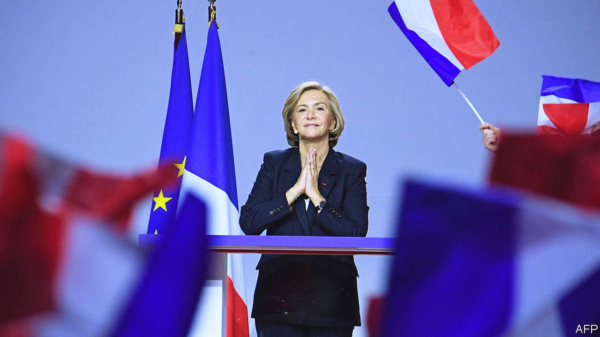

###### The Pécresse file

# Meet Valérie Pécresse, the French centre-right hopeful 

##### Her campaign is in trouble, but she fights on 

 

> Feb 19th 2022 

“MMMM, A NICE baguette from the Ardennes!” declares Valérie Pécresse, tearing off a chunk of the warm crusty loaf she has just bought at a boulangerie and popping it into her mouth. The centre-right Republicans’ presidential candidate, and head of the greater Paris region, has taken her campaign to the valleys and forests of north-eastern France on a recent weekday. In the village of Signy-l’Abbaye, no shop or café goes unvisited. As Mrs Pécresse breezes in and out, clutching her loaf, some locals seem bemused. The manager at Le Gibergeon restaurant confesses beforehand to having no idea who the visitor is, but is later charmed. “Oh yes, I recognised her from the telly,” she says. “It would be good to have a female présidente.”

After winning her party’s primary in December, Mrs Pécresse recorded a poll bump that made her the most serious contender against President Emmanuel Macron at France’s two-round election in April. Polls still suggest she would do about as well against the president in a run-off as would the nationalist-populist Marine Le Pen (though he is tipped to beat either), and much better than the far-right Eric Zemmour. Yet Mrs Pécresse’s first-round numbers have fallen, and her campaign has stalled. On February 13th, at a glitzy rally in Paris, she put in a wooden performance that was criticised even within her camp. The clear danger for Mrs Pécresse is that she will fail to make the run-off at all.


Out in the Ardennes, with its family-run dairy and cattle farms, locals list their troubles: the price of petrol, the distance to the nearest hospital. In and out the former budget minister goes, stopping for coffee in a café and a beer in a bar. A graduate, like Mr Macron, of the Ecole Nationale d’Administration, France’s elite technocratic training college, Mrs Pécresse is well briefed, serious, and tough in debate. But she also knows how to listen. “She was self-confident, very attentive and listened a lot,” says a retired woman in the village. Later, at a town-hall meeting in an industrial warehouse 25 kilometres (16 miles) away, a participant says: “She’s much nicer than she seems on the television.”

Smart, tough and nice, however, may not be enough. Mrs Pécresse is running into two difficulties as she seeks to become France’s first female president. The first is that, on stage, she does not light up a room. After a day campaigning in the Ardennes, she heads for a rally in the town of Charleville-Mézières, where Ms Le Pen topped first-round voting in 2017. A professional crowd-pumper chants “Valérie! Valérie!” as the candidate enters the hall. A mostly grey-haired audience tentatively joins in. At her Paris rally, packed with over 7,000 supporters, Mrs Pécresse gave a stilted performance. The next day she confessed to being “more at ease” in conversation.

The other is her political positioning. Mrs Pécresse instinctively belongs to the moderate, pro-European centre-right and was once seen as a potential recruit to Mr Macron’s government. Yet she secured her nomination by defeating Eric Ciotti, a party right-winger, in the primary run-off. He embraces the “great replacement” theory—adopted as a slogan globally by white supremacists—that foreign populations threaten to replace the “indigenous” French. To try to keep this broad church together, Mrs Pécresse nods in Mr Ciotti’s direction. At her Paris rally she deplored Mr Macron’s “failure” to forbid athletes from competing while wearing the Muslim headscarf, and referred, albeit ambiguously, to replacement theory.

Mrs Pécresse denies that she has hardened her line, arguing that she has always been proud of being on the right, and tracing her lineage to Jacques Chirac, a Gaullist former president and her mentor. She calls herself “two-thirds Merkel and one-third Thatcher”, and a feminist. “I know how to be firm, but also how to hold dialogue,” says Mrs Pécresse during a break on the Ardennes trail, dismissing Mr Macron as “Blairite”, a “left-wing liberal” and a “candidate of the cities”. Her project, she insists, bears “no similarity to Macron’s”.

 


Yet many centre-right voters are confused. They are drawn to Mrs Pécresse’s fiscally prudent vow to curb public spending, which has soared under Mr Macron during the pandemic, as well as to trim the 5.6m-strong French civil service by a net 150,000 jobs and raise the state retirement age from 62 to 65 years. But such voters are put off by her nationalist tone on the need to “stop uncontrolled immigration”, and by her attacks on Mr Macron’s broader economic management, which she calls “calamitous”. The economy last year grew at its fastest rate for half a century.

Amid these contradictions, Mrs Pécresse’s campaign is fraying. In recent days she has lost Eric Woerth, the Republicans’ former budget minister, who now backs Mr Macron, as does Natacha Bouchart, the Republicans’ mayor of Calais. At the other extreme, Guillaume Peltier, a former party vice-president, has quit for Mr Zemmour. Even Nicolas Sarkozy, the Republicans’ former president, has declined so far to offer public support for la candidate.

Perhaps voters just find it difficult to relate to Mrs Pécresse, who lives in Versailles and was privately educated in the swanky Paris suburb of Neuilly-sur-Seine. Her most rebellious moment was the time she spent, rather improbably, as a teenager in Soviet youth summer camps, after falling in love with Russian literature. To this day, she can speak the language. “I’ve always been very intrepid,” she says.

The risk for Mrs Pécresse is that she now loses momentum. Mr Zemmour has crept past her in two new polls. When Mr Macron confirms his candidacy, which is expected any day now, the campaign dynamics may shift again. “There’s been a lot of criticism of Macron during the pandemic,” says a retired railway worker in Signy-l’Abbaye. “He’s arrogant, but he hasn’t managed things too badly.”

Mrs Pécresse, meanwhile, is off again on her campaign “à la Chirac”, a candidate who delighted in rural French life. Leaving the boulangerie in Signy-l’Abbaye, she asks the baker the secret of a good loaf. “You need patience, you need time for the flavour to develop,” he replies. Time which, for Mrs Pécresse, may be running out. ■

For more coverage of the French election, visit our dedicated 

