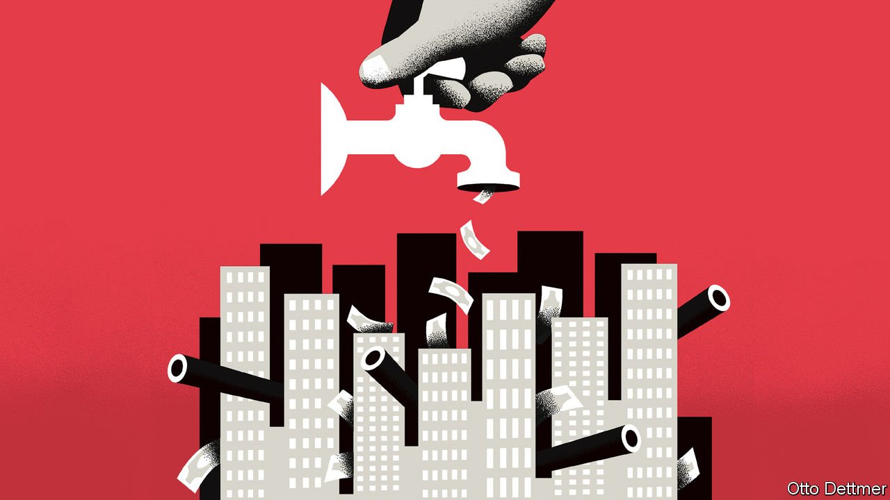

###### Free exchange

# A new history of sanctions has unsettling lessons for today 

##### Sometimes they create the problem they are trying to solve 

 

> Feb 19th 2022 

JUST AFTER the end of the first world war and the dissolution of Austria-Hungary, one observer noted that “every clock in Prague [was] gone, melted for the metals.” Another, in Vienna, saw children “wrapped in paper, for want of sheets and blankets”. At the time much of Europe was under strict economic sanctions, as western powers tried to hold the post-war peace and restrain communism. It was the first time that the “economic weapon”, the title of Nicholas Mulder’s new book, had been used, but by no means the last. By the 2010s a third of the world’s population lived under sanctions. Prominent among the current targets is Russia, which will face further sanctions if it invades Ukraine. Mr Mulder, of Cornell University, looks at sanctions over the three decades after the first world war—and reaches unsettling conclusions.

Economic war against civilians is a centuries-old phenomenon. During the Hundred Years’ War English troops launched countless brutal sieges against French garrisons, often starving them into submission. Blockades were an important part of the toolkit of the naval wars of the 18th century. Sanctions were and are different. Rather than being imposed by one country on another, they often involved groups of countries coming together to punish rogue states. The formation of the League of Nations in 1919-20 made co-ordinated action easier. And rather than being seen as an act of war, sanctions were often supposed to prevent it.


Sanctions were also the product of the first great wave of globalisation. In the 70 years to 1914 trade flows rose from 5% of global GDP to 14%, then an all-time high. With economies ever more integrated, like-minded governments had many points of leverage over renegades, whether by denying them the supply of crucial raw materials or by refusing to buy their goods.

The role of finance truly distinguished sanctions from previous economic warfare. In 1870-1914 annual capital flows averaged 4% of global GDP. The Allied powers controlled the world’s main financial centres. Economists, as well as traditional military types, thus helped design sanctions. They aimed to hit aggressor states where they were weakest: in their financing requirements.

Mr Mulder’s book is filled with anecdotes of how sanctions worked in practice. As signs of impending war grew in 1935, Italian companies such as Pirelli (tyres), Fiat (cars) and Montecatini (chemicals) were denied financing for their import needs by the Bank of England. By August 1941 expansionist Japan was cut off from the rest of the world economy, having lost 90% of its foreign oil supply and 70% of its trade revenues. Enforcing sanctions required a great deal of effort in a world of increasing financial ingenuity. In the late 1910s Banco Holandés de la América del Sud, a Buenos Aires subsidiary of a Dutch bank, used five different names to undertake transactions for various Latin American subsidiaries of German banks.

William Arnold-Forster, a British administrator, argued that sanctions could “make our enemies unwilling that their children should be born”. Indeed, they could have horrific effects. Of the three main weapons targeting civilians during the period—air power, gas warfare and economic blockade—blockade was by far the deadliest, Mr Mulder argues. “Pens seem so much cleaner instruments than bayonets,” Arnold-Forster wryly noted.

Whether sanctions achieved their objectives was another matter. Small countries could be bullied into obedience, such as on two occasions in the 1920s, when the threat of sanctions stopped skirmishes in the Balkans from escalating into wider war. Bigger powers were tougher nuts to crack. Overall, “most economic sanctions have not worked”—the first lesson of Mr Mulder’s book. Most significantly, they did not stop Germany from choosing war.

Sanctions sometimes failed because of insufficient political will. For a long time American opinion had it that sanctions were fundamentally un-American, an anachronistic form of European-style imperialism. In other cases financial globalisation constrained, rather than widened, sanctioners’ room for manoeuvre. Britain refrained from imposing a severe financial blockade of Nazi Germany in the mid-1930s in part because British banks held huge amounts of German debt. In the event of sanctions the Reich would stop servicing this debt, and British financiers worried that the City would face a solvency crisis.

The second lesson of Mr Mulder’s book is that sanctions can have unintended consequences. By the 1930s global politics and economics had radically changed from the 1920s. The Great Depression had sent many governments down a protectionist route. Global trade was in a long slump. Fascism was on the march.

Doom loop

Sanctions, Mr Mulder shows, added fuel to the fire. Governments that believed themselves vulnerable to sanctions withdrew even further from the global economy, in order to secure strategic independence. In the 1930s Japan sought to develop a “yen bloc”, an economic zone including Korea and Taiwan, so as to reduce dependence on the Allied powers. In the mid-1930s Germany gunned for “raw-materials freedom”, in part via the construction of massive capacity for the synthetic production of oil. (Anyone witnessing Russia’s efforts in recent years to wean itself off Western finance may conclude that nothing much has changed.) It also necessitated conquest. “I need Ukraine”, said Adolf Hitler in 1939, “so that they cannot again starve us out like in the last war.”

In that sense the international search for effective sanctions and the ultra-nationalist search for autarky “became locked in an escalatory spiral”. Sanctions did not work in a deglobalising world, and contributed to its continued fracturing, in turn setting the stage for the second world war. Mr Mulder is too careful a historian to labour the parallels between what happened in the inter-war period and today, when geopolitics is once again fractious and globalisation is in retreat. But the lessons are sobering. ■

For more expert analysis of the biggest stories in economics, business and markets, , our weekly newsletter.

