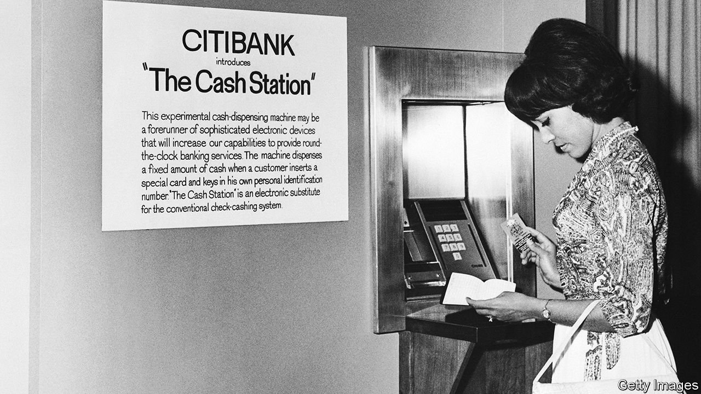

###### The Citi that was never finished

# Citigroup is disposing of its international retail network 

##### The sale marks the end of a remarkable experiment in global finance 

 

> Feb 19th 2022 

THE “DILLY-DALLYING”, to use the term put forward by Jane Fraser soon after taking over Citigroup in early 2021, is almost over. Outside America and a few international centres, the distinctive blue branches that were once common features of big cities around the world will soon be vestiges of another era, much like black, yellow and red Kodak signs. The New York-based bank, which built a reputation over decades as a global consumer giant, is in retreat. From now on it will focus primarily on commercial banking and wealth management, serving large and medium-sized businesses and millionaires. The retail branches it retains will mostly be concentrated in a few domestic markets, such as New York and California.

A series of announcements have already been made: in August the sale of the Australian retail operations to National Australia Bank; in October the wind-down of those in South Korea; in December the sale of its Philippine business to UnionBank of the Philippines; in January a disposal of Indonesian, Malaysian, Thai and Vietnamese branches to Singapore’s United Overseas Bank (UOB), whose chief executive, Wee Ee Cheong, remarked that in a single deal his institution had added what it had taken “even Citi” half a century to build; and, also in January, the sale of Citi’s consumer business in Taiwan to DBS, another Singaporean bank.


The remaining announcements are expected to come soon. One of the most important will be about India, where Citi has long had an outsized influence; Axis Bank, India’s third-largest private-sector lender, is rumoured to be close to picking up the business for around $2.5bn. Operations in China, Russia, Poland and Bahrain are still in play. Added to the disposal list recently has been the wholly owned Banamex, Mexico’s third-largest bank. Delay would only erode whatever value remains in these operations as employees and customers look for a stable home.

Citi’s retreat is not unique. HSBC, which came closest to having Citi-like global ambitions in retail banking, has pared back—though not as dramatically, at least in part because its core market, Hong Kong, is much smaller than Citi’s. Australia’s ANZ gave up on a pan-Asia strategy six years ago. Like Citi, these banks have kept offices around the world for corporate business, from lending to treasury services.

As a result, it is tempting to view Citi’s retreat as just another failed attempt at world domination in consumer banking. But it differs from past failures in two respects: the sheer ambition behind the initial expansion, and the legacy it leaves in retail-banking markets around the world.

Important to Reed

The expansion was premised on rethinking global finance, with a vast network serving everyone, everywhere, in every way. As with many ambitious plans, Citi’s global push was in response to problems at home. In the 1970s, regulatory restraints resulted in a retail-branch network that was limited to New York City, unprofitable and unable to provide the funds Citi wanted for its lending business. While on holiday, John Reed, a senior executive, wrote a seven-page “memo from the beach” arguing that one option would be for Citi to dump retail banking altogether, a path later taken by Bankers Trust (now part of Deutsche Bank), Bank of New York and Boston’s State Street, among other institutions. The other option was to go very big.

Mr Reed posited that rather than thinking about retail banking as deposits and loans, Citi should answer the expansive financial needs of families, whatever they may be. Through “success transfer”, as the bank dubbed it, solutions developed in one market could be rolled out in others, creating economies of scale where they would not exist in a self-contained local institution. The bank came up with a clever slogan to fit: “Citi Never Sleeps”.

Years of heavy losses were incurred to create a new form of retail banking, components of which are now so familiar that it is hard to imagine they once didn’t exist. These included ATMs (Citi was the first big American bank to introduce customer-friendly machines at scale), credit cards (of which it went on to become the world’s largest issuer) and electronic payments (which it was one to the first to offer to retail customers).

Citi’s reputation as a driving force in financial technology stretched into the 1990s, when more than a million customers received floppy disks biannually with software updates, enabling proto-internet banking. Aware of the identification challenge that existed in a transition from human contact in branches, the bank experimented with the retina-scanning technology that, along with facial recognition, is only now becoming common.

These innovations helped drive international expansion. Mr Reed became the bank’s chief executive in 1984 and an ever-wider array of markets were opened, extending from Nigeria and Sweden to (via a Hong Kong acquisition) Thailand, as well as particularly swanky efforts in London and Geneva. The bank opened a representative office in Beijing, too. Augmenting the branches were call, processing and innovation centres in numerous places, including Silicon Valley, the Philippines and perhaps most importantly India, where they played a critical role in germinating the country’s vibrant technology-outsourcing industry.

The bank’s drive was a magnet for bright people. Alumni included a former prime minister and the current finance minister of Pakistan, a former central-bank governor of the Philippines and the future leaders of innumerable financial institutions, including the largest private-sector bank in India in terms of assets, HDFC Bank—whose market capitalisation alone is more than 90% of Citi’s—and DBS, whose present chief executive came to the bank after being a star at Citi.

In many ways this reflected Citi’s success but it also illustrated its vulnerability. “Success transfer” ultimately meant creating capable competitors. Local regulators created their own obstacles, limiting the rights of foreign banks to open branches or link international accounts, thereby undermining economies of scale. Technological innovation dimmed after Mr Reed’s departure in 2000. Rivals, including those run by former Citibankers, copied Citi’s innovations, sometimes improving on them or offering them more cheaply.

Then came the global financial crisis in 2007. After incurring huge losses on over $300bn of risky assets, Citi required a bail-out—revealing that, in a pinch, it was an American, not global, institution. This was underscored by stringent new domestic regulations complicating, when not blocking, international transactions.

That began a long period of contraction. Early to go was the German retail operation, for $7.7bn, then others in Turkey, Brazil, Egypt and over a dozen other countries. It was as if the United Nations of banking was being unwound. The Asian and Mexican operations remained, each in different ways offering much potential. But Ms Fraser, who joined the bank in 2004 and was less tied to the old strategy, concluded that the bank lacked the scale needed to compete in many of its markets.

A striking feature of the final reckoning has been how little the Asian operations really mattered to Citi’s results. Their presence vastly exceeded their financial relevance: the Asian businesses that are being sold accounted for only 1.6% of group earnings in 2021. This helps explain the paucity of bidders. None of the businesses have been bought by Standard Chartered or HSBC, and their own far-reaching operations are now questioned. Years ago JPMorgan Chase’s boss, Jamie Dimon, formerly of Citi, considered replicating its global network, only to conclude that building a retail business market by market wasn’t viable. It is also striking that Chinese banks, the new Goliaths, have made barely any effort to build foreign retail operations.

Buyers of Citi’s Asian assets, to the extent they have emerged, are fully or somewhat local. True, Singapore’s DBS and UOB have been willing to acquire abroad, but Taiwan and Vietnam are hardly far-flung, especially for banks whose home market is small and serves as a hub for Asian finance. Local and regional consolidation would seem to be more reflective of the times.

Systemic rewards

As Ms Fraser pushes on with the dismantlement, there will doubtless be gnashing of teeth within an institution that looks to many outsiders like a shadow of its former self. It may be some consolation to current and former Citibankers that the technological components of Mr Reed’s vision have been taken up both through interlinkages in the global financial system—ATMs and credit cards have long been ubiquitous—and through fintech operators such as Grab in Singapore, Ant Group in China and Wise in Britain, that enable electronic payments and remittances. Citi’s experience, in short, suggests that the benefits of globalised finance can be more easily enjoyed by the system as a whole than by any single institution. ■

For more expert analysis of the biggest stories in economics, business and markets, , our weekly newsletter.

