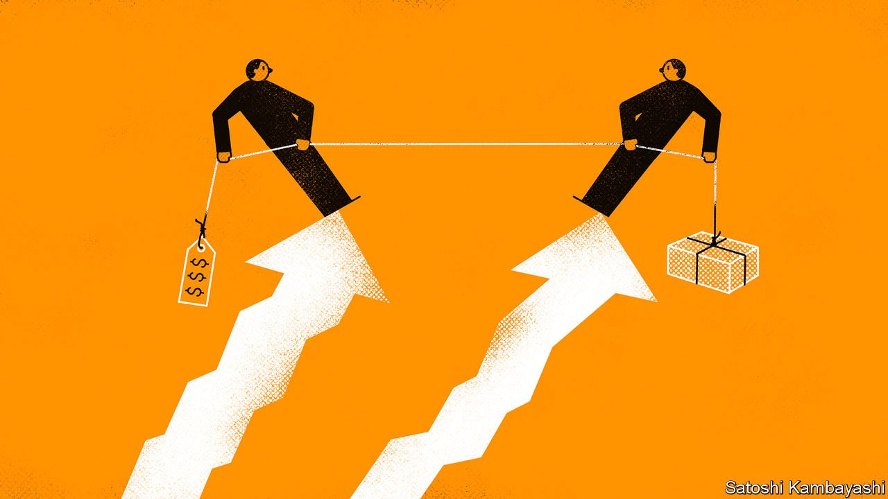
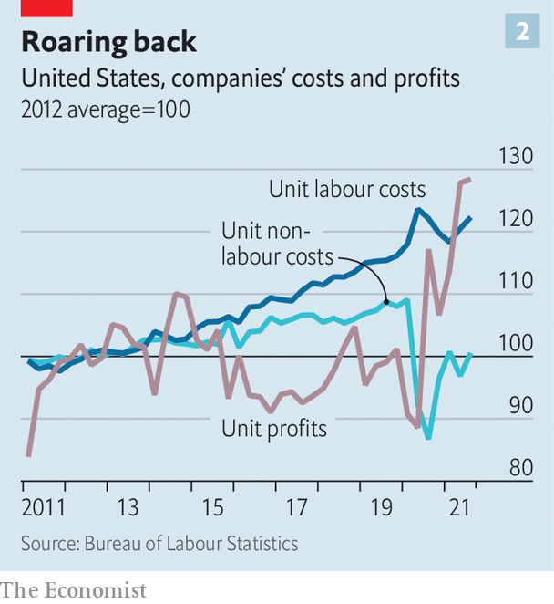

###### The battle of the markups

# Labour v capital in the post-lockdown economy 

##### As prices and wages rise, are workers or firms winning? 

 

> Feb 19th 2022 

“A GOOD COMPROMISE”, the saying goes, “is when both parties are dissatisfied.” Dissatisfaction rages in the post-lockdown economy. Households say that price-gouging companies are jacking up prices, contributing to an inflation rate across the rich world of 6.6% year on year. Companies bat such accusations aside, believing that they are the truly wronged party. They complain that staff have become work-shy ingrates who demand ever-higher wages. Earlier this month Andrew Bailey, the governor of the Bank of England, courted controversy by suggesting that workers should moderate their wage demands—even as he failed to tell companies not to raise their prices.

A “battle of the markups”, between higher wages and higher shop prices, is under way. And there can only be one winner, all else being equal. Broadly speaking, economic output must flow either to owners of capital, in the form of profits, dividends and rents, or to labour, as wages, salaries and perks. Economists refer to this as the “capital” or “labour” share of GDP. Which of the two has the upper hand in the post-lockdown economy?

 


The Economist has compiled a range of indicators to answer this question. First we calculate a high-frequency measure of the capital-labour share across 30 mostly rich countries. In 2020 the aggregate labour share across this group soared (see chart 1). This was largely because firms continued to pay people’s wages—helped, in large part, by government-stimulus programmes—even as GDP collapsed. Advantage, labour.


More recently, however, the battle seems to have shifted in favour of capital. Since reaching a peak in 2020 the rich-world labour share has fallen by 2.3 percentage points. Frustratingly, the data only go up to September 2021—and most economists anyway argue that labour’s share is not a perfect gauge of economic fairness, since it is devilishly hard to measure. The evidence since then suggests that countries fall into one of three buckets, depending on how the battle of the markups is playing out.

In the first camp is Britain. There, underlying wage growth is in the region of 5% a year, unusually fast by rich-world standards. But corporations seem not to have a great deal of pricing power, meaning that they are struggling to fully offset higher costs in the form of higher prices. Digging into Britain’s national accounts, we estimate that the nominal profit in pounds per unit of goods and services sold is only roughly as high as it was in early 2019, even as unit labour costs are rising by about 3% per year. Labour seems to be winning out at the expense of capital. Perhaps Mr Bailey has a point.

The second group consists of most other rich countries outside America. There, neither labour nor capital seems able to triumph. After correcting for pandemic-related distortions Japan’s pay growth appears to be slowing to below 1% a year, suggest data from Goldman Sachs, a bank. Pay settlements in Italy and Spain are treading water, while wage growth in Australia, France and Germany remains well below where it was before the pandemic. Workers in these places are not really joining in with the inflationary party.

But businesses are not soaring either. In Europe pre-tax profit margins, as measured in the national accounts, have risen in recent months but remain below where they were just before the pandemic. In Japan the “recurring” profits before tax of large and medium-sized companies recently returned to pre-pandemic levels. The profits of smaller companies remain well below, however.

In the third group sits America. Here wage growth is rapid, at about 5% a year. But as shown in their most recent financial results, big listed American companies are doing a better job of protecting margins than analysts had expected. A series of unusually large stimulus payments may mean that households are able to absorb the higher prices that companies impose. In early February Amazon said it would increase the price of its Prime membership package by 17% in its home market—even as it chose not to announce price rises in other parts of the world.

Some firms are increasing their margins despite soaring costs. Tyson, an American meat producer, reported an 18% jump in the costs of its inputs in the most recent quarter compared with a year earlier, a 19.6% increase in its average selling prices, and a 40% rise in its adjusted operating profits. It says that rising meat prices have not slowed demand.

 


An economy-wide measure of corporate margins is rising fast. Dario Perkins of TS Lombard, a financial-services firm, breaks down America’s rise in unit prices since the start of the pandemic into companies’ labour costs, non-labour costs and profits. Wages are rising, but nonetheless markups are responsible for more than 70% of inflation since late 2019, he finds (see chart 2). In a recent report, analysts at Bank of America argue that greater pricing power helps explain why American equities have a higher price-earnings ratio than European ones.

Good, you’re all unhappy

The story is not over yet. Some economists wonder if workers will before long demand even higher wages to compensate for higher prices in the shops. There is some evidence of this in America and Britain, where wage growth seems to be accelerating. Businesses’ expectations for future wage settlements remain fairly conservative, though that could soon change. If wages do start to grow more quickly, the cycle of price rises and compensating wage demands might start up all over again. Before long the post-lockdown economy could look like the ultimate compromise—where nobody is satisfied. ■

For more expert analysis of the biggest stories in economics, business and markets, , our weekly newsletter.

