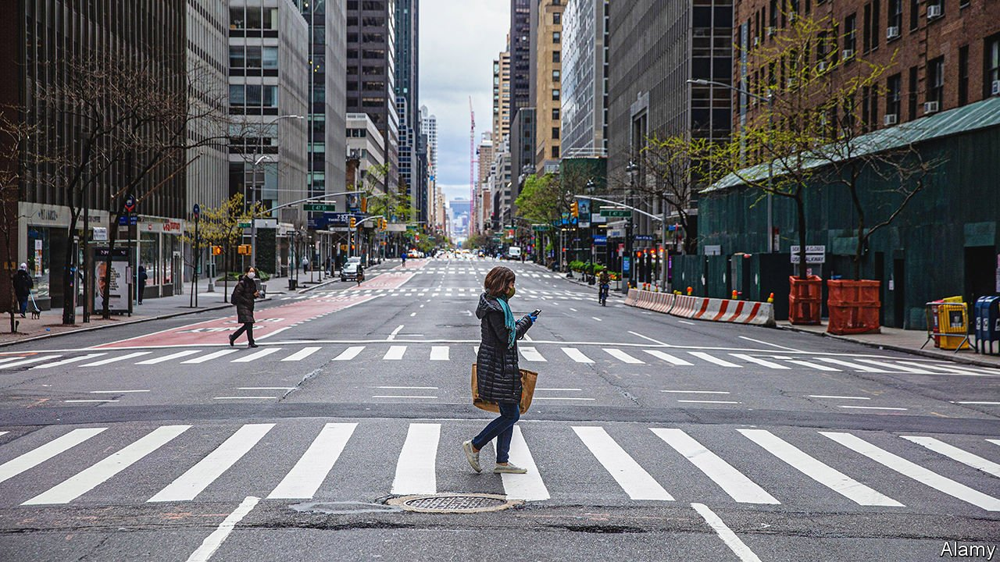
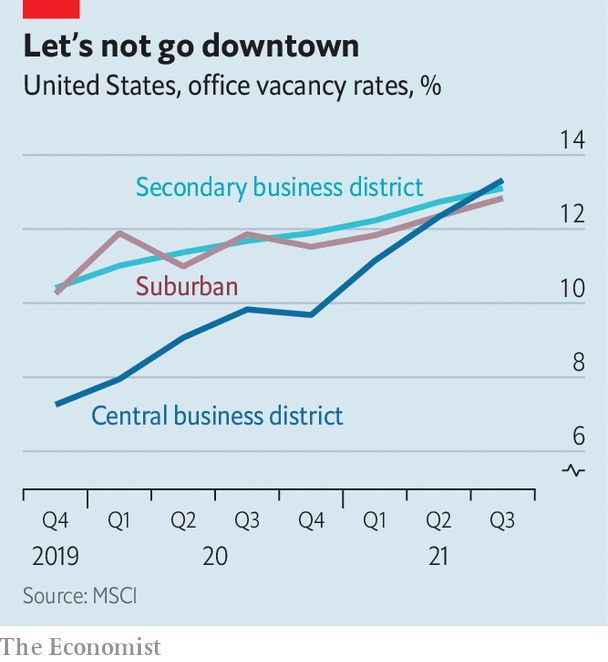

###### Future of cities

# The true cost of empty offices 

##### Property investors are sitting on big losses 

 

> Feb 19th 2022 

CITIES HAVE often bounced back from crises. From pandemics and earthquakes to floods and fires, the world’s urban powerhouses have emerged stronger when faced with adversity. After the Great Fire of London destroyed most of the city in 1666 a raft of fire-safety regulations were ushered in. Builders swapped timber for brick or stone. Walls were made thicker. Streets became wider. When cholera tore through America in the 1850s New York and other cities introduced sewage systems and public parks. As the disease spread to Paris, authorities there too introduced radical public-health measures. Tree-lined boulevards were built, fountains were erected and slums were cleared.

Today’s urban areas face a challenge of a different sort. With the mass return to office work still uncertain, the pandemic has sharpened debate about what the future holds for their commercial hubs. Key business districts such as Manhattan, the City of London, Tokyo’s Marunouchi and La Défense in Paris have borne the brunt of the office exodus. Before lockdowns the 21 largest business districts in the world housed 4.5m workers and around a fifth of the headquarters of Fortune Global 500 companies, according to EY and the Urban Land Institute. When covid-19 emptied offices around the world, most professional work shifted to home offices or kitchen tables. As the pandemic stretches into a third year, the fate of urban business districts remains unclear. Can they continue to attract investment and talent or will new work patterns jeopardise their commercial dominance?


On the face of it, things could have been worse for the owners of gleaming city office towers. Unlike the retail and hospitality sectors, office tenants have mostly continued to pay rent and analysts have retracted many of their worst projections. Leasing activity even picked up in cities like London towards the end of 2021.

The reality, however, is far from rosy. Home-working has hit demand for office space, with vacancy rates rising faster in business districts than anywhere else. Globally, unoccupied offices make up 12% of the total, up from 8% before covid. Across London 18% of offices are vacant. In New York the share is nearly 16%. More than one in five offices in San Francisco are empty. In Hong Kong, where downsizing has become common, net effective rent, which is adjusted for abatements or incentives, dropped by more than 7% in 2021 after falling by more than 17% in 2020.

Rather than lowering rents, landlords are offering more freebies than ever to retain tenants or attract new ones. In Manhattan, cash gifts for tenants—typically used for kitting out new office space—have more than doubled since 2016. Across America, the average number of rent-free months has risen to its highest since 2013. Some property developers remain optimistic, betting that demand for office space will eventually bounce back. But with each new variant of covid-19, plans for a wide-scale return to the office have been delayed, and delayed again. And changing patterns of attendance look set to reduce the overall demand for space.

Financial markets reflect the darkening mood. Offices, particularly in business districts, are rapidly losing ground to better-performing areas of property such as warehouses and apartments. Having traditionally formed the core of commercial-property portfolios in America, offices accounted for less than a fifth of transactions in 2021. Globally, investors spent more on apartments for the first time. Foreign investment into offices also fell below the pre-pandemic average in countries such as America and Australia in 2021. By contrast, foreign investment in warehouses more than doubled in these markets.

Valuations mirror the uncertainty, too. Prices of buildings in business districts have taken a hit even as commercial-property prices have boomed in other parts of cities. In San Francisco’s Financial District, for example, property prices have slumped by nearly a fifth since the end of 2019, according to the latest figures. Across the broader metropolitan area, they have increased by more than 5%. In Manhattan they have fallen by around 8% since the start of the pandemic. Asian cities have fared better. Office prices across Seoul, for instance, have risen by more than a third since the end of 2019. In Singapore they are up by more than a tenth.

 


Most investors take a long-term view, so capital allocated to offices will be locked in for years. But sentiment is shifting away from cities with a large concentration of offices and towards smaller markets with a broader mix of buildings. A survey of investors with assets under management of more than $50bn by CBRE, a property firm, showed a preference in 2021 for markets like Phoenix and Denver over New York and Chicago. The biggest business hubs will no doubt continue to attract large sums: London’s offices are forecast to attract £60bn ($81bn) of overseas capital over the next few years, according to Knight Frank. But deserted office blocks in dense commercial districts will continue to cast an ominous shadow.

Landlords insist concerns are overblown. Despite many buildings remaining stubbornly empty, they maintain that demand for the best space is holding up. True, some prime properties still attract plenty of suitors. Tenants are increasingly swapping ageing office blocks for modern, greener workplaces with better air-filtration systems and higher-quality amenities. But these high-end properties represent 20% or less of buildings in most cities. (They do, however, make up a disproportionate share of investment activity: in New York, just nine out of 69 office transactions accounted for 80% of the total amount invested in 2021.)

The gap between the best assets and the rest of the market will widen further. Refurbishments may rejuvenate some tired-looking buildings. For many older assets, however, inflation, shortages of labour and materials in the construction industry and the high cost of upgrading buildings to meet tougher environmental standards will make it harder to justify the expense.

The consequences for business districts could be far-reaching. The mass departure of bankers, lawyers and other professionals also hurts the cafes, restaurants and other small businesses that serve them. Many were already struggling with supply-chain disruptions, labour shortages and rising costs. Lockdowns cost Sydney’s economy an estimated A$250m ($178m) a week and 40,000 jobs. Across New York City, more than a third of small businesses closed during lockdowns; before the pandemic the sector accounted for over half of private-sector jobs in the city.

Civic slide

Municipal finances, too, are exposed. Dormant offices mean shrinking tax revenues for cities which rely on them to fund public services. Empty offices also put pressure on transit systems. Reduced passenger numbers are projected to leave a £1.5bn hole in the finances of London’s transport authority by 2024. New York’s Metropolitan Transportation Authority, which runs the city’s subway, is forecasting a $1.4bn deficit in 2025 as federal aid is phased out.

Business districts are taking defensive measures. A common approach has been to make them more vibrant, a trend that was already under way before the pandemic. The City of London is proposing more “all-night cultural celebrations”, traffic-free streets on weekends and at least 1,500 new apartments by 2030, while Canary Wharf has added bars, restaurants and pleasure boats to draw in younger crowds. Singapore’s Urban Redevelopment Authority concedes it may need to rethink the mix of buildings in the downtown district, in addition to planning more cycle paths and pedestrianised streets. In America, skyscrapers are opening their doors to the public, offering new observation decks and Instagrammable art installations. Sydney has pedestrianised inner-city streets to use for al fresco dining. Paris, meanwhile, plans to turn car parks in La Défense into “last-mile” delivery hubs. As the world of work evolves, places of work are changing with it. ■

For more expert analysis of the biggest stories in economics, business and markets, , our weekly newsletter.

Dig deeper

All our stories relating to the pandemic can be found on our . You can also find trackers showing ,  and the virus’s spread across .

