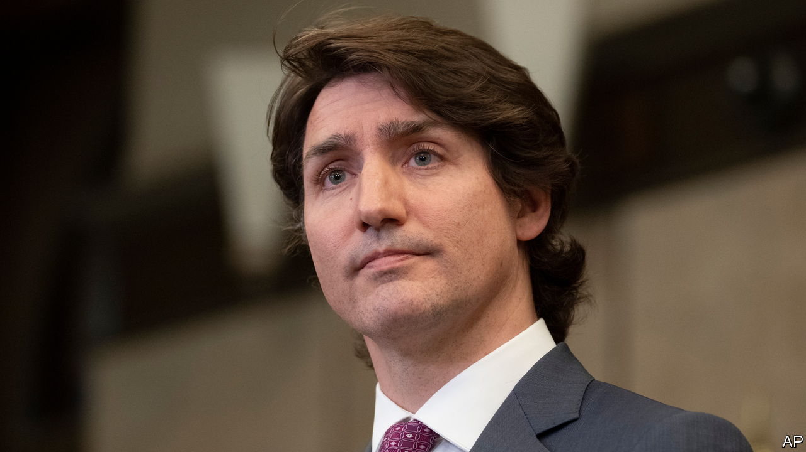

###### No, Canada

# Justin Trudeau’s crackdown on protests could make things worse 

##### By seeking to curb free speech, he will aggravate Canada’s divisions 

 

> Feb 19th 2022 

CANADA’S REPUTATION for impeccable politeness is taking a . In recent weeks crowds of lorry-drivers and other Canadians protesting against covid-19 restrictions have blocked public highways and camped outside parliament in Ottawa. Many wave placards reading “Fuck Trudeau”, referring to their youthful prime minister, though the expletive often appears with a maple leaf as an asterisk. Nastier messages have cropped up, too. One or two protesters carried flags emblazoned with swastikas, perhaps to suggest, absurdly, that Canada’s covid restrictions are akin to Nazism.

The freedom convoy, as the hundreds of lorry-drivers call themselves, was sparked by the introduction of a covid vaccine mandate in January. This requires all truckers who enter Canada from the United States, as thousands of Canadian drivers do every day, either to be jabbed or to endure a two-week quarantine.


Although most Canadians think such rules are reasonable, the protesters have struck a chord with some. A vocal minority are fed up with burdensome pandemic restrictions. Many of the young, who have suffered job losses because of lockdowns designed to protect their elders, are especially grumpy. The truckers have received both verbal and monetary support from abroad. Donald Trump, Fox News and a cacophony of populists praise them. Well-wishers have crowdfunded their cause.

Faced with this ruckus, Canada’s government should have drawn a clear distinction between harmful acts and obnoxious or foolish words. Peaceful protests are fine; blocking crucial highways so that others cannot go about their business is not. Some of the truckers shut down a bridge over which 25% of Canada’s goods trade with the United States passes. The police took six days to remove them. Given that the protest blocked an estimated $350m of trade each day, this was needlessly slow.

The truckers are wrong about the vaccine mandate at the border. Such rules are a reasonable precaution to slow the spread of a deadly and highly infectious disease. Canada’s government is right to enforce them. But the truckers have every right to express their disagreement. A wise government would listen to them and respond politely, taking their complaints seriously and patiently explaining why covid restrictions, though onerous, are necessary for the time being.

Justin Trudeau has done the opposite. First, he refused to meet them. Then, seizing on the fact that a few of the protesters appear to be bigots, he attempted to put all of them outside the boundaries of reasonable debate by condemning “the anti-Semitism, Islamophobia, anti-black racism, homophobia and trans phobia that we’ve seen on display in Ottawa over the past number of days”. The police already have ample powers to quell disorder. Yet on February 14th Mr Trudeau invoked emergency powers under a 34-year-old law that had never been used before. It would allow the government to declare protests illegal and freeze the bank accounts of protesters without a court order.

Meanwhile, his Liberal government is mulling two worrying changes to Canada’s already illiberal hate-speech laws. One would allow Canada’s Human Rights Tribunal to impose large fines on those it deems to have used hateful language. It has in the past taken an expansive view of what counts as hateful, and defendants would enjoy fewer safeguards than they do under criminal law. The other proposed change would let individuals file legal complaints against people pre-emptively, if they fear that they may be about to say something hateful.

These are both terrible ideas. The Economist has long argued that free speech should be restricted only under exceptional circumstances, such as when the speaker intends to incite physical violence. Canada’s laws are already more restrictive than this, and the country’s illiberal left would like them to be still more so. Academics have been suspended or disciplined for writing that Canada is “not racist” or for holding gender-critical views. The proposed amendments would give illiberal activists legal tools to harass conservative religious folk, traditional feminists and many more besides, simply for holding views that the left finds offensive. Worse, it would allow some to be gagged before they speak.

Canada is not yet a rancorous or bitterly divided society. If Mr Trudeau wants to keep it that way, he should stop trying to police Canadians’ thoughts. ■

