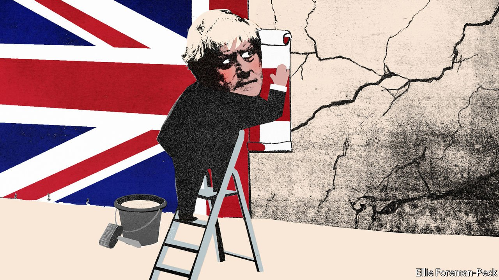

###### Factional dissipation

# The Tories’ problems go deeper than just one man 

##### Boris Johnson is a symptom of Conservative political malaise, not its cause 

 

> Feb 19th 2022 

“YOU MAY only have lent us your vote. You may not think of yourself as a natural Tory.” In his victory speech after the general election in 2019 Boris Johnson acknowledged that he owed his majority to a combination of first-time and long-term Conservative voters, brought together by a desire to end the battles over Brexit and fear of a far-left Labour government under Jeremy Corbyn. Mr Johnson offered unity not just to a divided country, but also to his own divided party, riven by civil war after the referendum. It is now clear that this unity was a façade.

The past few months have been torrid for the prime minister. First he tried a dirty parliamentary manoeuvre to protect Owen Paterson, an old friend and fellow MP, from punishment for his breaches of lobbying rules. Mr Johnson was then revealed to have attended a series of parties during covid-19 lockdowns. Police are now investigating; on February 11th his office confirmed that he was among those required to respond to official questioning. Tory MPs are struggling to muster the courage to call a vote of no confidence. They should: a disregard for the truth and a lack of application make Mr Johnson a poor prime minister. But he is a symptom of what ails the Conservative Party, not the cause. If Britain is to have the government it needs, getting rid of him will not be enough.


After 12 years in power, Conservative MPs have become careless of the law and  protest and rebellion. Instead of governing, they posture and grandstand. Their party used to have a reputation for weaving disparate ideological strands together in order to gain and wield power. Today what was once a broad church is bedevilled by schisms.

The Conservative scofflaws go beyond breaching the covid lockdowns that they themselves imposed. After fighting for a diamond-hard Brexit, the winners took victory as a mandate to ignore rules big and small. In 2019 Mr Johnson suspended Parliament to avoid inconvenient scrutiny of his Brexit plans; the courts concluded this was unlawful. Under his leadership the ministerial code of conduct has become discretionary. His government’s attitude towards the Northern Ireland protocol, a part of the exit deal it struck with the EU that it now finds troublesome, is to threaten to tear it up.

Rather than making peace after the EU referendum, the Brexiteers purged Remainers from government. That left it needlessly short of talent. Britain’s first cabinet in decades to be independent of the EU has the sheen of newness. But underneath its Brexity surface, it is shopworn: entitled, undisciplined and complacent. It lacks fresh thinking and the fear of returning to impotent opposition. Even ministers indulge in the politics of gesture—threatening to defund the BBC for alleged breaches of impartiality rather than soberly reconsidering the licence fee; or proposing to send the Royal Navy to repel irregular migrants crossing the English Channel rather than co-operating with France to stop them setting off.

Just as the government sees office not as a responsibility but as a licence to do as it pleases, so Tory backbenchers lack discipline, loyalty and common purpose. A taste for rebellion is indulged by parliamentarians ranging from grandees (Theresa May, Mr Johnson’s predecessor) to neophytes (an MP elected in December cast a vote against his own government’s pandemic measures just two weeks later). The party has splintered into the sort of noisy infighting more familiar on the British left.

Although some rebellions have just cause, as in the vote against Mr Paterson, they mostly signal a failure of policymaking. On every important issue, from setting tax rates and encouraging regional development to combating climate change and containing covid, an alphabet soup of backbench clusters demand incompatible policies. Factions like the ultra-Brexiteer European Research Group and the anti-lockdown Covid Recovery Group act as an internal opposition; compromise in the service of a functioning government is a lesser part of the job.

Governments everywhere are struggling with the effects of ageing populations and the pandemic’s social, medical and financial aftershocks, even as the drums of war beat on Europe’s eastern flank. For Britain, the rupture of Brexit poses an extra challenge—as well as some opportunities. A government with a 77-seat majority should be well-placed to benefit. But instead of picking a prime minister with the Conservative genius for welding together disparate parts, the party plumped for Mr Johnson, who wound them in duct tape.

A two-party political system requires competence from both sides. One reason the Conservatives gained that thumping majority in 2019 was the spectre of Mr Corbyn, who came close to destroying Labour. It is a tragedy for Britain that the Conservatives, who pride themselves on being the natural party of government, are now so poor at running the country. ■

