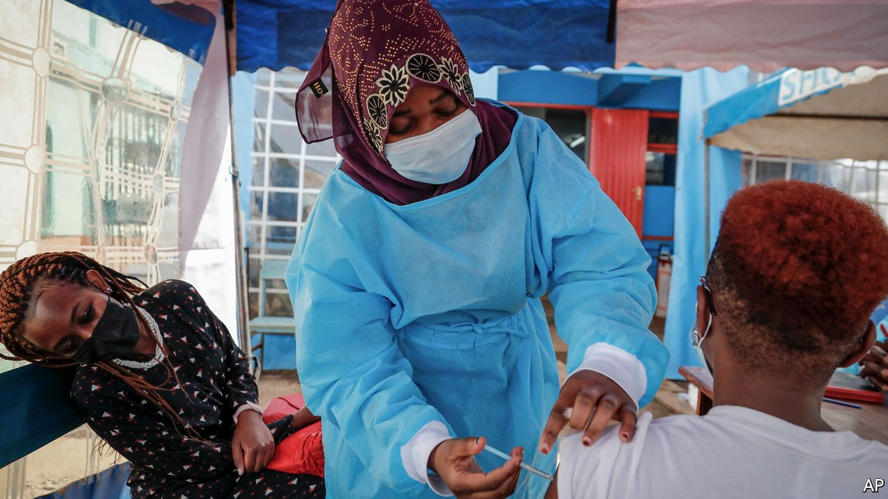
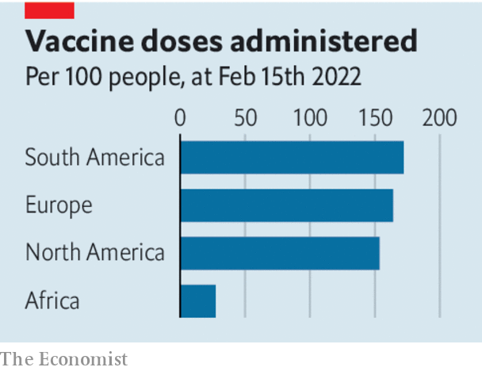

###### Drug manufacturing

# To build a vaccine industry, Africa must embrace the private sector 

##### Without a shift in focus, the continent risks always being at the back of the queue 

 

> Feb 19th 2022 

THE GLOBAL vaccination drive has been both inspiring and depressing. Inspiring because a combination of ingenuity, private-sector endeavour and effective government action has led to 4.9bn people around the world receiving at least one jab in one of the largest mobilisations of medical resources in history. Depressing because 3bn people, mainly in poorer countries, have yet to receive a single shot and because the distribution of vaccines has been mired in autarky and bickering.

Of the world’s regions, Africa has come out worst: it accounts for just 3.6% of global administered doses, partly because of hesitancy but mainly because it has struggled to get supplies and distribute them. Governments across the continent understandably want to escape from the back of the vaccine queue. Many of them, backed by supporters in the rich world, have focused on chastising pharmaceutical groups and arguing that intellectual property must be compulsorily licensed. That is a bad idea.


The pandemic has prompted a wave of investment in vaccines, which used to be shunned by some investors for being only intermittently profitable. Total global annual manufacturing capacity has risen from 5.7bn doses before the pandemic to 15.4bn, according to Bernstein, a financial firm, and based on current plans could reach 19bn. Capital spending at a panel of ten listed firms that make vaccines, among other things, is forecast to surge by 29% this year compared with 2019, according to Bloomberg data. This boom is welcome. But production sites are regional and therein lies a problem. In normal times vaccines are traded like any other medicine. In a pandemic, when contracts may be broken in the scramble for supplies, places with no factories may lose out.

 


Africa has 1.3bn people, 17% of the world’s total, but less than 1% of its vaccine-making capacity. It is enjoying signs of growth. BioNTech, a pioneer in mRNA vaccines,  of modular manufacturing in Africa, and Moderna, a competitor, may build plants there, too. The African Union wants to create five production hubs in the next decade. Senegal’s government is planning a $200m covid-19 vaccine facility with the Pasteur Institute, a French non-profit agency. But these projects are unlikely to provide much capacity any time soon. For example, the first phase of the BioNTech project will supply only up to 60m doses a year.

Emerging economies are not doomed to be in a weak position. Together India and China have an annual capacity of over 3bn doses. To do better, African countries need to attract private capital that will boost output and ensure that vaccines reflect the latest global innovations, which are likely to have been created elsewhere. This is best provided by policies that accept the legitimacy of drug firms, intellectual property and the realities of the vaccine business.

What might these policies look like? Because the need for vaccines can be intermittent, a first step is to create dependable demand. Governments should guarantee to buy in bulk the products of new manufacturing plants for an extended period of, say, ten years. Western governments and non-profit organisations such as GAVI, a vaccine alliance, are keen to do more: they can help subsidise these commitments at scale.

A second step is efficient regulation to test and certify products. None of the continent’s national regulators is considered “stringent” by the World Health Organisation, which means that drug firms have to seek approval in lots of countries, raising costs. A treaty to create a new African Medicines Agency, potentially licensing new formulations for the whole continent, has been ratified. It should become a reality.

Finally, African countries must respect intellectual-property rights. Today too much time is wasted discussing the evils of patents or creating local laws that let them be qualified or suspended. Yet if firms are obliged to surrender their innovations, they will invest less and provide less help in supplying much-needed manufacturing know-how to poorer countries. Covid has shown how invidious Africa’s situation is: to escape it countries need to work with drug companies, not around them. ■

Dig deeper

All our stories relating to the pandemic can be found on our . You can also find trackers showing ,  and the virus’s spread across .

