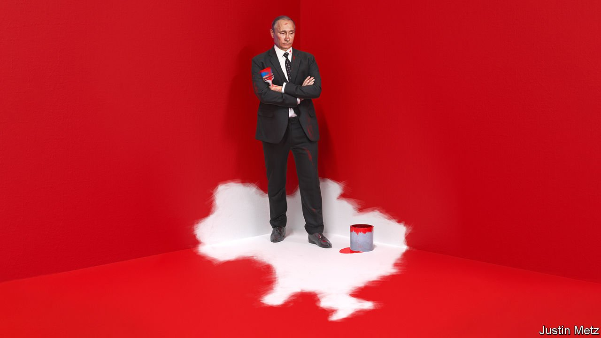

###### Russia and Ukraine

# Whether he invades Ukraine or backs down, Putin has harmed Russia 

##### He will try to claim victory though 

 

> Feb 19th 2022 

THE NEWS, for a moment, seemed encouraging. In a stage-managed television appearance on February 14th Vladimir Putin grunted a terse “good” to the proposal of his foreign minister that, despite warnings by the West of an imminent invasion of Ukraine, diplomacy should continue. A day later Russia’s defence ministry said that some of the 180,000 or so troops it has deployed at its borders with Ukraine are to be withdrawn to barracks, having completed their military exercises which, it has always maintained, is why they were there in the first place.

Officials, and the markets, breathed a small sigh of relief. Alas,  soon showed that, although a few units were moving, many more were preparing to fight. With the candour that has wrong-footed Mr Putin, many Western security officials accused him of lying, redoubling their warnings of a looming Russian invasion. Even if the troops pull back, this crisis is not yet over. And, whatever happens, war or no war, Mr Putin has damaged his country by engineering it.


Plenty of Western observers would dispute that judgment. Without firing a shot, they point out, Mr Putin has made himself the centre of global attention, proving that Russia matters once more. He has destabilised Ukraine and impressed on everyone that its future is his business. He may yet win concessions from NATO for avoiding war. And at home he has underlined his statesmanship and distracted from economic hardship and the repression of opposition figures such as Alexei Navalny, who was this week once again hauled before a judge.

Yet these gains are tactical. Even as Mr Putin has won them, in a longer-lasting and more strategic sense he has lost ground.

For one thing, although all eyes are on Mr Putin, he has galvanised his opponents. Led by Joe Biden, who once called Mr Putin “a killer” and surely loathes the man who tried to deny him the presidency, the West has agreed on a tougher package of threatened sanctions than in 2014, when Russia annexed Crimea. NATO, dismissed in 2019 by the French president as suffering “brain death”, has found renewed purpose in protecting its Russia-facing flanks. Having always preferred to keep their distance, Sweden and Finland may even join the alliance. Germany, having unwisely backed the new Nord Stream 2 pipeline, has accepted that Russian gas is a liability it must deal with and that an invasion would kill off the project. If Mr Putin imagined that his threats would be met with Western mush, he has been disabused.

Ukraine has indeed suffered. But the crisis has also affirmed the popular sense among Ukrainians that their destiny lies with the West. True, Mr Putin has extracted assurances that Ukraine is not about to join NATO—but these were cheap, because membership was always remote. What matters more is that, having been neglected in recent years, Ukraine is enjoying the West’s unprecedented diplomatic and military support. Those bonds, forged in crisis, will not suddenly dissolve if Russian forces pull back. Again, it is the opposite of what Mr Putin wanted.

It is also true that Mr Putin has put Europe’s security on the agenda, including discussions over missiles and military exercises. But such talks would be in everyone’s interest, because they reduce the danger of conflict. If win-win negotiations count as victories for Mr Putin, let there be more of them.

Mr Putin’s most intriguing loss is at home. Russia has attempted to build a fortress economy. It has boosted its reserves and reduced the share of them held in dollars. It has curtailed firms’ dependency on foreign capital and worked hard to build up its “tech stack” (everything from chips to apps to the ). It has also cosied up to China in the hope of finding an alternative buyer for the hydrocarbons that are still its principal source of foreign exchange.

Although these actions have lessened the potential harm from Western sanctions, they have not eliminated it. The EU still takes 27% of all Russian exports; China about half that. The Power of Siberia gas pipeline that runs towards China will, when completed in 2025, carry only a fifth of what now goes to Europe. In the event of a serious conflict, sanctions through the SWIFT banking-transactions network or on big Russian banks would cut off the financial system. Huawei-style import restrictions would cause huge difficulties for Russia’s tech firms.

Mr Putin can either live with this interdependency or turn further towards China. Yet that would condemn Russia to being the junior partner of an unsentimental regime which sees it as a diplomatic sidekick and a backward source of cheap commodities. That is a yoke Mr Putin would chafe under.

This alliance of autocrats would also have a psychological cost . It would demonstrate Mr Putin’s dependence on the siloviki, the security bosses who see in Ukraine’s democracy and deepening ties with the West a threat to their own ability to control and loot Russia. It would be a further sign to the liberal capitalists and technocrats who are the other pillar of the Russian state that they had lost. More of the best and brightest would leave; others would give up. Stagnation and resentment would build into opposition likely to be met with heightened brutality.

And what if Mr Putin, mindful of all this, were to invade? That may yet be the terrible outcome of this crisis, as each side seeks to outmanoeuvre the other. Just this week the Russian State Duma urged Mr Putin to recognise the self-declared “republics” in the Donbas, which claim big chunks of Ukrainian territory they do not currently control—adding one more trigger that Mr Putin can pull whenever he chooses.

As well as devastating Ukraine, war would do far greater harm to Russia than the threat of war. The West would be more galvanised and more determined to turn its back on Russian gas; Ukraine would become a running sore, bleeding Russia of money and men; and Mr Putin would be a pariah. Russia itself would be blighted, in the short run by sanctions and later by still deeper autarky and repression.

Mr Putin has painted himself into a corner. He could lash out. Yet a retreat now, with his ambitions thwarted, may only lead to an attack later. By standing up to the threat he poses, the West has the best chance of deterring that fateful choice.■

For subscribers only: to see how we design each week’s cover, sign up to our weekly 

All of our recent coverage of the Ukraine crisis can be found 

