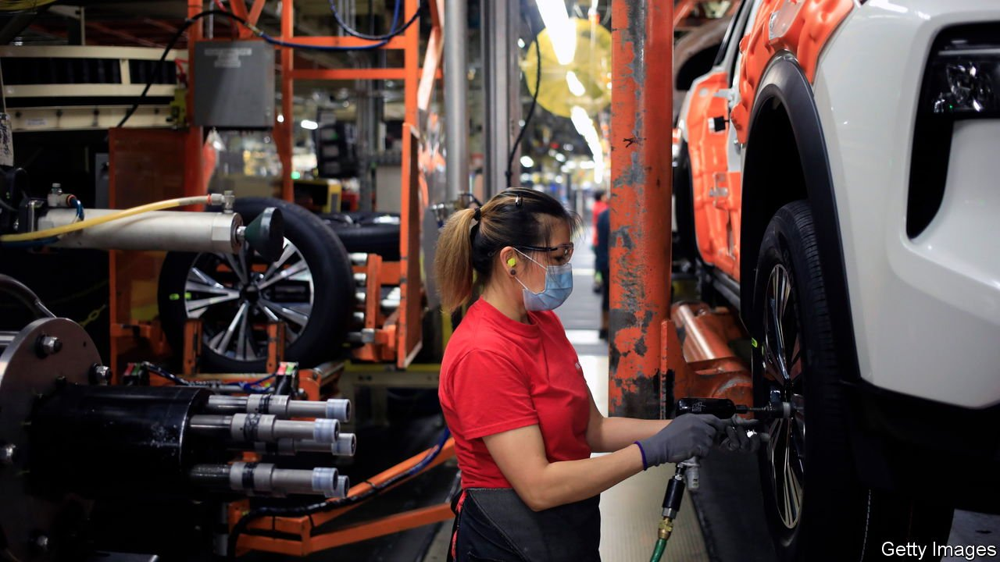

###### The chicken and the peg

# Workers have the most to lose from a wage-price spiral 

##### As prices rise, real wages are falling 

 

> Feb 19th 2022 

THE WORLD economy keeps producing . In January consumer prices grew by more than expected in America, Britain and the euro zone, and America’s rate of annual producer-price inflation stayed close to 10%. Making matters worse, fears that Russia would invade Ukraine sent the oil price to over $96 a barrel on February 14th, its highest since 2014. On both sides of the Atlantic financial markets have rapidly priced in more  in 2022, as some central bankers have begun to worry in public that they face a test of their credibility.

 


Monetary policymakers are scouring labour markets for signs that high inflation is becoming baked into workers’ wage demands, indicating the start of a . They are in an awkward spot, because the idea that wages are rising too fast is politically toxic. In America annual wage growth of 5.7% is plainly inconsistent with the Federal Reserve’s 2% inflation target. Yet President Joe Biden is celebrating rising pay while left-wing Democrats . There is plenty of fuss elsewhere, too. Britain’s government has said it does not support a call by Andrew Bailey, the governor of the Bank of England, for workers to rein in their pay demands. Christine Lagarde, head of the European Central Bank, says she hopes to see wages rise, even as her colleagues warn of the dangers of excessive pay growth.


In the popular imagination workers are often canny first movers in a wage-price spiral, rather than its victims. Rising pay pushes up costs for firms, which then increase prices to protect profits. In part this is based on the experience of the late 1960s and 1970s, when union bosses negotiated above-inflation pay increases for their members. In 1974, in Germany’s infamous Kluncker-Runde, Heinz Kluncker, a combative unionist, won public-sector workers a budget-busting 11% pay rise.


In fact, high inflation often hurts workers. Over the past year inflation has been higher than wage growth in every G7 country, despite widespread labour shortages. Unions are much less powerful today than they were in the 1970s and scholars typically find that prices lead wages, rather than vice versa. Even in the 1970s many workers suffered from the wage-price spiral. In that decade American wages grew only half as fast as workers’ productivity, just as today wages are yet to catch up with such gains.

In Europe high inflation is mostly down to expensive energy. But in America it is the consequence of a tsunami of spending, the result of stimulus cheques and low interest rates, overwhelming the economy’s capacity to expand production. Firms have  not to pass on costs but to curb demand, sending profit margins . As consumer-price inflation has risen to 7.5%, it is capital, not labour, which has had the upper hand, feeding claims that firms are profiteering. The outcome is perverse, not least because Jerome Powell, the Fed’s chairman, has often said that the main justification for stimulus was to help workers and to reduce inequality.

It is pointless, however, to attempt to bully firms or workers into resisting market forces. Just ask Japan, where the government has for years tried to deal with below-target inflation by badgering firms to raise wages, without success. The correct response to an economy that is too hot or too cold is to adjust macroeconomic policy, not to interfere with wage- and price-setting.

It is important that the Fed raises interest rates quickly—and that European policymakers stay vigilant. The longer inflation is too high, the more painful it could be to bring it back down. The wage-price spirals of the 1970s were contained only after tight monetary policy induced a global downturn in which American unemployment peaked at nearly 11%. If central bankers once again have to induce recessions to restore their credibility on inflation, workers will pay the price for that, too. ■

