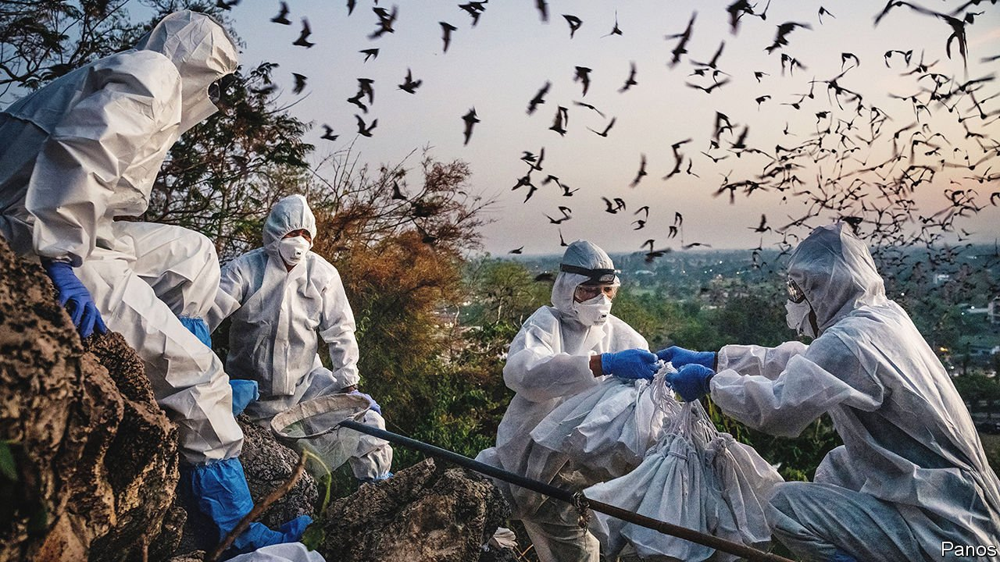
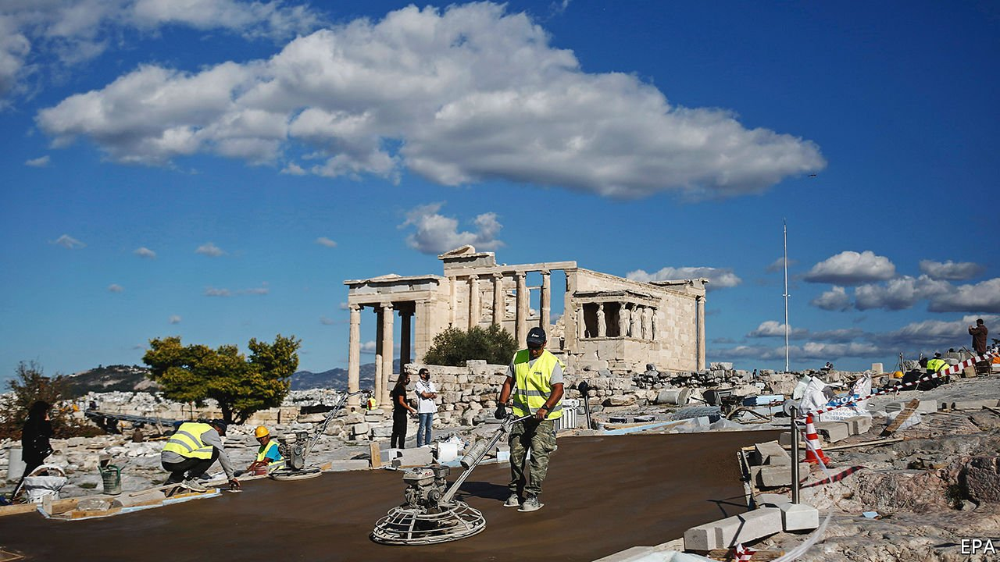
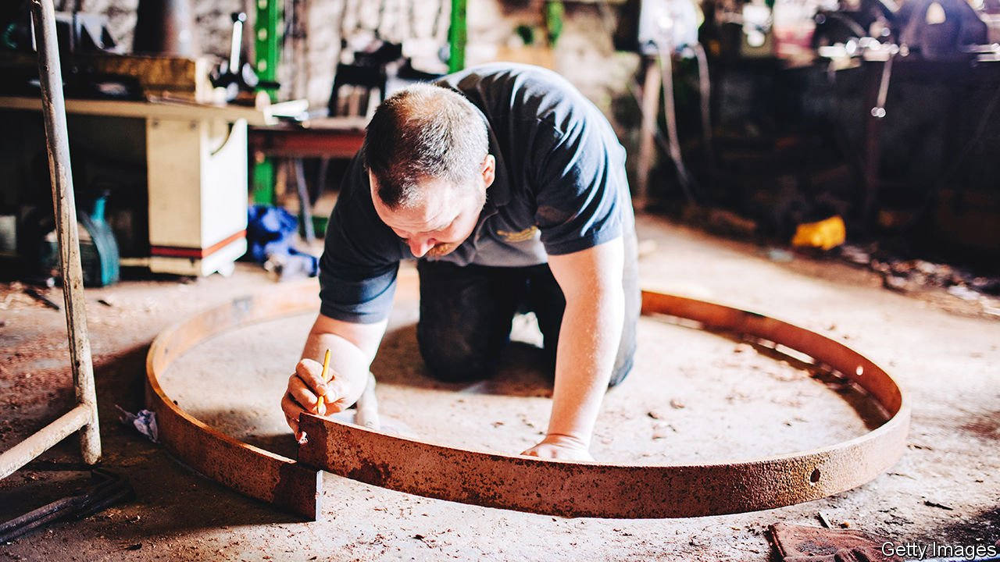

###### On peer review, Myanmar, pay, DNA, the Acropolis, vellum, Ottawa

# Letters to the editor 

##### A selection of correspondence 

 

> Feb 19th 2022 


Peer pressure

I suspect you have not examined the evidence behind your statement that the quality-assurance system of scientific journals “generally works well” (“”, February 5th). Peer review is the main assurance system for science journals, but remarkably, until about 40 years ago nobody had studied the process.


When studies did begin researchers found little or no evidence of effectiveness. They did find that peer review is slow, expensive, inefficient, poor at detecting errors or fraud, prone to bias and something of a lottery. It is also anti-innovation, in that truly original studies that win Nobel prizes are often rejected. We know too that journals are filled with statistical errors and studies where the conclusions are not supported by the methods and data. Drummond Rennie, one of the pioneers of peer-review research, summed up the evidence by saying, “If peer review were a drug it would not be allowed onto the market.” Paradoxically peer review, which is at the heart of science, is faith-based, not evidence-based.

RICHARD SMITH

Former editor

British Medical Journal

London

 


A year after the coup

Thank you for reporting on the forgotten tragedy in Myanmar (“”, January 29th). Why have no Western countries formally recognised the country’s parallel National Unity Government (NUG), formed by lawmakers who were deposed by the coup? In the current battle between authoritarianism and democracy, there is no more egregious example than Myanmar of where the former is failing dismally. Yet the West remains disgracefully hesitant. The NUG is imperfect and callow but it is also democratic, inclusive and decisively on the side of all Myanmar’s people. Clear and brave recognition of its legitimacy would send a strong message not just to the criminal Myanmar junta but to other bullies and tyrants globally.

RICHARD FOWLER

London

 


How to boost workers’ pay

“” (January 29th) defended the traditional focus of trustbusting on consumer welfare and discouraged attempts to broaden it to other areas, such as protecting workers. You were too hasty to discount the value of intervention in that area. There is growing empirical evidence that monopsony power over workers is very much a real phenomenon, significantly depressing their wages. For example, see Alan Manning’s review of the literature in Industrial and Labour Relations View (June 2020). Indeed, evidence and theory are so well established by now that I can teach simple monopsony models in my introduction to economics class alongside monopoly models. Other forms of interventions, such as minimum wages, can help deal with monopsonies, and establishing clear criteria would not be easy. But antitrust law would be invaluable in correcting this market failure because of its focus on intervention.

PEDRO FRANCO DE CAMPOS PINTO

Assistant professor

Musashi University

Tokyo

 


Marked for life

I wonder if any thought has gone into the consequences of a programme that aims to sequence the genomes of 200,000 babies (“”, January 29th)? You highlighted the potential medical benefits that comes from an early diagnosis of rare diseases. What about the insurance implications? Such records identify a baby’s predisposition to illness and would be a gold mine to insurance companies seeking to avoid future risk. When the babies become adults they may find they can’t get insured or must pay excessively high premiums on a range of policies from mortgages to travel.

The findings of such research may be treated as confidential. But once it became common practice insurers could ask a simple question: have you ever had your DNA checked? Failure to answer could mean a future claim is rejected, an unfair decision based on a medical issue that may not arise.

JOHN WALLS

Glasgow

 


Improving the Acropolis

Your article on Europe’s historic monuments mentioned works carried out on the Acropolis (“”, January 29th). All projects carried out on the Acropolis are in full compliance with national law and international conventions. They come under the scientific supervision and responsibility of the Committee for the Conservation of the Acropolis Monuments. The bits that the ministry of culture is responsible for are evaluated by the international scientific community; members of staff are internationally considered to be among the most experienced and capable experts in monument restoration. The recent works on the Acropolis were the subject of an international conference in November 2021, during which the participants were able to inspect them in person. The conference confirmed that the works were carried out with absolute respect for the monuments and all other archaeological remains.

The slope elevator (unique in its class), the hydraulic works that regulate the run-off of rainwater and the new visitor pathways have finally made the Acropolis accessible and safe for all people. We have eliminated the risk of accidents. The view of the monuments is unobstructed. You placed disproportionate emphasis on the opposition’s criticism of the paving material of the Acropolis routes. In fact, the works in question are primarily associated with the repaving of the previous existing routes, with materials that are similar to the ones used in the restoration of the monuments themselves.

PANAGIOTIS PANAGOPOULOS

Press office

Ministry of Culture and Sports

Athens

 


Writing skills

I am pleased that vellum is still being made in Milton Keynes (“, January 22nd). The survival of the craft in Britain hung in the balance when Parliament decided to go high-tech setting down its acts. Instead of printing or writing on calf skin, as had been the practice for centuries, legislation was to be set for posterity on acid-free paper. The matter was debated in the Commons. Vellum’s durability was praised, as it was still possible to view the death warrant for Charles I written on the parchment. Not wanting to support the industry the government countered: “In the event of a future royal death warrant or other matter, we might exceptionally violate the call of the leader of the opposition and import the material from France.”

GERALD SMITH

Wellington, New Zealand

Defending Ottawa

Canada is another example of a country moving its capital city (, January 24th). Ottawa, originally known as Bytown, became the capital after that status rotated among Kingston, Montreal, Toronto and Quebec City. This was in part a geographic compromise, but also to provide defence from a potentially powerful and aggressive neighbour, the United States.

PETER SEABY

Brampton, Canada

