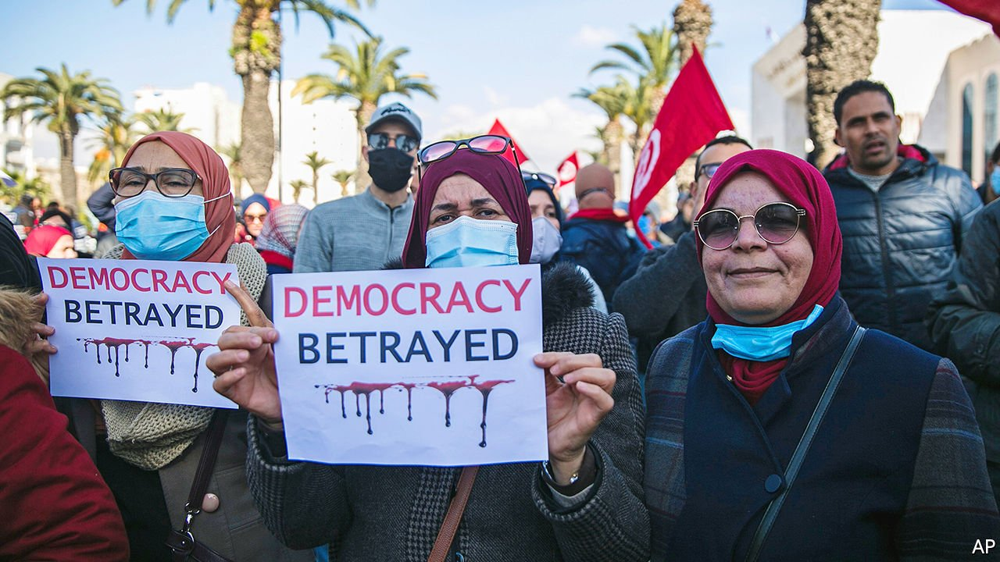

###### “RoboCop” hits a rough patch

# A recession threatens Tunisia’s President Kais Saied 

##### But the opposition is too divided to take advantage of it 

 

> Feb 17th 2022 

ON THE CAMPAIGN trail in 2019, Kais Saied cemented the sobriquet “RoboCop” for his dour, mechanical demeanour. He has lived up to the nickname as president, methodically targeting Tunisia’s democratic institutions. In July he suspended parliament and much of the constitution. He has shifted the country towards a presidential system: though he named a prime minister in September, she is a neophyte, her powers circumscribed.

Now he has trained his sights on the judiciary. On February 6th Mr Saied threatened to dissolve the Supreme Judicial Council, a constitutional panel that recommends nominees for judgeships and oversees their work. In the president’s telling, it was hopelessly corrupt. “You cannot imagine the money that certain judges have been able to receive,” he said.


Though exaggerated, his words struck a chord. Like so much in postrevolutionary Tunisia, judges are unpopular. Many see them as slow to prosecute corruption. The judges called his move an assault on their branch of government.

A week later Mr Saied replaced the council with a “temporary” alternative and arrogated the power to block judicial nominees and to remove judges for “misconduct”. Said Benarbia, the regional director for the International Commission of Jurists, says the decree “ends any semblance of judicial independence”.

Yet all of this has met a muted response. Perhaps 2,000 people protested against the council’s closure—hardly the sort of mass demonstration that, in the past, brought crowds of activists to the capital. Few Tunisians seem bothered by the country’s descent into one-man rule. The opposition, such as it is, comes mostly from the groups affected by Mr Saied’s power grab: politicians and judges. But they are too divided to mount much of a challenge.

The most obvious criticism comes from Ennahda, the Islamist party that held a plurality in the now-suspended parliament. Mr Saied has been particularly harsh towards its members, blaming them for much of Tunisia’s post-2011 dysfunction. Noureddine Bhiri, a former minister and vice-president of Ennahda, has been detained without charge since December.

But few other parties will join forces with Ennahda. Leftists dislike its Islamism and its free-market economics. Secular factions are happy to blame Ennahda for the country’s woes—and thus absolve themselves. Many politicians, even those who backed Mr Saied’s power grab last summer, now describe it as a coup. If they are uneasy about his anti-democratic means, though, they are not altogether unhappy to see Islamists excluded from political life. The ideological schisms that have roiled Tunisia for a decade make it hard to mount a united front.

Civil-society groups are similarly split. No Tunisian president can govern without backing from the main trade union, the UGTT, which shared a Nobel peace prize in 2015 for helping to defuse an earlier political crisis. Aside from a few sharply worded statements, however, the UGTT has played little role over the past seven months. In part that is because its own leadership is divided, and fearful that a tough line against Mr Saied would jeopardise their own power.

Not many Tunisians are asking for a tougher line, anyway. Protest had been a regular feature of postrevolutionary life. Tax increases in 2018 sparked a week of nationwide demonstrations, some violent. Thousands of people protested in 2017 against a proposed law (which was later passed) granting amnesty to members and supporters of the ancien régime, the decades-long dictatorship led by Zine el-Abidine Ben Ali until his ouster in 2011.

Since July the streets have been comparatively quiet. “People need a really good reason to protest. It’s dangerous,” says Heythem Guesmi, an activist and veteran of the protests in 2017. Kais Saied hasn’t taken any decisions that have obviously harmed the young or the poor, he adds. Few will come out for the judges, who tend to look away when the police beat protesters. “Kais Saied is like a new purchase,” he muses. “We’re still in the trial period.”

Polls, which can be unreliable in Tunisia, suggest that Mr Saied is losing support but is still popular. Insights TN, a local pollster, found a majority of respondents now think his actions were a coup and say they are “fearful” for democracy. Neither view had majority support last summer.

Emrhod Consulting, another research firm, found that 67% of the public was satisfied with the president’s performance. That was a 15-point drop from August but still a number that would make most Tunisian politicians envious. His predecessor, Beji Caid Essebsi, was polling in the mid-30s at a similar point in his term. “People here don’t really care about…technical ideas of democracy,” says Henda Chennaoui, an activist. “They want change. They want land and jobs.”

Frustration with a poor economy helped propel Mr Saied to victory in 2019. Yet his government has offered little to strengthen it. In 2020, slammed by covid-19, GDP slumped by almost 9% in what the IMF describes as Tunisia’s worst recession since independence in 1956. Although rebounding, growth remains weak and unemployment stands at 18%.

Some wonder if Mr Saied has sown the seeds of his own downfall. As economic frustrations mount, his popularity will probably wane: the downside of one-man rule is that there is only one man to blame. If this leads to mass protest, a president who often speaks in dark tones about conspiracies may order a harsh response. The army, which has historically stayed out of politics, is said to be uneasy about the country’s direction. Having dismantled so many of Tunisia’s institutions, Mr Saied may find himself facing an angry public with few allies. ■

