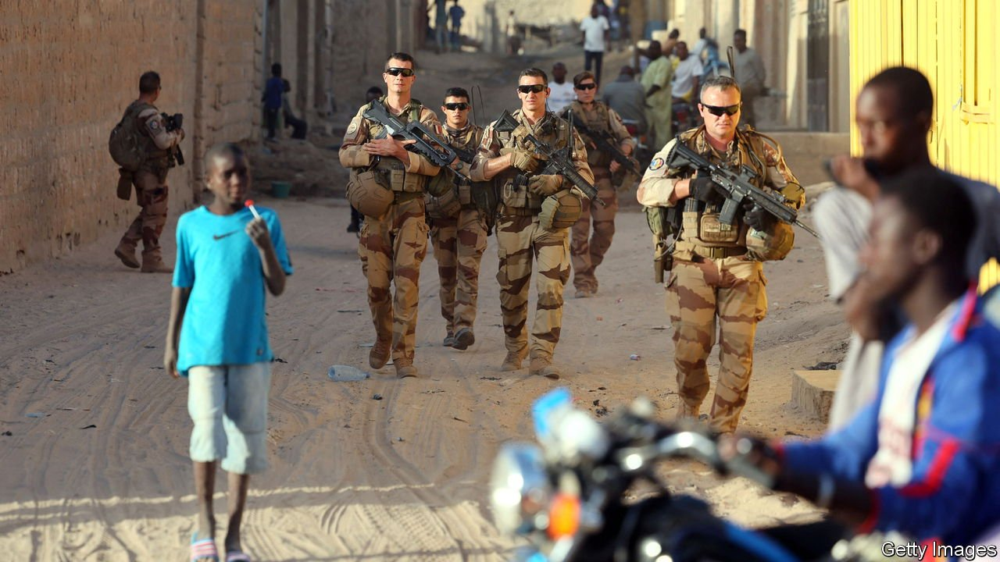

###### Mission incomplete

# France withdraws its forces from Mali 

##### But their fight against jihadists in the Sahel is not over 

 

> Feb 19th 2022 

WHEN THEY arrived in 2013 it was in a rush: 250 men from a base in Senegal; 950 from Chad; helicopters and men from Burkina Faso. With fast-moving columns of jihadists dashing south through Mali and poised to capture Bamako, the capital, within days, there was no time for a multinational force from the UN or ECOWAS, the regional bloc. François Hollande, then French president, ordered his troops into Mali, urging them to “get it done”.

And they did. Within hours they were attacking the jihadists; within weeks France was recapturing cities such as Timbuktu and Gao. Yet what had been planned as a brief intervention turned into a grinding nine-year struggle against jihadists affiliated to al-Qaeda and Islamic State. Now they are leaving, their mission incomplete. On February 17th, after meeting in Paris with European and African partners, France announced that “due to multiple obstructions” by the current Malian regime it would withdraw its roughly 2,400 troops from Mali. A European special-forces mission is withdrawing, too.


The immediate cause is a diplomatic breakdown between France (and its allies) and the junta that overthrew Mali’s elected government in 2020, led a second coup last year and has since refused to hand power to civilians. The junta recently kicked out the French ambassador and Danish commandos, who were helping it fight the jihadists. Rubbing salt in the wound, it hired Russian mercenaries from Wagner Group.

Yet the roots of this withdrawal are deeper. France’s campaign, which started so well, has been going badly. In 2020 more than 6,000 people were killed in conflict in Burkina Faso, Mali, and Niger, about seven times more than in 2016. About 3.5m have been forced from their homes.

France and the region’s armies have won tactical victories—since January 2020 they have killed about 2,700 militants—yet the jihadists continue to recruit and grow. Militants have since swept out of Mali and spread terror through Burkina Faso and Niger and are now striking south into coastal states such as Benin and Ivory Coast. Efforts to slow recruitment through economic development and improved governance have lagged. Insecurity has triggered a spate of coups with popular backing.

France’s withdrawal from Mali casts a shadow over multinational efforts to stabilise it. The UN’s mission, Minusma, has some 12,000 blue-helmeted troops including contingents from Britain and Germany. French help will be less readily available when they come under attack. Some troop contributors may follow the French out.

France will continue to fight jihadists in the region, but its task will be all the more difficult as the militants carve out more havens in Mali. The burning question is whether Mali’s neighbours can hold their own. President Emmanuel Macron said that European forces would be re-centred on Niger. Countries in the Gulf of Guinea would get extra help too. They will need it. The coastal states are richer and have stronger armies, which means they have a better chance of holding back the jihadist tide. But the fact that they face this test is in itself a worrying defeat, for the region and for its Western allies. ■

