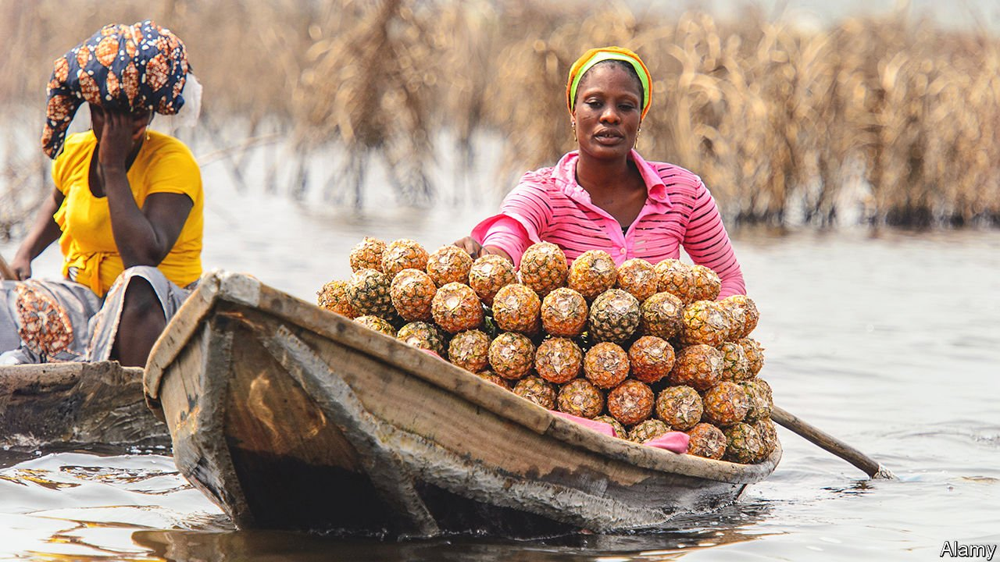

###### Fabulous fruit

# How the sugarloaf pineapple became the champagne of Benin 

##### African countries cash in on the fashion for posh-place products 

 

> Feb 19th 2022 

WHAT HAM is to Parma, cheese is to Caerphilly and sparkling wine is to a certain region of France, the spiky-haired sugarloaf pineapple is to Benin. Last year this juicy delicacy was granted the west African country’s first “geographical indication” (GI), a legal label that marks out products that come from a particular region.

Benin’s move signals a wider trend. Other places have long sought special status for their fanciest fodder. France and Italy have roughly 6,000 GIs each. Africans want a slice of the action. It could be tasty. Sales of products given GI status by the EU are worth €75bn a year ($83bn). On average foods with GI status command a 43% price premium, says a recent study. For wine, which makes up more than 50% of sales of EU-protected products, that rises to 300%.


Benin hopes that GIs will not only sweeten its pineapple exports—the fourth biggest in west Africa—but also make its sales of cashews, shea nuts and shea butter more fruitful. Higher prices could make a big difference in a country where 38% of people work on farms and 45% live on less than $1.90 a day.

Others in the region hope to benefit, too. Cameroon’s Penja pepper was the first African product to receive the coveted label in 2013. Sales of the sought-after peppercorn, which is grown in the volcanic soils of Mount Cameroon, helped stimulate a six-fold rise in local farmers’ incomes. It now graces the plates of Michelin-starred chefs.

GIs have the potential to encourage farmers to band together to improve standards and earn higher prices. But a big challenge, says Michael Blakeney, a professor at the University of Western Australia, will be to make sure that the benefits of premium prices are passed on to farmers and are not captured by middle men, who typically have more information about markets than small-scale farmers.

Moreover, competition is intensifying as more countries seek protected GIs for their own products. Penja pepper already has rivals from Cambodia and Indonesia. Benin’s pineapples will have to battle against the likes of Huay Mon ones, which Thailand hopes to protect. Though surely a sugarloaf by any other name would not taste as sweet.

