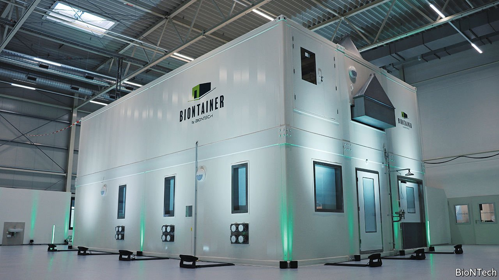

###### Drug manufacturing

# BioNTech plans to make vaccines in shipping containers 

##### These standardised factories could be quickly scaled up to expand capacity worldwide 

 

> Feb 19th 2022 

AT THE HEART of its site in Marburg, Germany, BioNTech is putting the finishing touches on a new kind of factory. The drug company has spent eight months reworking its manufacturing processes to produce its mRNA covid-19 vaccine inside a set of standard shipping containers. By creating a modular approach to drug manufacturing, Ugur Sahin, BioNTech’s boss, says he aims to transform medicine production around the world.

The work is analogous to software developers rewriting their code to run on different kinds of computer—porting a game from Microsoft’s Xbox so that it will run on a Sony PlayStation, for example. Biological porting involves tweaking the 50,000 steps that comprise the manufacturing process of the mRNA vaccine from one environment, BioNTech’s existing production lines around the world, so that they work in another, a series of connected, standard metal shipping containers. The firm plans to send its containerised mRNA factories—which it calls Biontainers—to parts of the world which lack their own vaccine-manufacturing capabilities. The first will arrive in an African country, not yet named, towards the end of 2022.


BioNTech has turned to containers as a reliable, repeatable way to achieve “good manufacturing practice” (GMP), a pharmaceutical-industry term for the minimum standards required of a manufacturer as part of their authorisation to sell products. GMP standards exist in order to ensure a consistently high quality of manufacturing output, which in turn protects consumers from badly made drugs. Validating new GMP facilities is a long, slow process. Mr Sahin’s aim is to remove, to some extent, local factors from the equation that governs where vaccines can be produced, with a modular GMP facility that can be installed and run anywhere in the world.

All manufacturing operations consist of a series of steps that are known in their entirety only to the collection of engineers who carry out the work, a sort of industrial recipe. This knowledge about the production process includes everything from the settings of dials on every device to the temperatures, pressures and timings at which chemical reactions should run. These variables are precise to the extent that they can change depending on the weather. The transfer of this recipe to new production facilities presents perhaps the greatest bottleneck to increasing vaccine production. Even when pharmaceutical companies were transferring this knowledge internally, during the height of the pandemic, it took around eight months to increase their own vaccine-production capacity.

Mr Sahin wants his shipping containers to speed things up. His idea is that after the process knowledge has been successfully ported into the standardised environment of the shipping container once, that facility can then be quickly cloned into other containers. Updates to the production method or tweaks to the recipe of the vaccine itself could be transmitted digitally to any containers in the network. “This”, says Mr Sahin, “is the future of manufacturing not only for Africa, but worldwide.”

Faster, more productive

After eight months of work to get its first container factory off the ground in Marburg, BioNTech’s approach will be put to the test later this year. By the end of June, Mr Sahin says, the site at its partner country in Africa will be prepared for the arrival of the containers—BioNTech is in discussions with South Africa, Rwanda and Senegal. He expects the containers, the interiors of which will have been set up to the letter in Germany, to have arrived by the end of 2022. Each set of 12 containers will need four or five operators and be capable of producing some 40m-60m doses every year. BioNTech hopes the facility will cost “significantly less” than a traditional vaccine manufacturing factory of equivalent output, which comes with a price tag of at least $170m.

The validation and quality-control work will carry on through 2023, as will hiring and training local operators. In parallel, there will be conversations with regulators about the new containerised production process. Mr Sahin says BioNTech is already talking to the African Union, a regional bloc, the Africa Centres for Disease Control and Prevention and national regulators. He hopes that the German and European GMP standards to which the container factories have been built will be acceptable. If they are, then vaccine production will start at the end of 2023.

Although BioNTech’s plan will not see any production facilities in operation for almost two years, it also plans for the Biontainers to have utility beyond the pandemic and the production of covid-19 vaccines. Mr Sahin says the production system could be used to make other vaccines and drugs, for example, against malaria or tuberculosis. In July last year BioNTech announced its aim “to develop a well-tolerated and highly effective malaria vaccine and implement sustainable vaccine supply solutions on the African continent”.

There may yet be pitfalls in BioNTech’s plan. Containers may prove to offer a less uniform manufacturing environment than Mr Sahin hopes. Regulators may spot issues. Countries around the world may not accept medicines produced in facilities which, although geographically local, are operationally under a foreign company’s control. But the principle of reducing the cost of copying process knowledge is sound. If it works, Mr Sahin is likely not just to boost manufacturing capacity on the African continent, but to change the way drugs are made everywhere. ■

To enjoy more of our mind-expanding science coverage, , our weekly newsletter.

Dig deeper

All our stories relating to the pandemic can be found on our . You can also find trackers showing ,  and the virus’s spread across .

