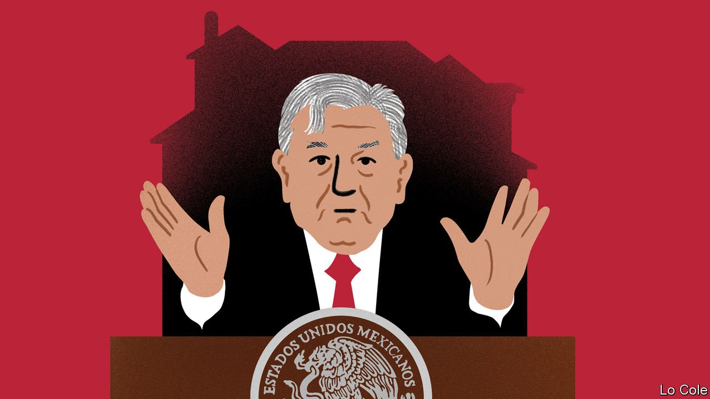

###### Bello

# Why allegations about his son could hurt Mexico’s president 

##### Andrés Manuel López Obrador’s son does not share his father’s distaste for luxury 

 

> Feb 19th 2022 

“WHAT ARE we fighting for? To end corruption…The formula is simple but effective—to govern by example.” So said Andrés Manuel López Obrador when he was campaigning for his country’s presidency. He was right that Mexicans were fed up with the racketeering and scandals that had marred previous governments. Since coming to office in 2018, he has made personal austerity a symbol, abolishing the presidential guard, moving out of the spacious official residence and flying around the country in economy class. Largely as a result, his approval rating in opinion polls hovers at 60%.

That is why recent allegations concerning his eldest son, José Ramón López Beltrán, are potentially game-changing for the president. According to an investigation by Mexicans Against Corruption and Impunity, a watchdog, and Carlos Loret de Mola, a journalist, Mr López Beltrán and his wife lived for a year until July 2020 in a mansion in the suburbs of Houston owned by Keith Schilling, a former manager of Baker Hughes, an oil-services company. During that period Baker Hughes received business worth $194m from Pemex, the state-owned oil giant into which the president has poured extra public money.


Mr López Obrador (or AMLO for short) insists that his son has no influence on the government and that “there is no proof of anything at all” against him. Mr Schilling, who left Baker Hughes in January 2020, told Bloomberg that he had no responsibility for his firm’s work in Mexico and did not know that his tenant was the president’s son. But Mr López Beltrán has yet to demonstrate that he paid the rent. And the photos of the capacious mansion with a home cinema, a large swimming pool and gardens hardly convey austerity.

The first son, who has since moved to another mansion near Houston, said that he lives from his earnings as a lawyer for a property developer. The company is owned by the children of Daniel Chávez, a businessman close to AMLO. He is an adviser for one of the president’s pet infrastructure projects, a tourist train that will run close to several of Mr Chávez’s hotels in the Yucatan peninsula.

The president clearly senses danger. Since the news broke last month, at his hours-long morning news conferences he has followed the populist textbook of distracting attention by inventing enemies of the people. First he launched a rant against Spanish companies, saying that they had “plundered” Mexico during the three previous “neoliberal” governments and that he would “pause” relations with Spain until the end of his term in 2024. The next day he clarified that he was not breaking ties formally.

A week later he claimed that Mr Loret de Mola was “a corrupt mercenary” who earned 35m pesos ($1.7m) in 2021. Although the journalist said that the figure was inflated and included earnings from different years, the details listed by the president could only come from the tax agency. Their publication is a crime. Mr López Obrador claimed he was acting in the name of “transparency”. Others saw intimidation in a country where five journalists have been killed so far this year and where extortion and kidnapping are shockingly common. The president is “furious” because he hasn’t been able to shake off the scandal, said Mr Loret. “He’s lost it.”

The president insists he is carrying out a moral “transformation” of Mexico, and that his critics represent vested interests threatened by this. He has little else to show, apart from an increase in cash transfers to some poorer groups. His government’s handling of the pandemic has been poor. The economy has been slow to recover from a slump in 2020, and violent crime remains rampant. Despite all this, most Mexicans still think that he is on their side and his critics are not.

Mexico’s largely discredited opposition now senses an opportunity. “I think it’s a turning point,” says Martín Vivanco of Movimiento Ciudadano (Citizens Movement), a newish social-democratic party. “For the first time he’s losing his monopoly of the public conversation.” Some of the president’s middle-class supporters peeled away in mid-term elections last year. He seems certain to win a self-engineered recall referendum on his rule in April. But local elections in six states in June may be a tougher test.

AMLO “governs through symbols,” says Mr Vivanco. The risk for the president is that the Houston mansion becomes the new symbol of his rule. He will strain mightily to prevent that.

Read more from Bello, our columnist on Latin America:

 (Feb 12th) 

 (Feb 5th 2022)

 (Jan 29th 2022)

