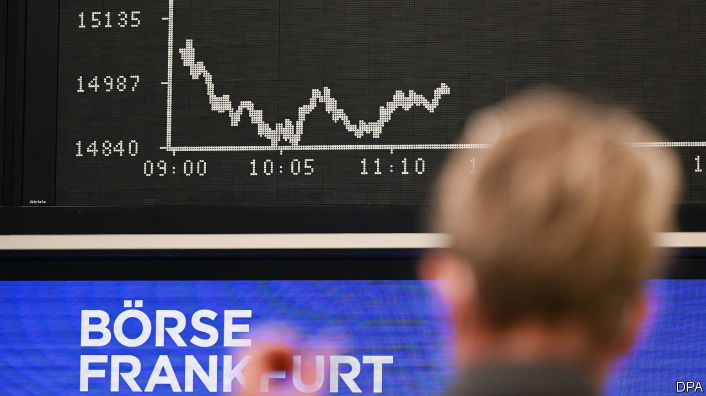
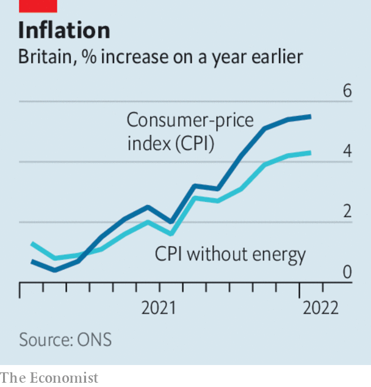

###### 

# Business this week 

#####  

 

> Feb 19th 2022 

Stockmarkets remained jittery amid the possibility of a Russian invasion of Ukraine. The S&amp;P 500 dropped by almost 2% in a day and the Nasdaq by almost 5% over two days as America warned that a Russian invasion was imminent. The disquiet spread to European markets, where share prices of airlines, which would see flight schedules disrupted by no-fly conflict zones over eastern Europe, were hit particularly hard. Trading seesawed in reaction to the latest diplomatic moves.


Russia’s belligerence also caused a spike in oil prices. A barrel of Brent crude hit close to $97 a barrel, the highest in seven years. Energy markets are hypersensitive to any disruption in oil-and-gas flows from Russia. In America the White House said it was open to the idea of suspending the fuel tax on petrol until next year. With annual  now at 7.5% the Democrats are looking at myriad ways to ease spiralling household costs.

Investors were also on high alert for signs of the Federal Reserve quickening the pace of interest-rate rises. The minutes of the Fed’s latest meeting showed it discussing a faster timetable. Goldman Sachs forecast that it will raise rates seven times this year.

Russia’s central bank increased interest rates for the eighth consecutive time, lifting its key rate from 8.5% to 9.5%. Annual inflation is running at close to 9%. The rouble has weakened as markets weigh the effect of crippling . The Bank of Russia says more rate rises are possible over coming months.

The lifting of a covid-19 state of emergency in September and resulting surge in consumer spending helped Japan’s economy expand by 1.3% in the last three months of 2021 compared with the previous quarter, when it had shrunk by 0.7%. Japanese GDP grew by 1.7% for the whole of 2021. New restrictions, however, came into force at the start of this year with the outbreak of the Omicron variant.

Falling food prices, notably for pork, lay behind a drop in China’s official consumer-inflation rate to 0.9% in January, year on year. Manufacturing costs also eased. The producer-price index rose by 9.1%. That was down from 10.3% in December, helped by a softening of coal and steel prices.

 


Britain’s annual rate of  inflation hit a new 30-year high, as consumer prices rose by 5.5% in the 12 months to January. Inflation is expected to rise to 7% in April when the regulator’s price cap on energy tariffs increases. As in other countries, household-energy costs are soaring. Electricity bills rose by 19% in the year to January and gas bills by 28%.

A home from home

Airbnb reported record revenues for 2021, as pandemic restrictions eased. Although there were signs of its renters returning to cities, growth was stronger in bookings for overnight stays in non-urban areas. Airbnb’s users are also staying in their rented abodes for longer. Long-term stays of 28 nights or more are the company’s fastest-growing category by trip length, now accounting for a fifth of nights booked. This year has seen a surge of interest in summer travel.

Flutterwave raised $250m in a round of fundraising, bringing its estimated value to $3bn and making it Africa’s most valuable startup. The fintech firm, based in Lagos but with headquarters in San Francisco, enables cross-border payments among businesses across Africa and wants to expand into the Middle East and Latin America.

Another takeover was announced in the chip industry, as Intel agreed to pay $5.4bn for Tower Semiconductors, an Israeli “foundry” company that makes chips and circuit boards for other firms, including Panasonic and Samsung, without designing them. Intel is expanding its foundry business amid a global shortage of chips as part of a turnaround plan, which includes investing $20bn in a new hub in Ohio.

Texas launched a lawsuit against Meta, Facebook’s parent company, claiming that the use of facial-recognition on the social network resulted in “tens of millions of violations” of the state’s privacy law. Meta pulled its facial-recognition system last year as the threat to its business from such lawsuits increased. Texas is seeking billions of dollars from Meta.

Market spirits

India’s securities and exchange regulator fined a former head of the Mumbai bourse $400,000 for sharing sensitive information with her guru. The regulator noted that Chitra Ramkrishna’s unnamed yogi lived in the Himalayas, and that she had described him as having “spiritual powers” that did not require “physical co-ordinates and would manifest at will”. That didn’t stop her from allegedly emailing the mystical mountain man about confidential business plans. The regulator said she had been a “puppet in his hands”.

