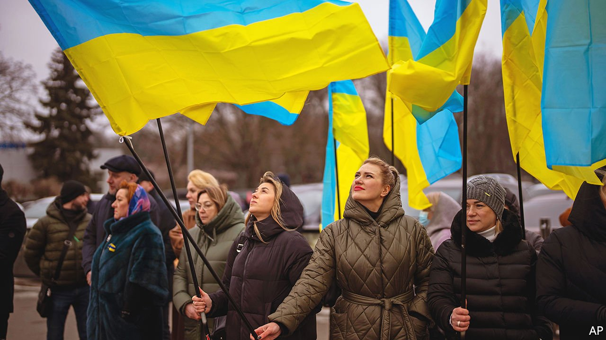
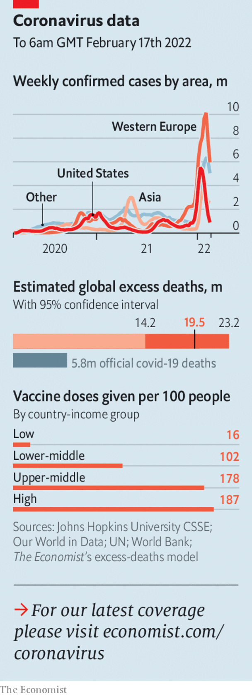

###### 

# Politics this week 

#####  

 

> Feb 19th 2022 

said it was pulling troops back from the border with Ukraine. Satellite footage showed it was hauling some back while pushing others forward. The White House warned that a Russian invasion of Ukraine was still on the cards. Vladimir Putin said diplomacy should continue. Russia’s tame parliament passed a bill urging Mr Putin to recognise two breakaway statelets in eastern Ukraine. Since these statelets claim big chunks of Ukraine they do not control, this would give Mr Putin a pretext for war. He said he would not sign the bill yet. The Kremlin insisted, absurdly, that Ukraine was committing genocide against Russian-speakers. Hackers attacked Ukrainian banks and the defence ministry.


France, its European allies and Canada said they would withdraw their troops from . They were protecting the capital from jihadists, but fell out with the government after two coups. Mali’s ruling junta recently expelled the French ambassador and has invited Russian mercenaries into the country.

, the centre-right presidential candidate of the Republicans in France, tried to relaunch her stalling campaign. But her big speech fell flat.

The EU’s highest court ruled that the European Commission can withhold subsidies from countries that violate the rule of law. offered to improve its behaviour. Hungary did not.

 reached an out-of-court settlement with Virginia Giuffre, who had claimed he sexually assaulted her when she was 17. Queen Elizabeth’s third child is unlikely ever to return to public duties.

The body that represents the interests of most of London’s police officers said it had “no faith” in Sadiq Khan, the city’s mayor, after his sacking of Cressida Dick as police commissioner. Botched handlings of peaceful protests, a failure to grapple with abuses by cops and a fiasco in investigating lockdown-breaching parties at the heart of government had made her position untenable.

The EU announced a €150bn ($170bn) fund to invest in . The money is intended not only to promote development in Africa but also to offer an alternative to China’s Belt and Road Initiative, which has funded roads, ports and railways across the continent.

Ethiopia lifted a state of emergency under which the security forces detained without charge thousands of people from the Tigrayan minority group. This may mean the government is preparing to start talks to end a conflict with rebels from Tigray.

France’s foreign minister said an agreement restraining Iran’s nuclear activities could be revived within days. The deal had largely collapsed in 2018 when Donald Trump pulled America out of it.

Naftali Bennett made the first visit by an Israeli prime minister to Bahrain, amid a thaw in relations between the Jewish state and Arab countries.

An illiberal Liberal

Justin Trudeau, , invoked a never-used emergency law to deal with protests against vaccine mandates. Critics said the government already has ample powers to stop people from blocking roads. Liberal lawmakers also mulled a bill to allow individuals to file complaints against people they think are about to say something hateful.

Juan Orlando Hernández, an ex-president of Honduras, was arrested two weeks after leaving office. The United States has requested his extradition on drug charges. He is alleged to have said he would “stuff drugs up the gringos’ noses”. He denies all allegations.

Jair Bolsonaro, Brazil’s populist president, met Vladimir Putin in Moscow. The trip was organised before the crisis over Ukraine. America first tried to dissuade him from going, then urged him to stress democratic principles in talks with Mr Putin. Instead, Mr Bolsonaro declared: “We are in solidarity with Russia.”

More than a month’s worth of rain fell in a day in Petrópolis, causing flooding and landslides that killed around 100 people. The Brazilian town is known for its links to the former monarchy, which kept its summer palace there.

 


New daily cases of covid, driven by the Omicron variant, surged to a record peak  in South Korea. New Zealand and Singapore also reported record increases and cases are soaring in Malaysia and Indonesia. Japan posted its highest daily death toll. But infections appear to have ebbed in some parts of Asia, including India.

In Hong Kong Carrie Lam, the city’s leader, said Omicron had “overwhelmed” the health-care system. This is despite a months-long . Xi Jinping, China’s president, ordered Hong Kong to “mobilise all possible forces and resources” to curtail cases.

The brother of Qandeel Baloch, a Pakistani social-media celebrity, was acquitted of her murder by an appeals court. He had confessed to the killing, saying her mildly suggestive videos brought shame on his family, and been sentenced to life imprisonment in 2019. The appeals court gave no reason for reversing his conviction.

Families of victims of the Sandy Hook massacre settled their case against Remington, the maker of the semi-automatic rifle used by the killer. The company agreed to pay out $73m. In 2012 a young gunman opened fire at the school in Connecticut, murdering 20 small children and six adults. Gunmakers are not normally liable for what customers do with their products, but the families argued that Remington’s marketing violated Connecticut’s consumer-protection law.

No jab, no job

New York sacked more than 1,400 public-sector employees who refused to get vaccinated. The vast majority worked in the education department. Thousands of workers rushed to prove they had been jabbed before a deadline. Thousands more have sought an exemption from the vaccine.

