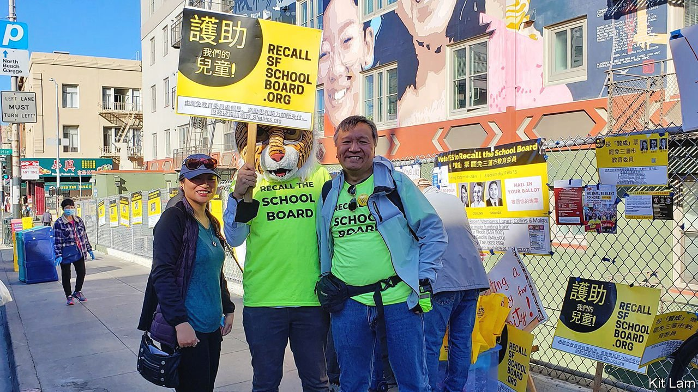

###### A recall election

# A successful school-board recall punishes left-wing excess 

##### It is a welcome victory for basic competence 

 

> Feb 17th 2022 

CLAD IN HIS bright yellow campaign shirt, Kit Lam and his fellow supporters of the effort to recall three members of the San Francisco Board of Education fanned out across Chinatown. They were making a final election-day push, eagerly speaking in Mandarin and Cantonese to passers-by. “We are going to win today, and it won’t be close,” says Mr Lam. He soon proved his chops as a pundit as well as a campaigner. The three commissioners—Alison Collins, Gabriela López and Faauuga Moliga—were soundly defeated on February 15th. It is the city’s first successful recall campaign since 1914.

San Francisco was an unlikely site for a school-board battle. It is a Democratic Party stronghold. Among America’s 100 largest cities, it has the lowest population share of children. Some 30% of them are enrolled in private schools. The emphatic rejection of the board points to a deep discontent. This stemmed from the lackadaisical approach to reopening public schools amid the covid-19 pandemic, coupled with an excessive focus on symbolic racial-justice issues.


Siva Raj saw the toll that remote learning had inflicted on his children. “Our kids were falling further and further behind,” says Mr Raj. Neither speeches, nor petitions, nor protests seemed to have any effect. In February Mr Raj and his partner, Autumn Looijen, began collecting signatures for a recall.

While students struggled, the board toyed with renaming 44 schools, some of which honoured infamous villains like Abraham Lincoln. It rejected a candidate for the parent advisory council because, as a gay, white male, he would not add sufficient racial diversity. Meanwhile, the city’s racial-achievement gap only widened during the pandemic: African-Americans suffered higher rates of absenteeism and learning loss than others. With a $125m schools-budget deficit looming, San Francisco’s mayor, London Breed, supported the recall. She will now appoint three replacements.

Many Asian-Americans were incensed by the decision to switch from merit-based admissions at the academically rigorous Lowell High School to a lottery. The board justified this change as necessary for racial justice. After the share of Asian-Americans in the subsequent freshman class at Lowell dropped from 50% to 42%, Ms López lauded the school’s “most diverse student population arguably ever”. “People in the community were just fed up,” says Mr Lam, a Chinese-American parent of two. Precincts in predominantly Asian-American neighbourhoods voted for the recall by almost ten percentage points more than the city at large.

Opponents tried in vain to tar the recall as a right-wing takeover. “This was a revolution for competence,” says Ms Looijen. It is a warning to radicals in school boards across America.

For exclusive insight and reading recommendations from our correspondents in America, , our weekly newsletter.

