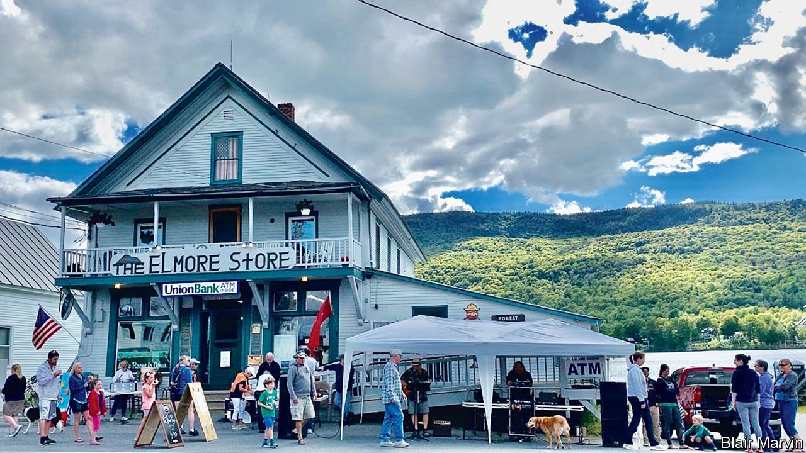

###### Post offices

# Long queues are the least of the US Postal Service’s problems 

##### Will the post-office bill deliver reform? 

 

> Feb 17th 2022 

“YOU CAN come in here at eight o’clock at night to pick up mail,” says Trevor Braun, bragging about the post office inside Elmore Store in rural Vermont. A recent Monday saw a steady stream of locals pop in to pick up their post, send packages and buy groceries. One customer excitedly tells Kate Gluckman, who runs the charming store with her husband, that “these are the shoes I told you about!” The shop and its post office have been at the centre of the small community, which still has a one-room schoolhouse, since they opened in the early 1800s. But that may soon change.

After the shop’s longtime owner retired, the United States Postal Service (USPS) did not automatically renew the contract with the new owner. Although it does nearly everything a post office does, it is not staffed by a postal worker. It is called a “contract postal unit”, which the USPS can shut with little notice.


Without the post office, many of the 900 residents would be virtually cut off from the world. Much of the area has no mobile-phone coverage. The post office is where many get their news. Small businesses, like the Elmore Sugarhouse and Elmore Mountain Bread, which use the post office to send maple syrup and bread, would be in a sticky mess. Locals would either have to drive to another town’s post office, several miles away, or erect a mailbox at the end of their driveway, something many rural residents do. But some live far from the road. Locals got the state’s congressional delegation, which includes Senator Bernie Sanders, a former presidential candidate, to fight to keep their post office. Contract negotiations are now under way.

It is not just Elmore’s post office that is in jeopardy. The USPS has been in financial trouble for years. Shifts in the way people communicate and pay bills have meant fewer letters in the post. Banking is done electronically and people use social media, texts or email to send cards, notes and photos. Newspapers such as The Economist increasingly arrive on mobile devices. True, package volume is up because of e-commerce. But the losses are staggering.

On February 8th the USPS announced a $1.3bn loss in its most recent quarterly results, compared with a $288m loss for the same period in 2020. Its biggest financial burden is the requirement that it pre-fund retiree health benefits for current and former workers for 75 years, something no other agency has to do. And unlike other federal agencies, the USPS does not receive direct federal funding. It must rely on stamp sales and shipping revenue.

Congress is at last paying attention, though it is not considering radical steps such as privatisation. Earlier this month, with rare bipartisan support, the House passed a sweeping overhaul of the USPS. The legislation requires future retirees to enroll in Medicare and it drops the crippling pre-funding requirement. Those two measures should save the service nearly $50bn over the next decade, according to the House Oversight Committee.

Elaine Kamarck of the Brookings Institution, a think-tank, says removing those burdens will free the postal service to fix its operating problems—and perhaps even to innovate, as it once did. For instance, it helped launch the aviation industry through airmail (Charles Lindbergh was an early postal pilot). And it established postal orders so that Union soldiers during the Civil War could send their wages home.

Chuck Schumer, the Democratic majority leader, promised to bring the bill to the Senate floor quickly. The legislation has the backing of the postal unions, the postmaster general and online retailers such as Amazon. But on February 14th Rick Scott, a Republican senator from Florida, blocked the vote because of national-debt worries.

The USPS cannot afford to wait long for help. Nor can its customers, who include most small businesses and the Social Security Administration, which mails 350m notices a year. About 7m Medicare recipients get at least one medicine through the post. Over 43% of voters cast their ballots by mail in 2020. Johnathan Hladik of the Centre for Rural Affairs, an advocacy group, puts it this way: “If you don’t have some of those basic amenities like the ability to get dependable mail,” small towns like Elmore simply “don’t stand a chance”. ■

For exclusive insight and reading recommendations from our correspondents in America, , our weekly newsletter.

