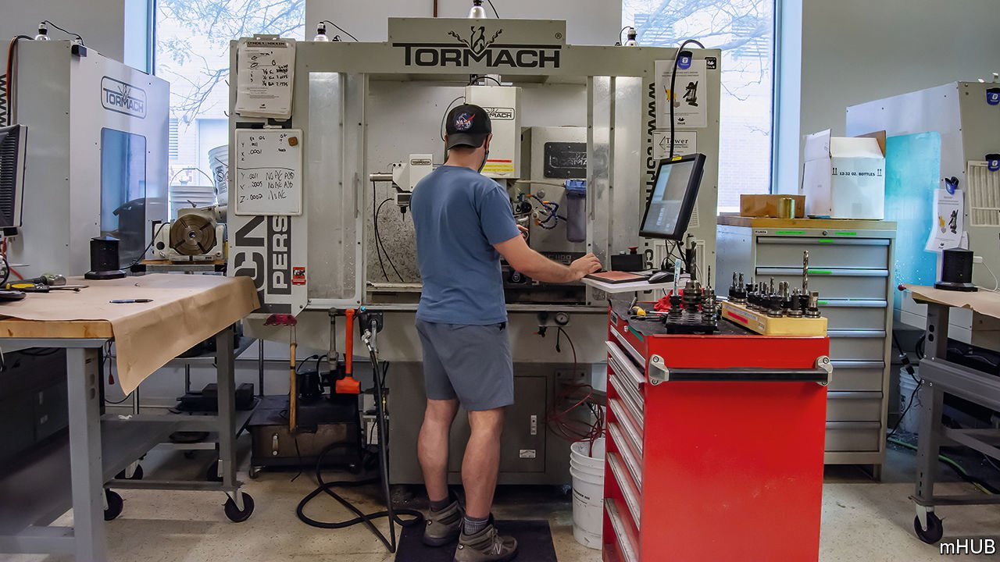

###### Industrial policy

# Midwestern states want to become “hard-tech” hubs 

##### Putting their money where their machines are 

 

> Feb 17th 2022 

THE ENTRANCE of MHub, a tech “incubator” in Chicago, resembles similar outfits elsewhere. There is a bar made from disused silicon chips, complete with a vintage arcade games machine, a foosball table and a pool table. Much like other tech incubators, there is also nobody around taking advantage of them, as covid-19 has reduced the appeal of socialising with lots of colleagues. To find out what is different about MHub, you have to go farther inside. At the back there is a fully equipped workshop. Three CNC milling machines, which cut aluminium into computer-designed shapes, hum away. There are devices which inject plastic into moulds; ones which print silicon chips; 3D printers; and a CT machine to scan prototypes. Unlike the toys in the games room, they are in use. Engineers scurry around clutching parts.

MHub, founded in 2017 in a building that once housed a Motorola design lab, is the world’s first “hard tech” incubator, at least according to its CEO, Haven Allen. The business model works much like tech incubators elsewhere. Startups are invited to apply to join through a competition. The winners are given mentoring, two years of access to the space and $75,000 in cash. MHub takes a chunk of equity, hoping to get its money back when the firms succeed. Unlike incubators elsewhere, however, which are devoted to finding brilliant app designers, at MHub only people with physical products to sell are considered. It is in Chicago so that successful applicants can “leverage” access to manufacturers across the Midwest, says Mr Allen.


MHub taps into the dreams of a lot of government types and business folk across the region that they might yet turn the rustbelt into something more glamorous—a “Silicon Heartland”. The idea is that the Midwest has a huge amount of manufacturing expertise in an era when tech firms increasingly need it.

“We know how to make things and make things happen in Michigan,” says Garlin Gilchrist, the lieutenant-governor of Michigan, a former software engineer who returned from the West Coast. “We’re just beginning to write our future,” says Penny Pritzker, a Chicago-based billionaire who was commerce secretary under Barack Obama. But for much of the past 60 years, the Great Lakes economic region (which also includes Indiana, Ohio and Wisconsin) has struggled. The manufacturing industry, which still makes up 15-20% of GDP in most of those states, has grown more slowly than services.

Can “hard tech” really reverse that? There are some reasons to be hopeful. Last month Intel, a chipmaking giant, announced plans to invest $20bn in a new factory near Columbus, Ohio, which the firm said could become “the largest silicon manufacturing location on the planet”. General Motors has announced that it is investing $7bn in Michigan in high-tech car manufacturing, including a battery plant near Lansing. In Chicago, funding for startups more than doubled in 2021, to about $7bn for the year.

According to Mark Muro of the Brookings Institution, a think-tank, a highly competitive manufacturing base could promote future growth for the region. “If it survived 25 years or more of hyper-globalisation and offshoring, what is left is pretty strong,” he says. That sort of high-tech manufacturing—particularly of cars, but also of medical equipment and drugs—tends to require both engineering and software-development talent. As it happens, the region’s universities already provide a ready supply of both. But in the past “a lot of that talent has wound up in Silicon Valley,” Mr Muro says.

One of the reasons why growth has been so sustained in big, densely populated places like New York and the San Francisco Bay Area is that tech firms like to be near other tech firms, so as to be able to poach talent. The “agglomeration” benefits are such that they are willing to pay even the outsize salaries workers in such regions can demand. That in turn has sucked away workers and capital from the interior. But if tech firms are starting to make more physical stuff, they need to be closer to factories—which the coasts have relatively few of, and the Midwest has aplenty. The competition to become the world’s leading internet software-developing region is “over, it’s happened”, says Chris Gladwin, a serial tech entrepreneur based in Chicago. But a new, wider boom may be starting.

Making sure it actually comes to the Midwest may take more than states are capable of doing on their own. To attract Intel, Ohio offered around $2.1bn in incentives, including grants and tax breaks. GM’s investment in Michigan came with around $800m. But cash alone cannot create the conditions for sustained growth, says Brad Henderson of P33, a Chicago organisation which connects firms to universities. Subsidies may merely move around investment that would have happened anyway.

Instead, sparking a boom will require deep co-operation and federal investment. A package of $250bn aimed at improving America’s competitiveness with China by investing in high-tech manufacturing is working its way through Congress. To reverse decades of relative decline is a tall order. But Americans are buying more stuff, and supply-chain jams have caused shortages of everything from silicon chips to lumber. If the Midwest is to catch up, its boosters believe it needs to take its chances now, before they begin to fade again. ■

For exclusive insight and reading recommendations from our correspondents in America, , our weekly newsletter.

