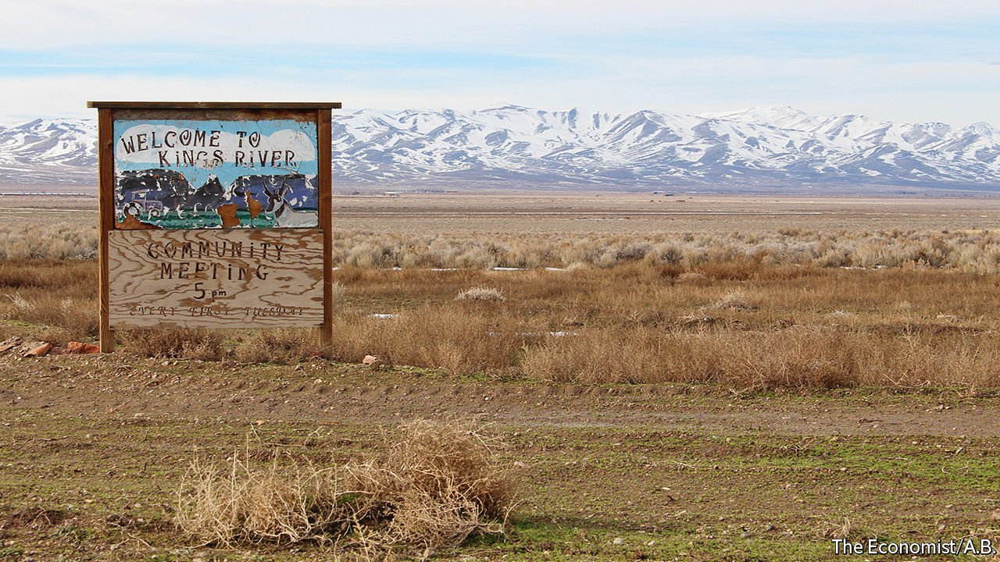
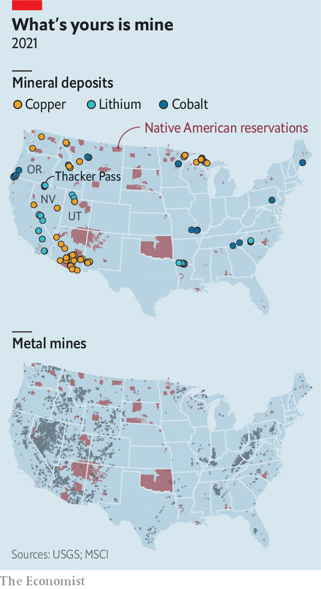

###### Between a rock and a hard place

# The energy transition is sparking America’s next mining boom 

##### Can critical minerals be secured without wrecking the environment and sacred tribal lands? 

 

> Feb 19th 2022 

ABOUT 16M YEARS ago, a supervolcano that straddled the borders of what is now Oregon and Nevada erupted, forming the McDermitt Caldera. The volcanic activity pushed lithium-rich rock up near the Earth’s surface, creating the largest known lithium deposit in the United States. Today, the same terrain around the Montana Mountains is carpeted with sagebrush, and coyotes are heard more often than people. But that may soon change. Lithium Americas, a Canadian company, has plans to build a mine and processing plant at Thacker Pass, near the southern tip of the caldera in Nevada. It would be America’s biggest lithium mine.

Ranchers and farmers in nearby Orovada, a town of about 120 people, worry that the mine will threaten their water supply and air quality. Native American tribes in the region say they were not properly consulted before the Bureau of Land Management (BLM), a federal agency that manages America’s vast public lands, decided to permit the project. Tribes also allege that a massacre of their ancestors took place at Thacker Pass in 1865. Michon Eben, a history preservationist for the Reno-Sparks Indian Colony, says destroying the massacre site would be akin to desecrating a sacred place. Environmentalists fret about protecting the habitat of the imperilled sage grouse and wildlife migration routes. Protesters who camped at the site see the mine as a symbol of the ills of development.

 


The fight over Thacker Pass is not surprising. President Joe Biden wants half of all cars sold in 2030 to be electric, and to reach net-zero emissions by 2050. These ambitious climate targets mean that battles over where and how to mine are coming to mineral-rich communities around the country. America is in need of cobalt, copper and lithium, among other things, which are used in batteries and other clean-energy technologies. As with past commodity booms, large deposits of many of these materials are found in America’s western states (see map).


America, of course, is not the only country racing to secure access to such materials. As countries pledge to go carbon-free, global demand for critical minerals is set to soar. The International Energy Agency, a forecaster, estimates that by 2040 demand for lithium could increase by more than 40 times relative to 2020. Demand for cobalt and nickel could grow by about 20 times in the same period.

Some environmentalists argue that the demand projections for lithium should be viewed sceptically as new kinds of batteries and storage are developed, and recycling technology improves. That may be true in the long term. But Venkat Srinivasan, who leads the Collaborative Centre for Energy Storage Science at Argonne National Laboratory near Chicago, says , for two reasons. First, because it takes about a decade to develop and scale up new technologies; and, second, because of the Biden administration’s aggressive timeline for electric vehicles.

Beyond its green goals, America is also intent on diversifying mineral supplies away from China, which—by virtue of its natural bounty and muscular industrial policy—has become a raw-materials juggernaut. The Biden administration’s desire to reshore supply chains continues America’s Trumpian retreat from globalisation. The covid-19 pandemic also revealed the pinch points in global networks, further spooking politicians and firms. The green transition has also turned the pursuit of critical minerals into a great-power competition not unlike the search for gold or oil in eras past. Mining for lithium, the Department of Energy (DoE) says, is not only a means of fighting climate change but also a matter of national security.

Go West, young miner

Westerners have seen all this before, and are wary of new mines for two reasons. First, Congress passed the General Mining Act of 1872 in the spirit of manifest destiny, giving prospectors the right to mine on land owned by the federal government. To this day, the law allows mining firms to extract minerals without paying any royalties. It was not until the 1960s and 1970s that lawmakers set environmental standards for mining on public lands. Charles Wilkinson, a legal scholar, christened the 1872 statute one of the “lords of yesterday”, a group of laws that set the tone for more than a century of land use in the West.

The economic history of the American West is a story of boom and bust. When a commodity bubble burst, boomtowns were abandoned. The legacy of those busts still plagues the region. In 2020 the Government Accountability Office estimated that there could be at least 530,000 abandoned hardrock-mine features, such as tunnels or waste piles, on federal lands. At least 89,000 of those could pose a safety or environmental hazard. Most of America’s abandoned hardrock mines are in 13 states west of the Mississippi River.

Today, mining companies have to study how their activities would affect the environment and clean up after themselves. “I know there’s concerns about abandoned mines. But if you look when those mines opened and actually operated it was 50 or 100 years ago,” says Jonathan Evans, the boss of Lithium Americas. Firms must operate differently now, he says. Residents of Orovada are less sanguine. “We’re still not convinced that this is in our best interest,” says Gina Amato, a local farmer. “We do very much feel that we are the sacrificial lamb for the greater good.”

Second, talk of new mines on public land fuels a  among some westerners that so much of their states are owned by the federal government. Federal agencies own about 80% of Nevada, 65% of Utah and 46% of California. It is a similar story across the region. Some would like to change that. Utah’s Republican governor has advocated more local control over the state’s public lands.

The green transition is not the only economic shift afoot. In recent decades, towns that were dependent on extractive activities have turned instead to outdoor recreation to help power their economies.  have boomed in part because they are close to wild places. This has come with costs such as high housing prices and overcrowded national parks. Still, marketing their mountains, canyons and even  seemed a way for parts of the West to put extraction in the rear-view mirror.

But some of these towns are sitting on materials needed for the clean-energy revolution. Moab, Utah, is now a mecca for hikers and off-road adrenalin junkies. Eastern Utah’s red-sandstone desert is also home to massive deposits of uranium, which America may need if it succeeds in . Reviving uranium mining would be considered sacrilege by the tourists who flock there and the locals who have watched the DOE spend more than a decade cleaning up leftover radioactive waste.

Is it possible to secure critical minerals while avoiding the mistakes of previous booms? America’s debates over how to use its public lands, and to whom those lands belong, are notoriously unruly. Conservationists, energy companies, ranchers and tribal nations all feel some sense of ownership. Total harmony is unlikely. But there are ways to lessen the animosity.

Start with environmental concerns. Mining is a dirty business, but development and conservation can coexist. In 2020 Stanford University helped broker a national agreement between the hydropower industry and conservation groups to increase safety and efficiency at existing dams while removing dams that are harming the environment. The inspiration for the agreement was a similar plan in 2004 that fixed some dams on the Penobscot River in Maine and tore down others that blocked fish from migrating. Dan Reicher, a former assistant secretary of energy, now at Stanford, says Penobscot is a useful template for balancing energy needs with protecting the environment.

Many worry that permitting new development on land sacred to tribes will be yet another example of America’s exploitation of indigenous peoples in pursuit of land and natural resources. MSCI, a consultancy, reckons that 97% of America’s nickel reserves, 89% of copper, 79% of lithium and 68% of cobalt are found within 35 miles of Native American reservations.

The art of compromise

The BLM is supposed to consult tribes about policies that may affect them. Ms Eben, the historical preservationist, argues that the consultation process is broken. Often it consists of sending tribes a letter notifying them of a mining or drilling proposal. “Over the last five or ten years, the concept of collaboration in government-to-government negotiations has changed a lot,” says Geoffrey Smith, an archaeologist at the University of Nevada, Reno. “No longer is a letter or a couple of letters sufficient.” Before they were forced onto reservations many indigenous groups in the West were nomadic. This means that more tribes have ties to the land than the BLM has traditionally consulted with. Revising the consultation process by involving more tribes earlier might help avoid or resolve conflict.

The communities in which new mines are built would also like a seat at the table. Orovada’s negotiations with Lithium Americas offer an example for other towns. Ms Amato helps run a group that meets regularly with the company. Its members do not trust the firm. Yet some are upbeat about the 300 jobs the mine will bring. There are other upsides to collaborating. Lithium Americas has offered to build the town a new school, one that will be farther away from a road that the firm will use to transport sulphur. Sitting in her truck outside a petrol station that doubles as Orovada’s local watering hole, Ms Amato recalled one group member’s response to the offer: “If all I’m going to get is a kick in the ass, because we’re getting the mine regardless, then I may as well get a kick in the ass and a brand new school.” ■

For exclusive insight and reading recommendations from our correspondents in America, , our weekly newsletter.

