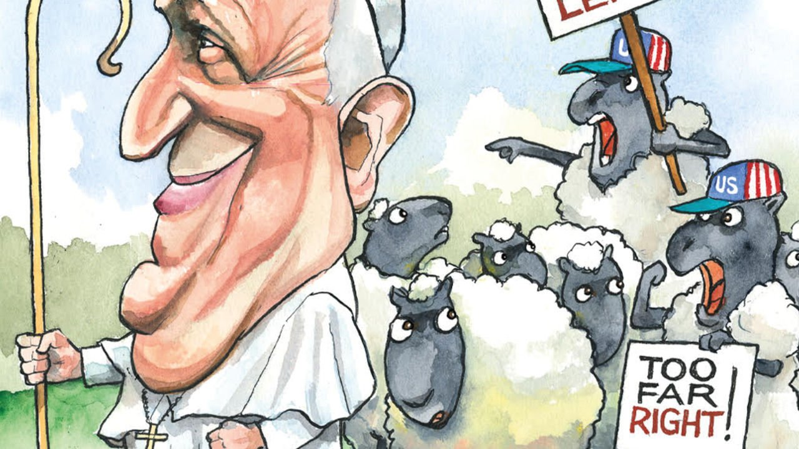

###### Lexington

# The fight for Catholic America 

##### Pope Francis is starting to get a grip on the world’s fourth-biggest Catholic country 

 

> Feb 19th 2022 

WHEN SHELTON FABRE became a bishop in New Orleans in 2007 he took as his motto a phrase from the prophet Isaiah: “Comfort my people”. It was apposite to the city, still recovering from Hurricane Katrina, and to the priest himself. The 43-year-old had been drawn to the church by the comfort he and his family received from their parish priests during two calamities. Growing up in New Roads, a small town near Baton Rouge, Louisiana, he lost one of his brothers to a drowning accident and another, when Bishop Fabre was 18, to leukaemia. His surviving siblings and parents—a bricklayer and schoolteacher—were broken. “But the church was there for us, comforting us, and that’s what I signed up to do,” he recalls. “I won’t say I’ve done it perfectly, but to the best of my ability I’ve tried to be there for people, to be with them in their communities, to bring them the comfort of Christ.”

His vocation took him to parishes around Baton Rouge and the Louisiana State Penitentiary at Angola, one of America’s biggest and most violent prisons, where he served as chaplain. His priority, he says, “was to give the people there hope”. It was not the sort of path traditionally followed by Catholic bishops, let alone archbishops, to whose exalted ranks he was promoted this month. As in the upper echelons of any hierarchy, they tend to be ambitious careerists. But then Bishop Fabre says he never much wanted to be a bishop in the first place: “I was very happy being a priest.” And his pastoral record and relative lack of interest in church politics are perfectly illustrative of how Pope Francis is trying to change the American Catholic church, whose 70m members make it by far the country’s biggest religious group.


Its leadership is still dominated by the conservatives his two traditionalist predecessors, John Paul II and Benedict XVI, appointed. Yet the 13 American archbishops Francis has picked have begun to move it in a less confrontational and more rounded direction. Disappointingly to progressives, they, like the pope himself, are not markedly, or sometimes at all, more liberal on the sexual ethical issues that the old guard obsesses over. Bishop Fabre opposes same-sex marriage, for example. Yet he and other Francis appointees—again like the pope—tend to speak of such matters less righteously, less often and within a broader array of moral priorities than their culture-warring brethren.

They stress pastoralism—in the sense of responding to the needs of congregants as they arise—over advocacy. That in turn leads them to abhor inequality, environmental damage, poverty and poor health care as much as abortion. Bishop Fabre, only the second African-American archbishop, is better known for his work on combating racism, as the leader of a high-profile church review of the issue, than for his opposition to gay marriage. It is not coincidental that he has been appointed Archbishop of Louisville, Kentucky, which has a large African-American population and saw highly charged protests over the killing of Breonna Taylor, an unarmed black woman, by the police in 2020.

If left-wing American Catholics are disappointed by the Francis reset, the right is livid. According to a close observer of the country’s Catholic bishops’ conference, around a third its 260 active members are hostile to the pope. And they have powerful champions in, for example, Cardinal Raymond Burke, a former Archbishop of Louisville who lambasts, among other things, the pope’s support for civil rights for gay couples and relatively relaxed view of divorcees receiving communion. He would also deny the Eucharist to Joe Biden and other Catholic politicians supportive of abortion rights. On the harder Catholic right, wilder spirits abound, from Bishop Joseph Strickland of Texas, a covid-19 anti-vaxxer and QAnon conspiracy disseminator who suggests it is impossible to be both Democratic and Catholic, to a legion of well-funded and often unhinged Catholic media entrepreneurs. They include the Alabama-based EWTN, a hotbed of pro-Trump, anti-Francis propaganda, which claims to be the “world’s largest religious media network” with a global audience of over 250m.

Fighting for pre-1960s social mores was never going to be easy. Yet the anger on the Catholic right has been hugely exacerbated by four decades of reckless and ultimately fruitless activism under Francis’s predecessors. Some date this development even farther back, to the 1950s, when Catholics began downplaying the church’s distinctive stress on social justice in a bid to join the Christian mainstream from which they were previously excluded. Yet the politicking became far more pronounced in the late 1970s, when conservative Catholic activists made common cause with the wider religious right in denouncing moral relativism, abortion, gay rights and other supposed sins of modernity.

The failure of that movement, and the despondency it has wrought, is signalled by the moribund, aggrieved and Trump-addled state of white evangelicals today. Catholic America, anchored in its network of schools, charities and the growing Hispanic church, was always less committed to the culture war and has been less radicalised as a result. White evangelicals are the least likely religious group to be vaccinated against covid, Catholics are the likeliest. Yet the anger on the Catholic right, though ostensibly aimed at the pope, is fuelled by the same sense of cultural and political defeat weighing on white evangelicals.

More to life than sex

This makes Francis’s attempt to draw the poison from the most divisive social issues, by lowering their profile rather than winning the argument over them, seem especially wise. Through the example of conscientious pastors such as Bishop Fabre, he aims to make the church less self-obsessed and more responsive to its congregants. And thereby, the pontiff must hope, also more relevant to their lives, even as organised religion retreats. Secular politicians might call this “meeting the voters where they are”. They should also try it. ■

Read more from Lexington, our columnist on American politics:

 (Feb 12th) 

 (Feb 5th)

 (Jan 29th)

For exclusive insight and reading recommendations from our correspondents in America, , our weekly newsletter.

