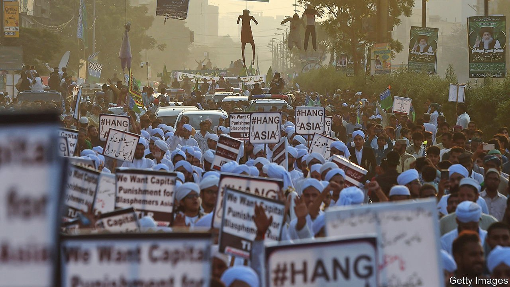

###### No mercy

# Pakistan’s blasphemy law devastates scores of lives each year 

##### Even devout Muslims are vulnerable to its abuse 

 

> Feb 26th 2022 

TANVEER AHMED, afraid to leave the near-darkness of his home, sits on his bed fretting. He is a civil engineer; his wife was the headmistress of a private school. They enjoyed a comfortable life together. An accusation of blasphemy levelled at his wife swept all that away, and he now cowers in a dilapidated couple of rooms in a suburb of Lahore. His wife, Salma Tanveer, is on death row. He has lost his home and job and worries that a mob could kill him at any time. “My wife is a very good woman, she did not deserve this,” he says. “We are afraid, we can’t go anywhere.”

The high-profile case of Asia Bibi, a Christian farmhand sentenced to death in lower courts for blasphemy after being accused by the Muslims she worked with of insulting the Prophet Muhammad, ended in 2018 with acquittal in the Supreme Court. But such accusations still ruin scores of lives in Pakistan each year. Indeed in 2020, the most recent year for which America’s State Department has tallied figures, Pakistani courts heard 199 blasphemy cases, a record number.


Ms Tanveer was sentenced to hang in September after a judge ruled she had distributed writings denying Mohammad was the final prophet of Islam. Her husband says she was suffering from long-standing mental illness, and that the case was pursued by a local cleric seeking revenge after a quarrel with the couple. (Ms Asia’s case also followed a row, with other farmhands.) Medical testimony on Ms Tanveer’s mental-health problems delayed her trial for years. Her death sentence has still to be confirmed. In fact, no death sentence for blasphemy has ever been carried out in Pakistan. But acquittals generate so much public anger that judges prefer to pass cases to appeals courts. Ms Tanveer is likely to spend years more languishing behind bars as her case crawls through the system to the Supreme Court.

According to the State Department’s survey, of the people facing blasphemy accusations in 2020, 35 were sentenced to death. Of the accused, 70% were Shia Muslims, 20% from the persecuted Ahmadi sect (who are considered non-Muslims under Pakistani law), 5% Sunnis and the rest Hindus or Christians.

Tehreek-e-Labbaik Pakistan (TLP), an extremist party, has amassed enormous political clout, in part by resisting attempts to reform the blasphemy laws. It has been emboldened by confrontations with the government of Imran Khan, the prime minister, all of which have ended with the government’s climbing down.

The Centre for Research and Security Studies, a think-tank in Islamabad, has counted nearly 1,300 accusations of blasphemy made between 2011 and 2021. Campaigners trying to help those accused say the success of the TLP has meant that making a blasphemy accusation and whipping up ill-educated followers can be a shrewd career move for an ambitious cleric.

The stream of accusations shows no sign of drying up. On January 19th a 26-year-old woman was sentenced to hang for allegedly sending blasphemous messages over WhatsApp and Facebook. The caricatures Aneeqa Ateeq forwarded were judged to be a deliberate insult to Islam. Ms Ateeq, who is Muslim herself, says she had been lured into conversation with the complainant, who made advances to her and then wanted revenge after she spurned them. In the days after her conviction, competing Twitter hashtags lobbied to save her and to hang her.

Earlier this month a mob in rural Punjab lynched a mentally ill man after accusing him of burning pages of the Koran. A Sri Lankan factory manager in the industrial city of Sialkot was murdered in December after workers accused him of tearing down posters bearing holy verses.

Salma Tanveer is being represented by Saif ul-Malook, the lawyer who also defended Ms Asia. That earlier case brought him international acclaim and even funding. He predicts he will receive no such support for this one. He says: “If the accusation is against a Christian, the whole Christian world is ready to stand, to fund a lawyer, to raise a media campaign and make diplomatic efforts with the government. But when it comes to a Muslim, they are not interested.” ■

