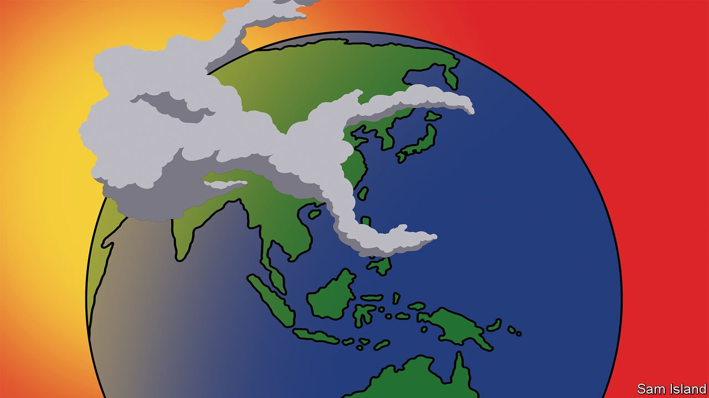

###### Banyan

# Parallels with Taiwan colour Asian views of the war in Ukraine 

##### Some fear a Chinese invasion has become more likely 

 

> Feb 26th 2022 

FOR THOSE concerned about peace in the Asia-Pacific region, Ukraine is, as one Japanese newspaper commentary puts it, “not a fire on the opposite shore”. Not least, Asia also has a small democracy bang next to a big bully. China has long claimed Taiwan as its own, uses its armed forces to intimidate it and reserves the right to invade.

Japan’s prime minister, Kishida Fumio, recently warned, “If we tolerate the use of force to change the status quo, it will have an impact on Asia as well.” He was implying that the aggression of Russia’s president, Vladimir Putin, towards Ukraine could embolden his Chinese counterpart, Xi Jinping, regarding Taiwan. China’s commentariat does little to dispel the notion. In response to a G7 call to support Ukraine’s territorial integrity, the Global Times, a state tabloid, tweeted mockingly, “When China takes action to eradicate [the] secessionist regime in Taiwan, you must also give China unwavering support.”


In reality, far from affirming the wisdom of  the war in Ukraine exposes its limits. Meanwhile, the differences between Ukraine and Taiwan illuminate more than do the similarities, starting with levels of American support. Most Americans cannot find Ukraine, their country’s 67th-biggest trading partner, on a map.

Taiwan, by contrast, is America’s ninth-largest trading partner and a semiconductor superpower at the heart of global supply chains. As a Chinese-speaking democracy, points out Bonnie Glaser of the German Marshall Fund of the US, a Washington think-tank, Taiwan has long been valued by the United States as an alternative political model to the Communist-run mainland. The two countries had a mutual-defence treaty until 1979, since when America has supplied weaponry and said it will resist forcible attempts to change the island’s status as an independent nation in all but name. Taiwan also sits at the nub of the western Pacific’s “first island chain” and, under friendly management, offers a crucial buffer to Japan, America’s main ally in the region, from Chinese threats.

So American credibility is much more at stake in Asia over Taiwan than it is in Europe over Ukraine. Losing Taiwan would mean the end of a security order in the region that America has led since the second world war, and ceding to China the role of the region’s uncontested power.

It is not surprising, then, that Taiwan’s president, Tsai Ing-wen, and her administration make much of their country’s differences from Ukraine. Mr Xi, they argue, knows that America would respond robustly to any attack. Of greater immediate concern, says Lo Chih-cheng, head of the ruling party’s foreign-affairs division, is that Ukraine will distract American attention, allowing China to make military mischief, such as testing Taiwan’s commitment to defending outlying islets. Andrew Yang, a Taiwanese former defence minister, predicts China will step up misinformation drives and cyber-attacks designed to sow doubt about American commitments and reinforce a narrative of the inevitability of Chinese dominance. Here, a linkage with Ukraine does exist, Ms Glaser notes: China is watching closely how Russia applies hybrid warfare there, with lessons for its use against Taiwan.

A final linkage is that Russia itself is an Asian power. Before it began preparing for war against Ukraine, its military activities in the Russian Far East were becoming not only more vigorous but also more hostile to America and its friends. Russia uses the Sea of Okhotsk, north of Japan, as a redoubt for its nuclear-armed submarines (designed to attack the United States as a last resort). It has conducted joint naval drills with China, an increasingly close military partner, in the Sea of Japan.

Meanwhile, Japan is the only G7 member with which Russia has a direct territorial dispute: Stalin seized four northern islands in the last days of the second world war. Japan’s hopes of their return have led to years of attempted rapprochement with Russia, in which Japan has been at pains not to be seen to be part of an anti-Russia grouping. But this week Japan has condemned Russia’s aggression and has joined Western sanctions on the country—despite unusually large Russian exercises in waters near Japan in recent weeks, intended, military analysts say, to deter Japan from siding with America and Europe. The heightened tension between Russia and Japan looks set to become the norm. Ukraine’s fires are already burning on the Asian shore.

Read more from Banyan, our columnist on Asia: (Feb 19th)

 (Feb 12th)

 (Feb 5th)

