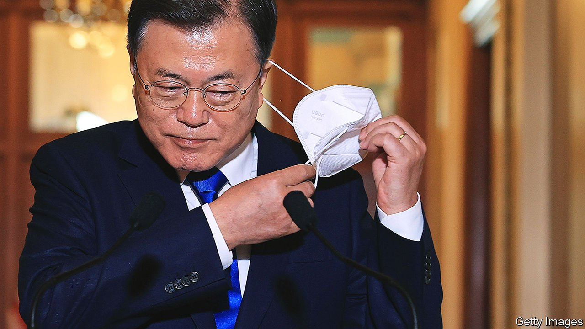

###### K-popular

# Why South Korea’s outgoing president is less unpopular than most 

##### Under Moon Jae-in the country has weathered covid-19 and acquired global cultural heft 

 

> Feb 26th 2022 

JUDGED AGAINST his own high standards Moon Jae-in, South Korea’s outgoing president, is a failure. He took office in May 2017 in a snap election after Park Geun-hye, his predecessor, had been jailed for corruption and abuse of power. There had been months of protests against Ms Park and the discredited political class; Mr Moon campaigned on a platform of social, political and economic renewal. He promised to end the cosy links between politics and big business and create an egalitarian economy. He would move the president’s office from the leafy outskirts to central Seoul, be in constant dialogue with citizens and end self-dealing and partisan strife. Moreover, he would bring an era of peace to the Korean peninsula by making overtures to Kim Jong Un, North Korea’s dictator.

With just over two months left of Mr Moon’s single five-year term, none of this has come to pass. The president remains ensconced in his palace in Seoul’s northern hills. He has pardoned Ms Park and paroled Lee Jae-yong, the heir of the Samsung empire, from whom she accepted bribes. Other leaders of conglomerates have been reassured of their firms’ central place in the economy. Ordinary citizens are struggling with unaffordable housing and a continuing shortage of jobs for the young. Partisan squabbling and mudslinging endure; indeed, they dominate the campaign to elect Mr Moon’s successor. North Korea, meanwhile, has expanded its arsenal of missiles and nuclear warheads and blown up the North-South liaison office in the demilitarised zone between the two Koreas.


Yet when it comes to how Mr Moon is likely to be remembered, all this may matter less than it first appears to. South Korea has weathered the covid-19 pandemic more successfully than any other rich country, at least partly thanks to his government. Mr Moon’s tenure also coincided with a huge jump in South Korea’s global cultural clout. And he has, in a quiet way, strengthened his country’s still-young democracy and begun to make life a little less stressful for its people. All that explains why he is likely to leave office as the most popular president in South Korea’s democratic history. Depending on the pollster and the type of survey, between two-fifths and just under half of all voters say they approve of the president, though less than a third say the same of his party.

Mr Moon is likely to be remembered chiefly for the way he shepherded South Korea through the pandemic. Although it is currently suffering a surge in covid-19 infections from the Omicron variant, it still has the second-lowest number (after New Zealand) of confirmed deaths from the disease relative to population of any country in the OECD, a club mostly of rich countries. Two years in, South Koreans are chafing under ongoing curfews and social-distancing rules, but they have not had to endure lockdowns or overwhelmed hospitals. Nor has the country’s economy suffered on the same scale as much of the world. GDP returned to pre-pandemic levels early last year, grew by 4% in 2021 and is predicted to grow by 3% in 2022.

That was not Mr Moon’s achievement alone. Reforms to public-health systems after a disastrous outbreak of MERS in 2015 help explain the bureaucracy’s nimble response to the pandemic. South Korea set up testing, tracing and isolation systems much faster than other rich countries. It helped that its highly automated semiconductor factories were less susceptible to disruption by covid-19 outbreaks than other industries were.

But Mr Moon set the train in motion when he called emergency meetings in January 2020 to persuade companies to speed up production of test kits. His decision to remain in the background of public-health management probably helped earn bipartisan support for the measures the authorities imposed. It has been maintained, and is reflected in ubiquitous mask-wearing and a vaccination rate of 86% of the population, one of the world’s highest. The legislative supermajority his party won in the elections to the National Assembly in 2020 helped the government swiftly dole out generous pandemic relief, minimising economic disruption.

That victory also allowed Mr Moon to advance another goal: to improve the work-life balance of overworked South Koreans. Before the pandemic, a reduction in working hours for employees at large companies had already led to increased spare time and fewer after-work dinners with the boss. More generous parental leave had encouraged more fathers to spend time with their children. Since then, the curbs on working hours have been extended to smaller companies. Budgets for parental leave and child care have been boosted.

Companies still have some catching up to do to accommodate these new habits. And the president’s commitment to improving life has waned at times: he has done little, for instance, to push his party to adopt fast-changing social mores on such matters as gay marriage and discrimination on grounds of sex, sexual orientation or health. Prominent political associates of the president have been embroiled in sexual-abuse scandals. Little by little, however, Mr Moon’s policies have been chipping away at a culture that puts work above all else.

The parliamentary supermajority also helped Mr Moon fulfil his promise to strengthen South Korean democracy. He curbed the power of the public prosecutor’s office by diverting some of its powers to other agencies. Supporters hope that the reforms will strengthen oversight of powerful government agencies and break the culture of politically motivated prosecutions that has bedevilled the presidency. All Mr Moon’s democratically elected predecessors have found themselves subject to corruption investigations after leaving office. Yoon Seok-youl, Mr Moon’s former chief prosecutor and now the conservative candidate for president, has threatened to go after his former boss if he wins the election. If he does, the result will be a test not just of Mr Moon’s probity, but also of the resilience of his reforms.

The changes wrought by Mr Moon have been mirrored in a development for which he is cannot claim credit, but for which he will probably be remembered as well: South Korea’s rise as an exporter of pop culture. BTS and Blackpink are the world’s most popular boy band and girl band respectively. Bong Joon-ho, who was one of thousands of artists and intellectuals blacklisted by Ms Park for his left-wing views, won a Best Picture Oscar for “Parasite”, a dark satire about inequality. “Squid Game”, a gory television show directed by Hwang Dong-hyuk, also offering a crude critique of capitalism, topped the Netflix charts and produced countless memes now lodged in the global imagination. That both directors are now treated as national icons rather than enemies of the state suggests South Korea’s democracy has indeed grown stronger under Mr Moon. That both shows depict a world hopelessly stacked against the little guy suggests that Mr Moon’s promised egalitarian revolution still has a long way to go. ■

