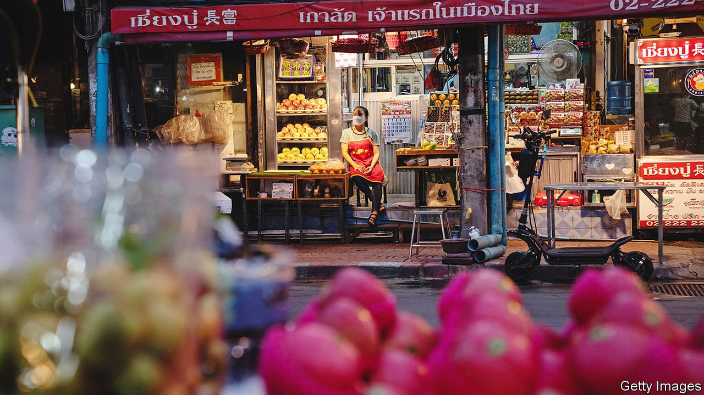

###### Call me by my name

# Why so many Asian cities adopt an alias 

##### Not because their people are demanding it 

 

> Feb 26th 2022 

KRUNG THEP MAHA NAKHON may be a mouthful, but it is less likely to provoke sniggering among those with a teenage mindset than its better-known alternative, “Bangkok”. That is one interpretation for guidance published on February 16th by the Office of the Royal Society, Thailand’s answer to the Académie Française. A dense press release noted that this pithy four-word version of the much longer formal Thai name for the country’s capital should be the standard for official purposes and should be used when writing in Roman script, too.

Some Thais criticised the government for abruptly changing how their capital is known around the world. But it is hardly the first to consider rebranding a world-famous city. Politicians have long loved to rename places to suit their whims. Rarely do citizens clamour for change.


Often a city’s name is changed to shed colonial or other unpleasant memories. Among the best-known is Bombay, named by the dastardly British, which became Mumbai in honour of a local goddess, Mumbadevi. Batavia, the Roman name for part of the Netherlands, became Jakarta when the Dutch left. Frunze, commemorating a prominent Bolshevik, became Bishkek as the Soviet Union crumbled. Equally common are simply tweaks to spelling to reflect local pronunciation: Kanpur not Cawnpore, for instance, or Yangon for Rangoon.

In Australia, various places associated with settlers or featuring offensive language have been given Aboriginal names instead. Tasmania’s Suicide Bay, where 30 indigenous men were murdered, is now called Taneneryouer, meaning “trauma”. In India, the ruling Bharatiya Janata Party is replacing Muslim-sounding names in pursuit of its Hindu-nationalist agenda. Faizabad district in Uttar Pradesh is now Ayodhya district, and the city of Allahabad has become Prayagraj. In 2019 Kazakhstan’s capital, formerly Astana, (ie, “capital”), was renamed Nur-Sultan in honour of Nursultan Nazarbayev, a former president who retired that year.

Inevitably, some changes are contentious. The city government of Ishigaki in southern Japan renamed an area under its jurisdiction to include the word “Senkaku”, as a scattering of islands there are known in that country. That annoyed both China and Taiwan, which lay claim to the uninhabited cluster of rocks, and know them as the Diaoyu islands. China, for its part, last year renamed several villages it claims in north-eastern India to reflect its preferred spellings.

Nor do all changes stick. Few people refer to Bangalore as Bengaluru or to Chittagong as Chattogram. Rebranding Bangkok, too, would be unlikely to change how foreigners refer to it. That may be why Thai officials hastily clarified matters the next day: Bangkok is still fine to use, they said—but so is Krung Thep Maha Nakhon.

