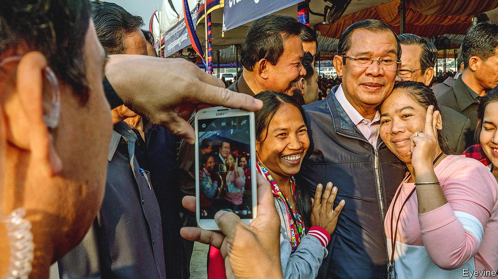

###### The chastened cowboy

# Will humiliation in Myanmar help Cambodia distance itself from China? 

##### Cambodia’s strongman failed as a peacemaker there 

 

> Feb 26th 2022 

HUN SEN likes doing things his own way. Cambodia’s prime minister has ruled the country for 37 years and counting. Satisfied with his own performance, he banned the main opposition party in 2017. In January he flew to Myanmar, deciding that he was the man to bring peace to that country, racked by war since the army seized power last year.

This did not go down well in the region. ASEAN, the club of South-East Asian countries to which Cambodia belongs, has a hallowed tradition of consensus, and last year decided to shun Myanmar’s junta. In 2022 Cambodia holds the bloc’s chair, which rotates annually. So the timing of Mr Hun Sen’s visit was unfortunate. It might have helped create the impression that the bloc considered the junta legitimate, remarked Malaysia’s foreign minister. In exchange, the generals offered no real concessions to Mr Hun Sen.


So the “cowboy” diplomat, as he has been dubbed, has had a rough ride, recalling the last time his country wielded ASEAN’s gavel. In 2012 Cambodia scandalised the region by appearing to act as a proxy for China, blocking the release of a joint ASEAN statement on the tussle between China and several South-East Asian countries over competing claims in the South China Sea. Cambodia began to be seen as a Chinese client-state. In 2020 Bilahari Kausikan, once Singapore’s most senior diplomat, suggested that ASEAN might one day be forced to expel Cambodia because it had fallen into China’s orbit.

The episode in 2012 haunts Cambodia’s government to this day. It saw this year’s chairmanship as a chance to “redeem” itself, says Elina Noor of the Asia Society Policy Institute, an American think-tank. Taking a hard line against the junta would counter the perception that it was an ally of authoritarians and the stooge of China, which has urged ASEAN to befriend the generals. Mr Hun Sen, who is 70, may never chair ASEAN again, and so this is one of his last opportunities to “refashion” his image on the world stage, says Aaron Connelly of the International Institute of Strategic Studies, a think-tank in Singapore.

Yet Mr Hun Sen could not resist making overtures to the junta. That is because he sees himself as a peacemaker who helped bring an end to war in his own country, says Mr Connelly. Myanmar is proving trickier, however. On February 17th, just six weeks into his chairmanship, he announced he would bequeath the crisis to his successor to resolve: “I’m damned if I do, and damned if I don’t, so just let it be.”

For the rest of his chairmanship, Mr Hun Sen will probably do as his diplomats suggest and try to distance himself from China. Following precedent, Cambodia did not invite junta officials to an ASEAN retreat on February 16th, and hopes to hold meetings with a rival government composed of deposed lawmakers. Western governments will probably shrug. Cambodia is one of China’s closest allies in the region. It is Cambodia’s biggest source of aid and investment, and is helping pay to upgrade a naval base. Yet Cambodia claims not to want to choose between America and China. Now might be a good time for Western countries to test its readiness to strike a better balance. ■

