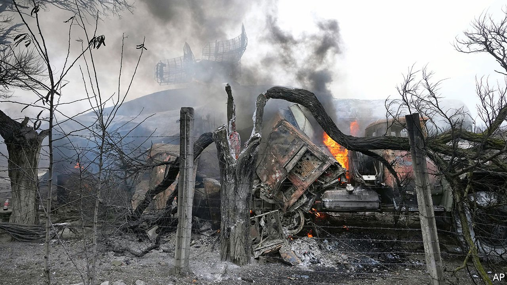
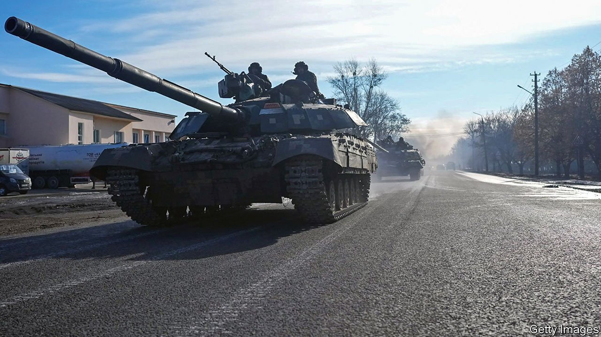
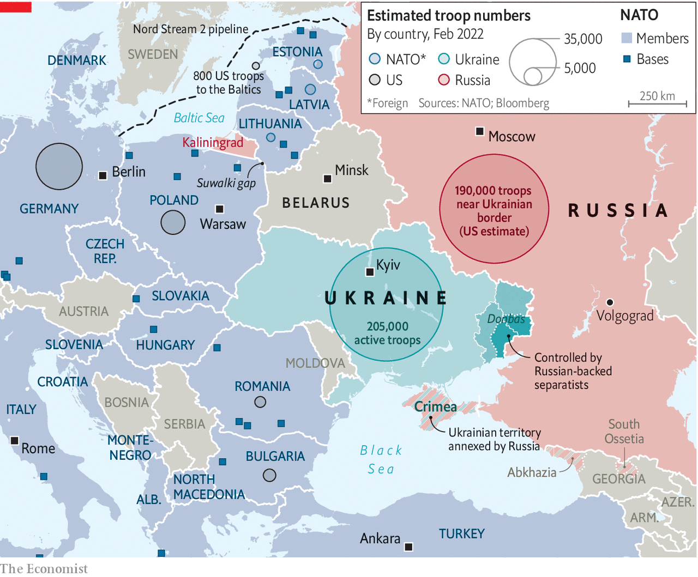

###### The return of large-scale war to Europe

# Russia’s invasion of Ukraine 

##### Vladimir Putin has brought war back to Europe 

 

> Feb 26th 2022 

“THERE WILL be no escalation in the coming week either, or in the week after that, or in the coming month,” declared Vladimir Chizhov, Russia’s envoy to the European Union, on February 16th. “Wars in Europe rarely start on a Wednesday.” And indeed it was early on Thursday, February 24th, as dawn broke over Ukraine, that Vladimir Putin, Russia’s president, took to television to declare war on Ukraine in the form of a “special military operation” to “denazify” the country.

Within minutes explosions were heard near Kyiv’s main airport, as well as in many other cities. Video footage taken in Ukraine showed cruise missiles slicing through the air and slamming into buildings. Mr Putin had launched what is sure to be Europe’s most intense war in a generation—possibly its largest since the second world war. It will shake his regime to its foundations, debilitate Russia’s economy and fracture Russian society. It will shatter existing assumptions about European security. It could well send shock waves through the global economy.


As The Economist was published, an initial wave of missiles had struck several of Ukraine’s airports and other targets across the country, all of which Russia claimed were military. Armoured forces had then begun rolling in not just from Russia itself but also from Belarus. They were the vanguard of a force of over 150,000 organised in over 110 of the battalion tactical groups which are Russia’s basic fighting formation. Russian forces were “literally pouring into Ukraine from Crimea”, according to Konrad Muzyka of Rochan Consulting.


Western security officials expect two major Russian thrusts. One, of which the landing in Mariupol would seem to be part, is a pincer movement aimed at encircling and shattering Ukrainian forces around the Donbas region in eastern Ukraine, preventing those forces from retreating west over the Dnieper river. The second is a drive south from Belarus towards Kyiv, which lies just 140km south of the border. Attacks elsewhere in the country will be aimed at disrupting Ukraine’s ability to respond to the advances.

The speech with which Mr Putin announced the war’s first shots was blood-curdling. He put his aggression into the context of the West having “tried to finish us off, to destroy us completely,” after the collapse of the Soviet Union. The countries of NATO were “supporting Nazis and nationalists in Ukraine who will never forgive the people of Crimea their choice of joining with Russia.” No quarter could be given to them. And Russia “is one of the greatest nuclear powers in the world and has certain advantages in the newest weapons. Nobody should be in any doubt that any direct aggression against our country will lead to crushing and most horrible consequences for any potential aggressor.”

Oil and gas prices jumped in response to the invasion; the Brent crude benchmark rose past $100 per barrel for the first time since 2014. Global stockmarkets fell. Moscow’s exchange was temporarily suspended and plunged on reopening. Civilian airliners were told to stay clear of Ukrainian airspace.

“Russia alone is responsible for the death and destruction this attack will bring, and the United States and its allies and partners will respond in a united and decisive way,” said a statement from President Joe Biden. Having imposed an initial round of sanctions earlier in the week, he said he would announce further measures on February 24th. The EU, Britain and other countries look set to follow suit. A G7 video summit was called for later in the day; EU leaders are also due to discuss the crisis.

Ukraine, for its part, was stunned. Its foreign minister, Dmytro Kuleba, tweeted that: “The world must act immediately. Future of Europe &amp; the world is at stake.” His predecessor, Pavlo Klimkin, says Ukraine “would not give in.” Its best hope, he thinks, lies in the West stepping in to negotiate a ceasefire without further territorial losses. “The alternative doesn't bear thinking about.”

The historical centre of Podyl, one of the oldest districts of Kyiv, was much less busy than usual as the day began. But trams continued to operate, and people huddled around the tram stop to discuss the events. Alexander Voltarnist, a 27-year-old, said he would gather together the women of his family and take them home and then register for the army. He has never fought before but says he knows how to handle himself. “There’s no sense in running. And all I will say to the crazy maniac is that he has put his nose where it isn’t welcome. And we will fuck him over.”

Anvil and hammer

Russia’s onslaught ended a long period of uncertainty, one which in Ukraine took the form of an almost eerie calm as the country and its leaders resolved not to panic. There was no doubt that Russia was building up an unprecedented amount of firepower within striking range. But the free availability of information about Russia’s build-up of troops gathered by Western governments and by open-source intelligence groups was in sharp contrast with Mr Putin’s opacity about his plans. Was he really focused on Ukraine? Or on broader regional security concerns that would get taken more seriously if he threatened Ukraine? Or on a piece of theatre tailored for domestic consumption? No satellite could say. Nor, it appeared, could Mr Putin’s inner circle.

A speech he gave on Monday February 21st clarified things. Mr Putin was recognising the pro-Russian “republics” of Donetsk and Luhansk in the two Ukrainian oblasts, or administrative divisions, of which those cities are the eponyms; he was also recognising their claim to the rest of the two oblasts. In doing so he triggered a first round of sanctions from Western nations and a state of emergency in Ukraine. But it was the vehemence with which he did so that shocked critically-minded Russians into reassessing their prior belief that a war which they saw as very unlikely to serve Russia’s long-term interests was, for that reason, a very unlikely war. The first part of the analysis stood; the second was thrown into doubt.

That was in part because of the insight the performance offered into Mr Putin’s sense of his own position. He came across as isolated, aggrieved and aggressive. In the past his talk of restoring the unity of a Slavic, Orthodox Russian homeland brought low by the collapse of the Soviet Union, could be treated as cover for the regime’s theft, authoritarianism and failure to deliver on its people’s aspirations. Now it looked like a fierce focus. The president presented himself not so much as an elected president but as an emperor looking for a place alongside Ivan the Terrible, Peter the Great, Catherine the Great and Stalin, the giants in the pantheon of transformative Russian rulers and gatherers-in of Russian lands.

The separatist “republics” which the speech was in principle about were created during the crisis which followed what is now known as Ukraine’s “Revolution of Dignity” in 2014. In November 2013 Ukraine’s parliament had been preparing to sign an “association agreement” with the EU which would have moved the country a lot closer to the union. At Mr Putin’s bidding, and with financial inducements, then-president Viktor Yanukovych, a crooked thug from Donbas, scuppered the deal. People protesting his actions were bludgeoned by the security forces in Kyiv’s Independence Square, known as Maidan. Far more protesters then took their place on Maidan, occupying it for months.

The following February violence broke out; in three days 130 people were killed, most of them protesters. Mr Yanukovych fled the country. Needing to impose himself, Mr Putin moved to annex Crimea, a peninsula in the Black Sea that many Russians considered Russian rather than Ukrainian. Irregular forces in Donbas supported by Mr Putin started the movements which would become the pro-Russian “republics” in Donetsk and Luhansk.

But Mr Putin’s new vision, as outlined in that February 21st speech, goes far beyond supporting the purported rights of the separatists to split their oblasts off from Ukraine. It rejects the very idea of Ukraine as a nation state, casting it instead as “an inalienable part of our history, culture and spiritual space” sundered from Russia by the Bolsheviks at the time of the revolution and then bolstered with territory seized from Hungary, Poland and Romania under Stalin. Mr Putin asserted a Russian claim not just to Donbas, but to a gamut of “historic Russian lands” which includes the Black Sea coast all the way to Odessa.

The enemy on all sides

 


As he did so he snarled his contempt for Ukrainians: they were ungrateful betrayers of Russia’s friendship, mindlessly aping foreigners. If they wanted to be free of the legacy of communism, he said, they should also be free of the territories communism had provided them. State broadcasters helpfully displayed a map of Ukraine in which, shorn of those “gifts”, its territory was reduced to a small yellow blob south of Kyiv. For Yulia Mostovaya, the editor of Zerkalo Nedeli, a Ukrainian newspaper, the display of emotion from a man schooled in the cool arts of spying was striking. Watch the speech, she says, and “You'll see zero emotions when he talks about NATO or America. When he talks about Ukraine he becomes consumed with a kind of squeamish loathing. He hates everything about us.”

Despite that disjuncture of tone, though, one of the clear messages of Mr Putin’s speech was that his enemies were all of a piece. Threatening Ukraine is not a way to bring the West to the table: it is a way to push it back from the door by expelling its Ukrainian lackeys. Ukraine was a hostile territory run by Americans trying to take Russia down. It has to be portrayed as such because Russians can be made to hate Americans much more easily than they can Ukrainians.

At a meeting of the national-security council televised before the speech—a grotesque spectacle of fear, humiliation and isolation—Viktor Zolotov, a former bodyguard of Mr Putin’s who now commands hundreds of thousands of soldiers in the national guard, put Mr Putin’s position simply: “We don’t have a border with Ukraine. It is America’s border, because they are the masters there, and all these…are vassals. And the fact that they are pumping them up full of arms and are trying to create nuclear arsenals—all this will cost us in future. So we must recognise these republics…and move further, to defend our country.” The baseless fear that Ukraine, briefly a nuclear-weapons state after the collapse of the Soviet Union, might become one again is a particularly disturbing casus belli for the millions of Russians fearing war.

Mr Putin needs such trickery. Russian society is currently divided as never before in his reign. Many who would not have agreed with him a year or two ago will nod grimly as they read Kirill Rogov, a political analyst, writing that “the consequences of aggression will cause greater damage to Russia and its economy than the destruction of Ukrainian infrastructure would bring to NATO.”

Storm after the calm

If for many in Russia the speech was a shock, for some in Ukraine it was just more of the same. Not only had eight years of conflict made war numbingly familiar. Nearly four months of remorseless military build-up meant it would take something shockingly unfamiliar to stir real panic. In October American intelligence agencies picked up signs that Mr Putin was beginning to move military forces to the Ukrainian border. Around the same time, whether through human sources or intercepted communications, they got hold of plans which showed Mr Putin’s intention to invade his neighbour with the largest military force built up in Europe for decades. Bill Burns, the director of the CIA, was sent to Moscow in early November to tell Mr Putin he had been rumbled—but the build-up continued.

As it reached its peak in mid-February, with most of Russia’s combat power within striking distance of Ukraine, the Kremlin began claiming that Ukraine had committed “genocide” in the Donbas region and was about to seize it by force. There followed a series of provocations—explosions in Donbas, the shelling of Russian soil and alleged Ukrainian incursions.

No particular moment during this escalation set alarm bells ringing throughout Ukraine, in part because the government, eager to reduce damage to the economy as capital took flight, bond yields rose and the currency depreciated, resolutely urged calm. Anastasia, a bartender in Slovyansk, a town in the Donetsk oblast which is 80km or so back from what was, until Thursday morning, the contact line between the Ukrainian army and the separatist forces, spoke for many when she said on February 22nd that although she was “very scared” by the real prospect of war with Russia, it took more than a single item of news to sway her mood. “I saw it on Instagram,” she said of Mr Putin’s speech. “I felt nothing, I thought nothing. I am very tired from all this.”

Nevertheless, the calm shown by Ukrainians throughout the months of escalation had started to dissipate in the days before the new invasion began. In both Donbas and Kyiv some of those with financial means and flexible lives were making plans to move, either to Ukraine’s west or abroad. Some had gone already—as indeed have some wealthy Russians.

On February 22nd Volodymyr Zelensky, the president, reaffirmed his belief that “there will not be an all-out war against Ukraine.” But he also brought together the leaders of all the country’s factions, including his arch-rival Petro Poroshenko, a man who just a month ago he was threatening with jail, in a show of unity. A new phrase entered the political lexicon in Kyiv: “Oboronnaya koalitsiya,” or defence coalition. That evening he called up Ukraine’s 200,000 army reserves. The following day he declared a state of emergency across Ukraine.

The hard way

Andriy Zagorodnyuk, a former Ukrainian minister of defence, said at the time that the country’s military leadership was working off two base scenarios—one bad, one worse. The first assumed that Moscow would allow itself a strategic pause, perhaps taking the opportunity to rotate tired troops, before moving into the parts of the Donetsk and Luhansk oblasts which the separatists claim but do not occupy. In the past, Mr Putin has often paused, or even taken a tactical step back, to throw opponents off balance. Some of Mr Zelensky’s intelligence officials thought the war which would follow might largely be confined to the existing conflict area and territory the separatists seized in 2014 but later lost, such as Slovyansk. Such a war might find more favour with Russians.

That assessment differed starkly from the one offered by America and Britain. They had believed for months that Mr Putin intended something much larger. An action limited to Donbas would have given him little of value: indeed it might have thrown away a good position. While the oblasts in which the two rebel republics sit were still part of Ukraine, the separatist’s claims could be used to disrupt Ukraine’s policy.

That was the point of the “Minsk accords” negotiated by Russia, Ukraine, France and Germany—the so-called Normandy group. Those accords, which brought a bout of major battles in the Donbas to an end in 2015, required that the separatists be provided with a level of autonomy and veto power that would stop the rest of Ukraine from moving towards the EU, economically, and NATO, militarily. Ukraine would be disunited, fragmented and unable to assert itself as a unitary state: just the sort of neighbour Mr Putin wants for Russia. As Bruno Tertrais of FRS, a French think-tank, puts it, he “seeks a form of castration of Ukraine, to deprive it of its military potential”.

By recognising the republics as independent Russia abandoned the route to a neutered Ukraine that the never implemented Minsk Accords had offered it on paper. Its alternative route was to insert a pro-Russian regime by force. If it did not do so, its military action would incur the heaviest sanctions the West was willing to impose without delivering the strategic realignment Mr Putin wanted; big costs for no real benefit.

Ukraine’s armed forces are unlikely to withstand this assault for long. The first round of Russian air and missile strikes was almost certainly intended to destroy Ukraine’s integrated air defence network; one of the targets hit was an air-defence battery in Vasilkiv, a town near Kyiv. If Russian warplanes have command of the skies its paratroopers and helicopter-borne forces will be able to bypass large concentrations of Ukrainian soldiers in order to seize key objectives well behind the front lines, going back on themselves to mop up pockets of resistance later. On the morning of February 24th there were reports that Russia had attempted to land paratroopers at Gostomel airport outside Kyiv. Ukraine claimed to have shot down some of the helicopters and captured Russian personnel

 


How quickly the government might fall, and whether Russian troops would need to enter Kyiv to bring it down, is hard to predict. One unknown factor is how many Ukrainians will resist—and how many will collaborate. “Meeting with Ukrainian security officials there is a widespread acknowledgment that many of their colleagues—even in some quite senior positions—are working for or sympathetic to Russia”, Jack Watling and Nick Reynolds of the Royal United Services Institute, a think-tank, wrote in a report based on interviews with Ukrainian military and intelligence officials conducted this month.

They say that last summer the FSB, Russia’s security service, created a 200-strong Ukraine team, the 9th Directorate. In December it reportedly held war-games with the special forces and airborne troops who would lead any invasion. The report also claims that Russian special forces have two companies, each of 60 to 80 men, in Kyiv and ready to strike: “Senior Ukrainian officials are clear that they expect, and have planned for, a decapitation strategy against them.”

Something new to occupy their minds

If Russia is to keep the puppet it presumably aims to install in power, rather than see them driven out as Mr Yanukovych was, it may well need not just to invade Ukraine but to occupy at least some of the country for some time. The very idea sounds outlandish; even Western politicians familiar with the intelligence seem hard put to credit it.

Nevertheless, the Russian forces in a position to invade and the auxiliary forces which may follow behind them, such as units of Mr Zolotov’s national guard, “appear more than sufficient to attempt an occupation of Ukraine's eastern regions”, argues Michael Kofman, an expert on Russia’s armed forces at CNA, a think-tank. Ukraine’s eastern areas plus Kyiv amount to only 18m inhabitants, he notes; the coast adds another 3m. That would give Russia a comparable force-density ratio—the number of troops relative to the population—to that which 177,000 troops gave America when it occupied Iraq.

And Russia enjoys advantages that those Americans did not. Its army does not suffer from the same language barriers; it understands the terrain; and it will be “much more ruthless in the application of violence”, notes Mr Watling. The 9th Directorate has been working on lists of potential collaborators who might take on government roles—as well as people who might lead the resistance.

As Mr Tertrais notes, Russia’s aims are limited in principle, “but wars have a tendency to not follow the path traced by those who launched them”. That is not least because others get a vote. “It is in our collective interest that Russia should ultimately fail and be seen to fail”, Boris Johnson, Britain’s prime minister, declared on February 19th.

Much more severe sanctions on the part of the West and its allies could be a part of that response. In the first tranche, triggered by Mr Putin’s speech on the 21st, American impose “full blocking sanctions” against VEB, an economic-development bank, and Promsvyazbank, which finances Russia’s defence sector, freezing their assets in America, prohibiting American individuals and companies from making deals with them, and blocking their access to dollars. Further institutions may now expect the same treatment.

The EU sanctions followed similar lines to America’s, showing that their planning had been more closely aligned than many had thought. The most eye-catching demonstration of solidarity was Germany’s decision to mothball Nord Stream 2, a pipeline which was to have supplied it with Russian gas by a route that bypassed Ukraine. Because no gas yet flows through the pipeline this will have no prompt economic effect. But it heralds a profound shift in both German energy policy and its attitude towards Russia, where it has long argued that interdependence could be a foundation for peace. “The situation today is fundamentally different,” said Olaf Scholz, Germany’s chancellor.

Many observers criticised those first sanctions as under-ambitious. The countries involved said they had to keep some in reserve to deter further aggression. Now they will have to show whether what they kept back measures up. Mr Kuleba, Ukraine’s foreign minister, has called for “devastating” sanctions on Russia, including its exclusion from the SWIFT system for international financial transactions.

Attacks in cyberspace are also a possibility. “There's a great temptation to reach for cyber operations,” says Marcus Willett, a former deputy head of Britain’s signal-intelligence agency, GCHQ. “They feel more robust than sanctions but not at the level of firing missiles.” And then there is support for missiles, and other weapons, fired by a Ukrainian resistance. Ukraine is awash with guns, and American special forces have been training potential partisans in eastern Ukraine. Poland and Romania would probably allow their territory to be used to get arms and communications gear over the border. Other states might provide supplies. Yet no one knows whether an insurgency is viable.

 


In the 1940s there was significant resistance to Soviet occupation in the territories Stalin had added in the west of the country; but there the terrain is hilly. The parts Russia is interested in today are the plains of the east and the centre, less well suited to a rural insurgency in the style, say, of Afghanistan’s mujahideen, or those who slink into villages and towns by night, ambushing enemy convoys. Samuel Charap, a former State Department adviser now at the RAND Corporation, a think-tank, says that he would imagine something along the lines of the provisional IRA, referring to the nationalist paramilitary group which waged a prolonged campaign of largely urban terrorism in Northern Ireland and mainland Britain from the 1970s to the 1990s.

Such an insurgency would invite Russian reprisals against its backers—as would cyber attacks. “If you start going against Russian networks, then the Russians may well be well placed to do similar things on US and allied networks,” says Mr Willett. Mark Warner, who chairs the intelligence committee in America’s Senate, warns that norms of cyber-deterrence and escalation are poorly understood. He paints a scenario in which a Russian cyber-attack causes deliberate or inadvertent harm to civilians in Europe, prompting NATO to retaliate.

Russia might be expected to be hesitant about the use of such cyber-attacks, and even more so of physical strikes on resistance bases and networks beyond Ukraine’s borders, lest it draw the West further into conflict. But mistakes get made. And the forces ringing Ukraine, along with the annexation of Belarus, have already brought Russian and NATO firepower into worrying proximity.

In recent weeks America has rushed to reinforce eastern Europe with thousands of troops and dozens of warplanes. The NATO Response Force, a 40,000-strong unit built around a high-readiness land brigade that can be put into the field in two to three days, may be deployed, for the first time in its history, in the coming days, though that requires the consent of all 30 allies. Jamie Shea, a former NATO official, says he thinks the military hotline between Tod Wolters, NATO’s top general, and Valery Gerasimov, Russia’s chief of general staff, may well be needed “to prevent incidents spiralling into open conflict.”

It gets worse

For America and Europe, Mr Putin’s war marks the decisive end to an interregnum: the apparently benign period between the end of the cold war and the return of open military competition, and confrontation, between great powers. The process began with a combative speech that Mr Putin gave at the Munich Security Conference in 2007. Now it is complete. That has far-reaching consequences for the West in areas ranging from energy security to nuclear strategy and beyond. It also makes yet harder America’s commitment to seeing the Indo-Pacific as the area most important to its future.

If the transformation to confrontation is complete, though, the conflict could still escalate. Though the target of Mr Putin’s tirade on February 21st was Ukraine, the former Soviet republics now in NATO, Estonia, Latvia and Lithuania, have cause for alarm over his irredentism

Russia’s effective absorption of Belarus—troops that went there for exercises in February have either moved into Ukraine or stayed put—means it has a lot of firepower on the edge of the “Suwalki gap”, a strip of land which connects Poland to the Baltic states. “If Putin succeeds in Ukraine, he might decide that he needs a land-bridge to link Kaliningrad to Belarus,” warns Stephen Hadley, who served as America’s national security adviser between 2005 and 2009. As such a land-bridge would have to go through either Lithuania or Poland, “That would mean a war between Russia and NATO.”

Western officials play down the idea that Mr Putin would attack NATO—a very different proposition from invading Ukraine, not least because it contains three countries with nuclear weapons. But they have to face the possibility that Russia has gone through a deep change. Mr Rogov argues that the country has always had two ways of seeing itself: as lagging behind the West and needing to catch up; or as subjected to Western attempts to hold it back. In the modernising mode the West attracts. In the paranoid mode it repels. To the Putin regime, now in full-on repulsive mode, isolation and confrontation reinforce each other, says Mr Rogov.

It is far from a stable dynamic. ■

