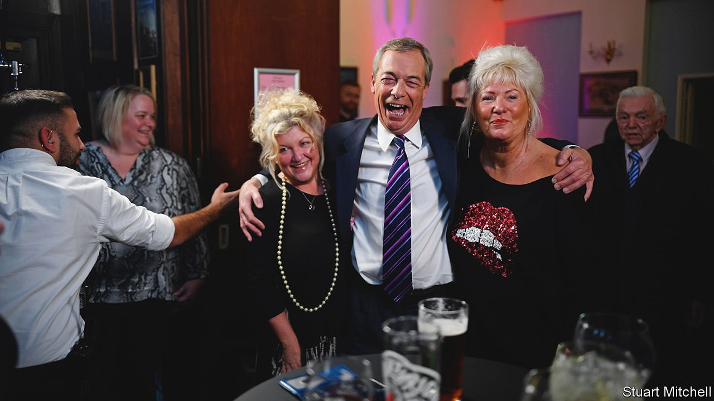

###### A new routine

# After Brexit, Nigel Farage has net zero in his sights 

##### He hopes for a referendum. He may find a niche 

 

> Feb 25th 2022 

THE NAVAL AND MILITARY CLUB, a haunt for ex-servicemen high above the Thames estuary, is the sort of venue Nigel Farage has worked for 30 years. In the early 1990s, as an unknown in a fringe movement, he would hone his oratory night after night in pubs, church halls and lounges across southern England, denouncing Brussels with a peroration his regulars learned to mouth in unison.

His gig on February 17th was the same as ever: a grey-haired audience, pints of ale, that raspy laugh. What has changed is the television cameras. Mr Farage has a show, part political manifesto, part light entertainment, four nights a week on GB News, a right-leaning channel. The other change is Mr Farage’s cause. He is agitating for a referendum on net zero, the government’s carbon-reduction policy. It spells higher energy bills and unaffordable electric cars, he tells the audience, to applause.


Mr Farage sees parallels with the EU cause. Like European integration, climate policy inches forward by treaty, drafted by officials at international conferences. Just as with Europe before 2016, there is a broad consensus among the major parties on meeting net zero. “The only debate is, ‘Can we go towards this lunacy more quickly’ ”, he says. UKIP’s roots were Thatcherite, and lamenting emissions rules is a natural extension from denouncing European red tape. For Mr Farage, climate policy is a case of Brexit failing to usher in radical deregulation: Boris Johnson’s exit deal binds Britain to the Paris climate agreement.

UKIP and its successor, the Brexit Party, didn’t need to win elections. The threat of splitting Tory voters and the parliamentary party was enough to force a referendum on Brexit, and then a hard form of it. On climate policy, the Tories are ripe for splitting again. A new backbench caucus, the Net Zero Scrutiny Group, is led by Craig Mackinlay, a former UKIP official. A Tory leadership election would offer new leverage for Mr Farage, as a public battle for the future of conservatism. Indeed, he thinks the mere discussion of a referendum will be enough to change policy. He imagines “a people’s army, mobilised to bombard their local MPs, so the political class say ‘Oh my God, it’s happening again.’ ”

A net-zero referendum would have clear echoes. As in 2016, a consensus of experts would fight on an equal footing with folksy wisdom and fringe voices. Just as Brexit was never defined in practice, there would be no clarity on what voting against net-zero would mean, whether merely a modest tweak or an emissions free-for-all. (Mr Farage supports coal and shale-gas extraction). The crucial difference, claims Mr Farage, is that industry cold on Brexit would this time support him.

Conservatives hoped that delivering Brexit would kill Mr Farage’s movement. In December 2019 four in five Brexit Party voters switched to the Tories. But there are signs Mr Johnson’s vote is becoming spongy: Leave voters support a no-confidence vote by 45% to to 37%, according to Ipsos, a pollster. Asked by Mr Farage whether they thought Mr Johnson would lead the Tories into the next election, only half the room in Southend raised their hands. “They like Boris’s optimism, but they’re beginning to wonder what they voted for,” he declares.

As for net zero, Britons as a whole support taking action. But four in ten Tory voters think the threat of climate change is exaggerated, and a similar number oppose climate-mitigation measures if they harm the economy. It is a niche too small for Mr Johnson to win election on, but large enough for Mr Farage to make trouble with. And although climate is less potent an issue than immigration, Mr Farage’s stature among Brexit voters means he may be able to electrify it, says Rob Ford of the University of Manchester. “He’s a hero to them. If he’s worked up about it, they’ll assume they should be too.”

Radical ideas can rush to centre stage at remarkable speed. In 2006 David Cameron dismissed Mr Farage’s outfit as “fruitcakes and loonies”; a decade later, Britain was out of the EU. In the Southend chill, four protesters gathered, waving EU flags and playing the Ode to Joy from a car stereo. Once, Mr Farage quips, it was his gang who used to protest outside other meetings. “We are now the consensus.” ■

For more coverage of climate change, register for , our fortnightly newsletter, or visit our 

