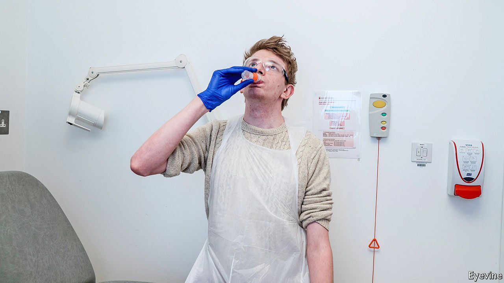

###### Trials and errors

# Clinical trials are ailing 

##### Britain invented clinical trials. Now it wants to reinvent them 

 

> Feb 26th 2022 

IN MAY 1941 Archie Cochrane was captured by the Germans. Clever, curious and bored, the young doctor passed the time in his Greek prisoner-of-war camp treating his fellow inmates—and conducting trials on them. In one, he measured the effects of yeast consumption on beriberi (it worked splendidly). In another, he tried international relations: did Yugoslav prisoners like British ones more or less after meeting them? (The results “were depressing”.) But one question obsessed him: did his medical treatments work? Too often, he wrote, “I had no idea whether I was doing more harm than good.”

“I will do no harm” is the Hippocratic oath. But for a long time, most doctors had no idea whether they were doing harm. Many didn’t mind. A wartime medical pamphlet relished doctors’ right to give whatever treatment they fancied. It was, Cochrane wrote, “ridiculous. I would willingly have sacrificed all my medical freedom for some hard evidence.” For the rest of his life Cochrane would be obsessed by one idea: better trials. In 1971 he wrote that doctors must run randomised control trials—what he called this “very beautiful technique”. Eminence-based medicine must give way to evidence-based medicine. A revolution had begun.


Now there are fears that it has stalled. The “very beautiful” idea is still beautiful, but it is also bureaucratic, inefficient, slow—and very expensive. Modern trials cost too much (£1bn, or $1.35bn, is not an unusual price tag), take too long to set up (two years is usual) and cover too many countries (100 is not uncommon). Many are not done properly. Of 2,895 registered trials of treatments for covid-19, a paper published in Nature last year found only 5% were good enough to trust. A full 95% were useless. That, says Dame Kate Bingham, who ran Britain’s vaccine taskforce, is an “off-the-chart statistic”.

Many problems faced by trials are startlingly analogue. To test a whizzy new drug on people you need two things: the drug and the people. It is the second that is more problematic. Serendipity, not science, limits many trials. To be eligible for a new cancer treatment you do not merely need to develop cancer. You must do so near a hospital that is running trials, turn up on a month when they are accepting patients, and on a day when the research nurse can sign you up. Get cancer in the wrong place, month or day, and you lose the trial and the trial loses you. The system is “sclerotic” says Charles Craddock, a professor of haemato-oncology at Birmingham University. For trials to work they need a pipeline of people pouring through. Instead, they catch raindrops in cups.

That problem leads to others. To catch enough patients, trials are often run in over 100 countries. This, says Sir Martin Landray, professor of medicine and epidemiology at Oxford University, is “hideously complicated and expensive” and often futile. Having shipped drugs, supplies and trainers “you’ll probably find that, of those 100 countries, 80% recruited almost nobody”. Bureaucratic sprawl (an “ever-growing spider’s web” of red tape), overcautiousness and outsourcing are other ills.

Dr Craddock and Dr Landray have created not-for-profit companies to help. Dr Craddock’s provides research nurses while Dr Landray’s runs trials for common diseases at a fraction of the cost. The government has bigger plans. In January, it launched a consultation with the aim of making post-Brexit Britain “a world-class sovereign regulatory environment for clinical trials”. World-beating statements are likely to make most wince; but there is reason to take this one seriously because of the NHS, an almost unparalleled potential testbed. (America, despite its huge drug pipeline, is less conducive to trials because its system is so fragmented.)

The NHS offers “huge, huge opportunity”, says Dame Kate. Massive, centralised, diverse, free, with cradle-to-grave records for all, the NHS could remove the need for serendipity in scientific research. If researchers could test a new cancer treatment, instead of just hoping that the right patients turn up on the right day, they could instantly let everyone with that cancer know that they could join a trial. Researchers would get people; patients would get treatments; trials would speed up; Britain might even become more attractive to big pharma companies. The NHS could, in short, open a pipeline of patients: no more catching raindrops in cups.

During the pandemic, Dame Kate’s vaccine task-force created the world’s first citizen registry of trial patients: 360,000 volunteers, ready to join trials at a moment’s notice. Meanwhile, Dr Landray co-ran the RECOVERY trial, the world’s largest trial for patients hospitalised with covid-19. Most trials take years to get going. RECOVERY went from first protocol to first patient in just nine days. Many trials fail to get enough patients. RECOVERY has enrolled 40,000 so far. Many trials fail to return usable results. Within 100 days, RECOVERY found that a cheap steroid, dexamethasone, reduced mortality by up to a third. By March 2021 the trial had already saved a million lives. RECOVERY was not just a dazzling success; it was a proof of principle.

In his prisoner-of-war camp Cochrane was haunted by the fear that he had “shortened the lives of some of my friends”. Dr Craddock has similar concerns. “It’s the most awful experience to sit down with a patient—I did it last week with a young girl—and tell her there is nothing we can do, because we don’t have that bandwidth to open these trials up.” There is, he thinks, a “moral obligation” to change how trials are done. The government is starting to listen. ■

