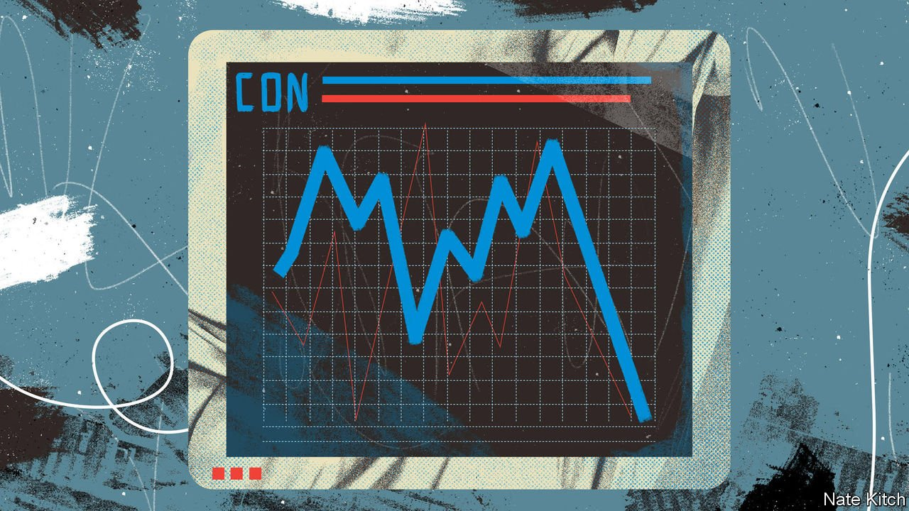

###### Bagehot

# Crisis in the NHS in 2022 in will damage the Conservatives 

##### Just as the financial crisis did Labour in 2008 

 

> Feb 26th 2022 

CLICHÉS ARE common in British politics. It is a land where a week is a long time, dear boys are told to worry about events and, more recently, everything is just like “The Thick Of It”. Some clichés count more than others. Wes Streeting, Labour’s shadow health secretary, returns to one when attacking the Conservatives on the NHS. “It’s not just that the Tories didn’t fix the roof while the sun was shining,” Mr Streeting likes to say. “They dismantled the roof and removed the floorboards.” This echoes George Osborne, the former Conservative chancellor, who hammered Labour for “fail[ing] to fix the roof when the sun was shining” during the global financial crisis.

If the soundbites are alike, that is because the predicament of the Conservatives in 2022 is similar to the one Labour found itself in after 2008. In both cases, a government faces a crisis in an area where voters never fully trusted it. For Labour under Gordon Brown, it was the economy in the wake of the financial crisis. For the Conservatives, it is the health service in the aftermath of the pandemic, with the prospect of 14m-long waiting lists. In neither case is the government directly culpable. In both cases, it banks on voter forgiveness. It was not forthcoming for Labour; it would be heroic to assume it will be for the Tories.


Enormous waiting lists undo almost two decades of detoxification when it comes to the Conservatives and health. If the NHS was “the closest thing the English have to a religion”, as the former Conservative chancellor Nigel Lawson put it, creating yet another political cliché, then the Conservatives were once happy heretics. Only after David Cameron took over in 2005 did the party start attending church. “Tony Blair once told us that his priorities could be summed up in three words: education, education, education,” he explained in one conference speech. “I can do mine in three letters: NHS.” Since returning to the top of politics, Boris Johnson has joined the cause. As a columnist, Mr Johnson aimed kicks at the health service, with its “starch-bosomed nurses” and its sometimes lousy care. As prime minister he is soppy. After a brush with covid-19, Mr Johnson declared that the NHS is “powered by love”.

Just now the NHS is hardly powered at all. About 6m people—roughly one in ten—are already waiting for a procedure. By 2024, when the next election is due, up to 14m people could be, or one in five. The Conservatives have at least been honest. Ministers admit chewing through waiting lists will be miserable. Sajid Javid, the health secretary, pledged to cut waiting times to under a year only by 2025. The wait for diagnostic treatment will return to pre-pandemic levels only then. An unpopular tax rise of 2.5 percentage points on national insurance will help clear the backlog, before being put towards social care from 2023. The most uncomfortable part of the levy is that it will only stop things becoming worse.

It is a familiar tale. For Labour, the financial crisis undid 15 years of detoxification. In the 1990s John Smith, Labour’s leader between 1992 and 1994, launched a “prawn-cocktail offensive”, trying to charm bankers over dinner to no avail. (“Never have so many crustaceans died in vain,” mocked Michael Heseltine, a former Tory cabinet minister.) It was only under Tony Blair and Mr Brown that the rebrand was successful. Prudence became the watchword. But by the time Labour left office, a crisis-induced deficit of 10% of GDP had appeared. It was gleefully blamed by Mr Osborne on Labour profligacy.

Neither party is to blame for the crisis, whether financial or viral. But voters are rarely forgiving. Mr Brown handled the financial crisis well, but it did him no favours in the 2010 election. So far, voters have given the Conservatives the benefit of the doubt during the pandemic. But by 2024, the exceptional chaos of spring 2020 will be forgotten. Labour has already attacked the government for wasting £8.7bn (0.4% of GDP) on personal protective equipment (PPE) at the height of the pandemic. The fact that, at the time, governments were stealing PPE from each other and NHS staff were reduced to fashioning gear out of bin bags is forgotten. Any residual glow from a successful vaccine roll-out will have faded. A bunged-up NHS, with someone in every family on a waiting list, will be a day-to-day reality.

Both catastrophes exposed the failings of the government in power. Under Labour, there were no complaints as the City boomed unsustainably amid light-touch regulation, flooding government coffers with tax revenues. Criticism arrived only once it went bang. Likewise, the pandemic revealed how austerity eventually bled into areas supposedly protected from budget cuts, such as the NHS. A lack of capacity in the care system left the elderly stranded in hospitals. False economies jammed up the entire system, until the NHS had to deal with it.

Boris Brown, Gordon Johnson

Voter cynicism may yet be a Tory saviour. Labour have for years tried and failed to make political hay from the NHS. Ed Miliband accused the Conservatives of destroying it, when it was just about hanging together. Jeremy Corbyn said the Conservatives had plans to privatise the service, which was untrue. Mr Johnson was able to shrug off the assault. But when it comes to waiting lists, the attacks will be accurate. Conservatives may dismiss Labour wailing as Cassandraesque. Cassandra was, however, right in the end.

Once formed, such reputations (“Labour cannot be trusted with taxpayer money”; “the Conservatives break the NHS”) are hard to lose. The Tories hammered Labour so hard that ministers still appear on television to blame Labour’s mismanagement of the economy more than a decade later. “The 2015 election was won in the first six months after 2010,” says one former Conservative adviser. Sir Keir Starmer, the Labour leader, is still scrubbing at the stain of fiscal ineptitude, wiping away ink thrown by the Conservatives in that era. When it comes to waiting lists, the roles are reversed. Labour will happily repay the favour. ■

Read more from Bagehot, our columnist on British politics: (Feb 19th)

 (Feb 12th) 

 (Feb 5th)

