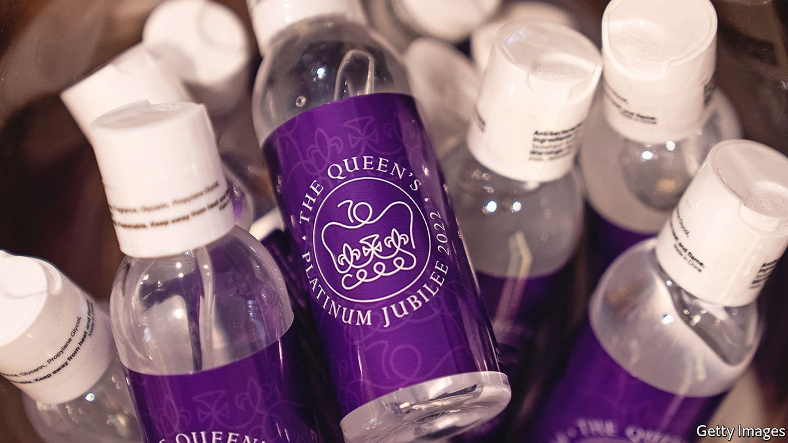

###### Covid-19 rules

# England’s coronavirus regulations are no more 

##### Many public-health advisers fear it may be too soon 

 

> Feb 25th 2022 

ON FEBRUARY 20TH Buckingham Palace announced that the queen had tested positive for covid-19. She was legally required to self-isolate for at least five days, lest she pass the virus to others. But when she woke up four days later, on February 24th, that rule was gone. She and the 2m-odd other residents of England infected with covid can now do as they please.

England is one of the first countries to remove its coronavirus regulations in their entirety (the other parts of the United Kingdom have devolved control over health policy and plan to scrap their rules later). After almost two years in which adherence to public-health guidance has been mandated by law, its reversion to mere advice in England marks a significant moment in the tail-end of the pandemic.


Many public-health advisers fear it may have come too soon. They say the number of deaths caused by coronavirus remains too high, and that restrictions should be lifted only once that number has not just come down but also stayed down for some time. Yet announcing the end of restrictions on February 21st, Boris Johnson argued that the trends in deaths and hospitalisations were in the right downward direction, so that the time was right to act.

Timing was always going to be tricky. Yet it is clear that covid in England is no longer the same disease that shut the country down in 2020 and 2021. That is mainly down to Britain’s high vaccination rate and to Omicron’s milder disease profile. “That very bad pneumonia which scared the hell out of everyone, we dealt with that with the vaccines,” says Sir John Bell, a professor of medicine at Oxford University.

The numbers bear this out. The Omicron variant drove cases to record levels in England, with a peak of 274,000 being recorded on January 4th, more than three times higher than the 2020 high of 83,000 on December 29th. And yet the numbers in hospital reached half the April 2020 peak. The number of people on ventilators never went up at all. The peak number of deaths in a day was six times lower than its previous high point: 244 on January 15th, against 1,486 on January 19th 2021. As of February 24th deaths and hospitalisations had both been dropping steadily for more than a month.

The removal of the legal mandates does not mean that the public-health guidance has changed. During the press conference at which the prime minister announced the end of restrictions, Sir Chris Whitty, England’s chief medical officer, urged people to continue following the advice to use masks in crowded spaces, to ensure good ventilation and to stay away from others if they are ill. Dr Whitty noted that this is standard public-health advice, the same as for other infectious diseases. Removing the legal mandates around the advice was “reverting away from an abnormal situation to a normal one”, he said.

The announcement also offered guidance for the future. Weekly infection surveys by the Office for National Statistics, which offer a vital view of the virus’s spread and have been hailed around the world as a model, will continue. So will the genomic-sequencing programme that allows the Health Security Agency to keep watch for new variants. These will inevitably arise, and they might also spread faster and pose a greater danger than Omicron did. Both surveillance programmes are important to ensuring a rapid response. Mr Johnson also announced that the government would scale back its expensive testing regime, ending the distribution of free tests on April 1st. Some 8m people classed as clinically vulnerable will still receive free tests, so their treatment for covid-19 can begin as soon after infection as possible. But testing as a means of controlling the spread of the virus is ending.

Despite their significance, the announcements did not hold public attention for long. Mr Johnson ended his press conference by declaring that he was off to telephone Volodymyr Zelenskyy, Ukraine’s president, about Russia’s latest incursions into Ukrainian territory. The prime minister has plenty to keep him occupied, including the battle to save his own political career. He must hope that his removal of restrictions does not turn out to have been too hasty. ■

Dig deeper

All our stories relating to the pandemic can be found on our . You can also find trackers showing ,  and the virus’s spread across .

