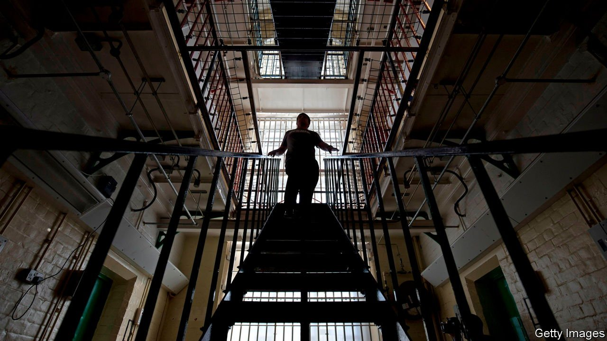

###### Indeterminate prison sentences

# Too many British prisoners are still serving indefinite sentences 

##### Even after those terms were scrapped 

 

> Feb 25th 2022 

IN 2006 LEROY, a 22-year-old, stole a phone from another man in the street. After being caught and convicted, he was given a minimum sentence of 30 months. Yet 16 years later, Leroy is still in prison with no idea when he may be released. He is one of some 3,000 inmates incarcerated in English and Welsh jails under sentences of Imprisonment for Public Protection (IPP), which were handed out only between 2005 and 2012.

Brought in by David Blunkett, then home secretary, IPPs were originally supposed to be used only for serious violent and/or sexual offenders who had been sentenced to a minimum tariff of ten years. The addition of an IPP after the minimum tariff put the onus on prisoners to prove they were safe to be released. But IPPs were enthusiastically embraced by the courts even for more minor crimes. The Labour government at the time estimated that perhaps 900 would be issued in all. Yet over seven years 8,711 were handed down for crimes, some with minimum tariffs as short as 28 days.


IPP prisoners have to convince a parole board that they are no longer a danger, in part by completing rehabilitation courses. When released they must also spend the rest of their lives on licence, meaning they can be returned to prison to continue their indefinite sentence once again, even for quite minor breaches.

The IPP sentence was scrapped in 2012 after a series of court cases that saw Mr (now Lord) Blunkett admit a breach of his duty to provide prisoners with the resources and opportunities to demonstrate their safety for release after their tariff had expired. The European Court of Human Rights also ruled that a group of prisoners who had exceeded their minimum tariff for the same reason had been arbitrarily detained. Yet after IPPs were abolished, no changes were made retrospectively for those who had already been sentenced.

Over 1,700 of the 3,000 in prison under IPPs have never been released. Fully 96% have served more than their minimum tariff, and 570 have served more than a decade longer. The rest are those recalled for infringements of their lifelong licences. From 2015 to 2020 the number of recalled IPP prisoners grew by 184%. Indeed, the rate of return could soon overtake the rate of release, so that the number incarcerated under IPPs looks set to rise.

Such perpetual punishment takes a terrible toll. A report in 2020 by the Prison Reform Trust, a charity, found that IPP prisoners were over two and a half times more likely than other prisoners to harm themselves. Widespread mental-health problems only aggravate the challenges of navigating the system towards release. Covid-19 has meant further delays in getting courses, support and parole hearings.

Successive governments have failed to put right this Kafkaesque situation. An inquiry by the Commons Justice Committee that is due to report shortly may create another opportunity. After all, Lord Blunkett himself admitted in December 2021 that “I got it wrong. The government now have the chance to get it right.” The alternative may just be to leave Leroy and the other 3,000 sentenced under IPPs in prison for the rest of their lives. ■

