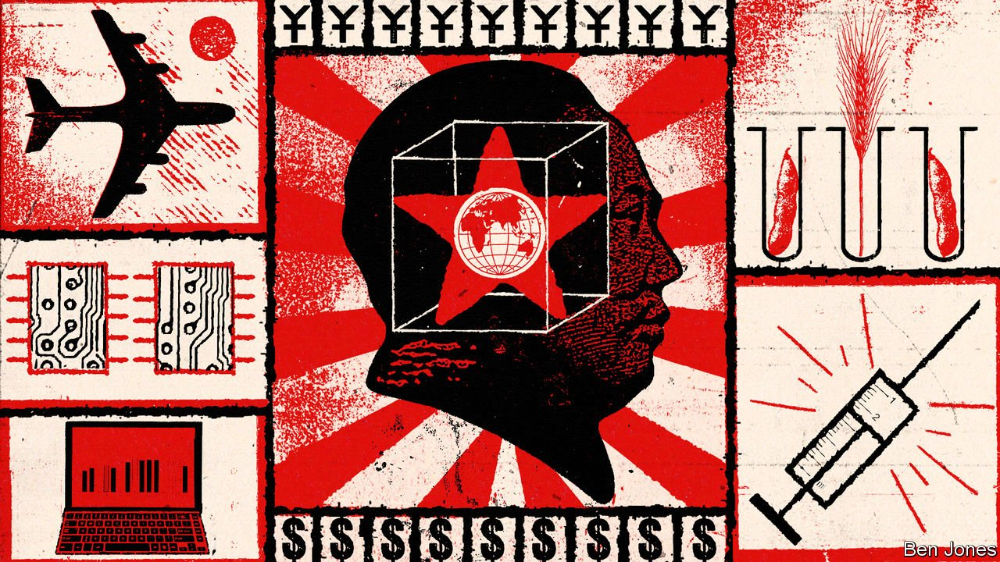
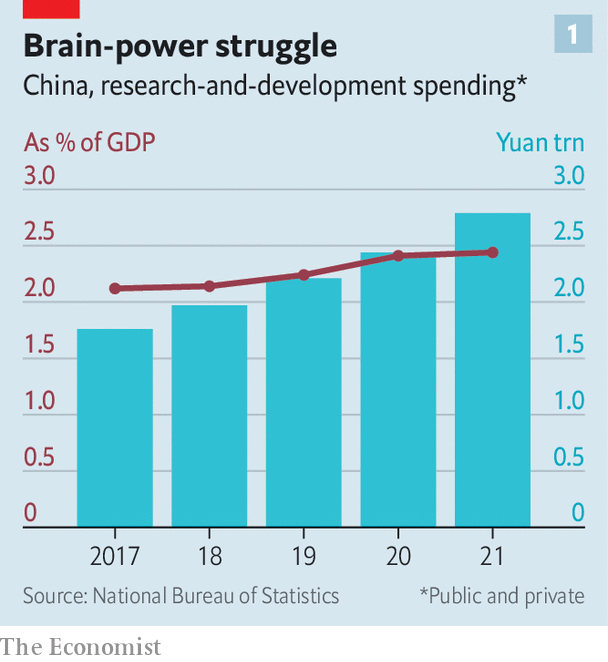
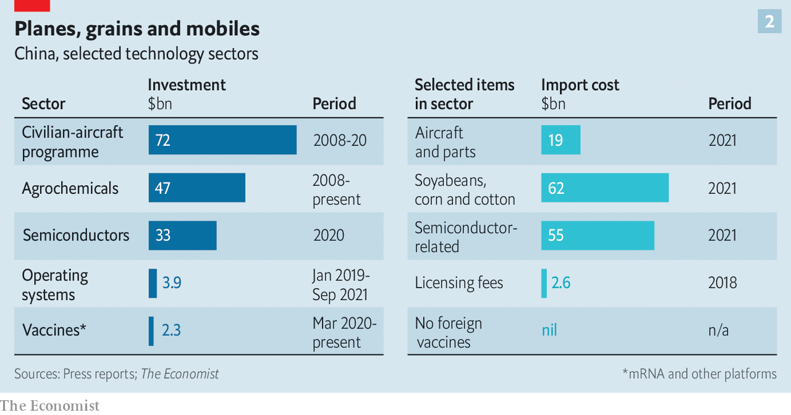

###### The techno-independence movement

# China wants to insulate itself against Western sanctions 

##### We assess its progress in six critical technologies 

 

> Feb 26th 2022 

A STRIKINGLY HARSH appraisal of China’s ongoing technological battle with America appeared on the website of a prestigious Beijing-based think-tank on January 30th. The paper, published by the Institute of International and Strategic Studies (IISS) at Peking University, found that China is likely to be the bigger loser from the technological and economic decoupling under way between the two world powers. China lacks control over core computing systems, the paper stated, and is far behind America in a number of important areas such as semiconductors, operating systems and aerospace. Within a week of its posting, the document vanished.

The circumstances around its removal are unclear. Communist Party bosses may have decided it signals weakness at a time when Xi Jinping wants to project strength—his country’s, the Communist Party’s and, as he prepares to be anointed president for life later this year, his own. The report’s conclusions are indeed inconvenient for Mr Xi. He has been talking up “self-strengthening” against what his government calls “chokeholds” that the West exerts over access to critical technologies, from seeds to semiconductors. The power of the West to hobble its adversaries with sanctions is about to be tested in Russia, which on February 24th attacked Ukraine (see Briefing). China’s rulers will be  closely because it may illuminate their own vulnerabilities. China’s 14th five-year plan, a strategic blueprint published in 2021 that covers the years until 2025, makes self-reliance in science and technology a cornerstone of economic policy.


The plan’s deadlines for China to break free from existing techno-dependence are fast approaching. The government is pouring billions into the effort, and cajoling Chinese companies to do the same. Combined public and private research-and-development spending soared to a record 2.8trn yuan ($440bn) in 2021 in a bid to catch up with foreign rivals. That is equivalent to 2.5% of GDP, still far from America’s 3% or so but up from just over 2% five years ago (see chart 1). On February 11th SMIC, China’s biggest chipmaker, said that it would invest some $5bn in 2022 in new semiconductor factories. Three days later the Hong Kong unit of Standard Chartered, a British bank, became the first foreign lender outside mainland China to be directly linked to CIPS, the Chinese answer to the Belgium-based SWIFT interbank payments system.

 


To see how much all this adds up to, The Economist has surveyed six areas in which China’s reliance on the West has been of particular concern to the party and Mr Xi. We looked at mRNA vaccines, agrochemicals, civilian aerospace, semiconductors, computer operating systems and payments networks. Our conclusions mirror those of the IISS paper: although there has been a degree of self-strengthening, self-reliance is some way off.

Chinese progress has been most pronounced in fields that, though themselves technologically sophisticated, require less extended and complex supply chains. Start with the vaccines. Much of China’s progress in mRNA technology used in Western jabs such as Pfizer-BioNTech or Moderna has been linked to one man, Ying Bo. For several years Mr Ying worked on mRNA at Moderna, before returning to China from Boston at the start of the pandemic. His homecoming was hailed by state media as a patriot answering the call of the motherland. His company, Abogen Biosciences, has worked with the People’s Liberation Army to develop the country’s most advanced mRNA shot, and was part of a programme that has invested at least $2.3bn in developing local vaccines.

Results from phase-one clinical trials of Abogen’s jab, known as ARCoVax, were recently released, according to state media. In some ways, that looks impressive, coming just a year and a half after the Western versions. However, the company has not made any statements about wide deployment. Annual production capacity of 200m doses looks modest next to the 4bn doses expected this year for the Pfizer-BioNTech vaccine. BioNTech offered to provide its shot to China in a partnership with Fosun, a local conglomerate, a year ago. By championing ARCOVax while denying approval to Western mRNA jabs (though not Western covid pills, one of which was approved this month), Mr Xi appears to have placed a higher value on self-reliance than on public well-being, says Huang Yanzhong of the of the Council on Foreign Relations (CFR), a think-tank.

Similar considerations appear to have slowed progress in agrochemical technology. Foreign genetic-modification and seed-editing methods have been banned from domestic use out of a long-held fear that this would hand foreign firms control of China’s grain supply. Chinese companies have been developing home-grown alternatives; Dabeinong Biotechnology, a big feed producer, is investing heavily in research. They have also been procuring them through acquisitions. The most notable of these was the $44bn purchase in 2016 by ChemChina, a state-controlled chemicals conglomerate, of Syngenta, a Swiss seed-and-agrochemicals giant with a granary’s worth of intellectual property. But a continued lack of domestic production capacity means that China is still dependent on the import of crops. In 2021 China spent at least 400bn yuan on imports of soya, corn and cotton—much of it genetically modified (see chart 2).

 


Imported aeroplanes and parts cost China considerably less than that—$19bn last year. But here, too, the party wants the industry to fly free of foreign dependencies. If state media are to be believed, it already is. This year COMAC, a state-owned aerospace group, plans to start delivering its narrow-body C919, a rival to the Boeing 737 and Airbus A320 in development since 2008. Chinese airlines have ordered hundreds of them.

On closer inspection, though, the C919 does not look all that Chinese. The programme has eaten up $72bn or more, according to an analysis by the Centre for Strategic and International Studies, an other think-tank. Yet the aircraft remains a jumble of foreign parts. Because the turbofan engines being developed for it have been mired in technical troubles, for example, the aeroplanes will for now be fitted with engines from a joint venture between France’s Safran and America’s GE Aviation. With hundreds of other components also produced abroad, the final product is a facsimile of a Western plane—and not exactly state-of-the-art. One Western airline-industry bigwig points out that the C919 is a generation behind Airbus’s fuel-efficient A320neo, and therefore much less competitive in the global market.

China faces the same problem in trying to extricate itself from the global semiconductor supply chain, which like that for aircraft is complex and dominated by America and its allies. China’s vulnerability to tech sanctions became clear in 2018, when Donald Trump’s administration halted the sales of sensitive hardware that used American technology to two Chinese telecoms-equipment makers, ZTE and Huawei.

To avert anything like this happening again, the latest five-year plan stipulates that China should  of the chips it consumes by 2025, up from less than 20% last year. As in the other areas, the country is making some progress towards that goal. SMIC is planning to complete the construction of three new factories this year. The state has poured hundreds of billions of yuan into the sector. The money has helped Chinese chipmakers go on a recruiting binge. A lab in Shanghai run by Micron, an American chipmaker, has become a poaching ground for local firms. On January 26th Micron said it would close the lab altogether. The result has been to enable some big Chinese chipmakers to operate production lines cleansed of American technology, notes Adam Segal of the CFR.

A chip on their shoulder

But as with airliners, the Chinese chips lag well behind the cutting edge. SMIC and others are trying to fully domesticate the supply chain for chips with structures measured in tens of nanometres (billionths of a metre), an order of magnitude bigger the most advanced current chips. That puts them a few generations behind TSMC of Taiwan and Samsung of South Korea, the two industry leaders. China is probably years away from replicating the lithography machines built by ASML, a Dutch firm which has cornered the market for equipment to etch the tiniest integrated circuits onto silicon wafers. Shanghai Micro Electronics Equipment Group, the state company tasked with catching up with ASML, is running behind on delivering the devices, according to Tilly Zhang of GaveKal Dragonomics, a research firm. Some large investments in Chinese semiconductor capacity have gone to firms that folded or turned out to be frauds.

In the last two critical technologies China’s problem has less to do with mastering a technology or recreating supply chains and more with overcoming users’ lack of trust in its alternatives. The operating systems that power personal computers and smartphones are a prime example. When the Trump administration banned American firms from working with Huawei in 2019, a generation of the Chinese firm’s phones were deprived not just of chips but also of Google’s Android operating system. Together, these restrictions contributed to the decline of about 30% in Huawei’s revenues last year.

Chinese companies are estimated to have invested $4bn or so between 2019 and September of 2021 in the development of operating systems. Some analysts expect Huawei’s Android alternative, called Harmony OS and partially based on Google’s open-source system, to gain market share. But virtually all Chinese smartphones continue to run on Android and Apple’s iOS, and nearly all Chinese desktops are powered by Apple’s mac OS or Microsoft Windows. Alternative Chinese operating systems struggle to attract developers because they are not widely used—and they are not widely used because they do not have many apps or programs to download.

A similar chicken-and-egg problem afflicts China’s effort to create a worldwide payments network. The bulk of global money transfers are processed through SWIFT, a Belgium-based interbank messaging system, and CHIPS, America’s domestic clearing system. These, plus the widespread use of the dollar in international finance and trade, give America power over the global financial system. To insulate itself against the threat of eviction from the world’s financial plumbing, which America has contemplated over Mr Xi’s crackdown on freedom in Hong Kong and its human-rights abuses in Xinjiang, China has since 2015 been expanding a parallel system for yuan payments known as CIPS. In September the service was processing 317bn yuan in transactions each day in more than 100 jurisdictions.

The costs of CIPS’s expansion are unknown but probably large. Yet gauged against the size of the Chinese economy, the system’s footprint is puny. CIPS’s 80 or so connected institutions are dwarfed by SWIFT’s 11,000-plus. Much of the growth in the yuan’s cross-border use—to 2.7% in December from 1.9% two years earlier—was the result not of foreign demand for the Chinese currency but of Chinese state firms’ overseas expansion. A recent report from the Carnegie Endowment for International Peace, one more think-tank, notes that distrust of China has increased since the start of the pandemic. This does not bode well for the yuan in the short term.

Such stumbles may only strengthen the Communist Party’s resolve to wean itself off the West in areas it sees as of strategic importance. Like all autarky, the technological sort will come at a cost: in billions spent, often wastefully, as well as in apps undeveloped, fields unplanted, arms unjabbed. In Mr Xi’s eyes, that appears to be a price worth paying. ■


