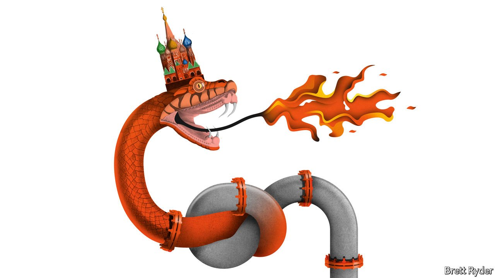

###### Schumpeter

# How Gazprom helps the Kremlin put the squeeze on Europe 

##### Vladimir Putin’s python may tie itself in knots 

 

> Feb 26th 2022 

THE BUSINESS pages of newspapers tend to deal with the cut and thrust of competition, rather than the cacophony of war. But when it comes to Vladimir Putin’s assault on the sovereignty of Ukraine, there is a company—the world’s largest gas producer—that is right in the thick of it. Gazprom, majority-owned by the Russian state, has mastered the art of furthering the Kremlin’s interests as well as its own commercial ones. That extends to squeezing European gas supplies until the pips squeak. On February 22nd it received a dose of its own medicine when Germany said it would mothball the  pipeline owned by Gazprom in retaliation for Russia’s warmongering in Ukraine. Two days later Russia attacked Ukraine. Even those two events may not stop the firm from making mischief—and money.

To understand Gazprom, it helps to remember it is a child of the cold war, born from the Soviet Union’s Ministry of the Gas Industry in 1989. Its boss, Alexey Miller, has run it since 2001, the year after Mr Putin took power. The two men are cut from the same cloth. When America imposed sanctions on Mr Miller in 2018, he remarked: “Finally I’ve been included. It means we are doing everything right.” Investors in the West, who buy Gazprom stock for a spectacular dividend yield, lament that it splurges on projects that benefit the state, not shareholders; a plan to build the world’s second-tallest skyscraper in St Petersburg is a case in point. As for mixing politics with commerce, its business model relies on a monopoly on the high-margin export of piped natural gas in order to cross-subsidise cheap gas to Russians. In a land of frozen winters, that is a precious quid pro quo for Mr Putin.


The run-up to war in Ukraine offered a textbook lesson in how Gazprom served the government’s interests while feathering its own nest. For years its efforts to circumvent Ukraine, an important transit route for its gas, led it to construct alternative pipelines into northern and southern Europe that were intended to strengthen its bargaining power when its contract with Ukraine ended in 2024. These efforts also set European countries that stood to win and lose from the new configurations against each other. Gazprom’s decision to dribble only a bit of surplus gas to Europe as  in recent months had a commercial logic—the resulting spike in spot prices translated into record profits. However, it also sent a message: Europe should not take Gazprom for granted. “It suits their purposes to keep Europeans on their toes,” says Jack Sharples of the Oxford Institute for Energy Studies, a think-tank.

Since the cold war, western European countries have tended to shrug off this nasty side of Gazprom. Instead they have become overdependent on its gas. Germany, which gets about half of the fuel from Russia, is in a particularly invidious position. Some Gazprom hangers-on, like Gerhard Schröder, an ex-chancellor who chairs Nord Stream, deserve special ignominy. Former Eastern bloc countries, such as Poland, have no such illusions. They know that as well as extending the hand of friendship, Gazprom can wield the knuckle duster. They are also the most exposed, observes Anna Mikulska, an expert on Russian energy at Rice University’s Baker Institute. The most extreme case is Ukraine, where Gazprom provided cheap gas and other benefits, then turned them on and off as punishment for the country’s westward drift. Recently Moldova has suffered similar treatment.

Russia’s war against Ukraine paints Gazprom’s geopolitical thuggery in stark relief. It sent prices of Brent crude soaring above $100 a barrel, their highest level since 2014. It caused a surge in prices of natural gas, of which Russia is the world’s second-biggest producer. The so-called Brotherhood Network running through Ukraine used to be the main transit route for Gazprom’s gas into Europe, though supplies have dwindled recently. Nonetheless, fears that vital pipelines will be destroyed are likely to keep gas prices elevated. So will concerns that Mr Putin could turn off the taps as part of his war effort, though he may prefer European cash pouring into his coffers. While Gazprom continues to supply Europe, high prices are good for it.

Germany’s decision to halt the approval process for , a €9.5bn ($10.7bn) underwater pipeline running from Russia to Germany, does not change much. It had already been suspended for legal reasons in Germany. The bigger question is whether sanctions will be imposed on Gazprom. Before the attack, the betting was that given how dependent on Gazprom Europe remained, the firm would not suffer much. Russia’s potential eviction from the SWIFT interbank payments system—which some Western politicians are calling for—would probably not entirely sever Gazprom’s links with its European customers, who still need a way to pay for its energy. An idea suggested by Ms Mikulska, among others, to sideline Gazprom with a “Gaslift” of liquefied natural gas (LNG), a maritime version of the airlift that overcame Russia’s blockade of Berlin in 1948-49, looks like a long shot.

Put that in your pipeline

At a time of war, Gazprom’s fealty to the Kremlin is unlikely to be shaken. Being a loyal servant has won it the support it needs from the regime as other presidential pets, such as Rosneft, an oil giant, try to wrestle away its monopoly on piped-gas exports.

The conflict will do grave damage to Gazprom’s reputation nonetheless. It is a wake-up call to European countries that they should invest in more terminals to import LNG, and further build up their renewables capacity to reduce dependence on Russia. It will be studiously watched in China, where Gazprom has pivoted in recent years in order to diversify its gas customers away from Europe. China is likely to be less bothered by Mr Putin’s belligerence. But even the Communist Party in Beijing has good reason to care about Gazprom’s trustworthiness as it watches the squeeze on Europe. The python may yet end up tying itself in knots. ■

For more expert analysis of the biggest stories in economics, business and markets, , our weekly newsletter.

Read more from Schumpeter, our columnist on global business:

 (Feb 19th) (Feb 12th)

 (Feb 5th)

